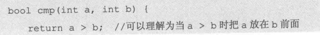
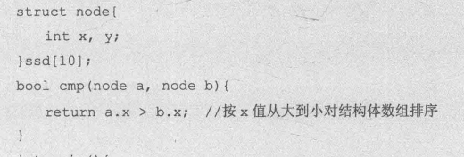
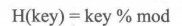
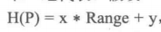
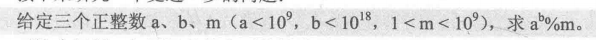
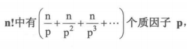
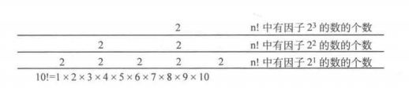
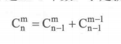

## C/C++的一点随笔

1. 如何调试：
   1. 进入调试：F5
   2. 设置断点：能直接执行断点行之前的所有行，==不执行断点行==
   3. 继续（continue）：F5，执行断点行和之后连续的所有非断点行，最后再断点行处暂停
   4. 单步跳过（step over）：F10，不管断点，只执行一个语句（不进入函数内部，直接运行完整个函数）
   5. 单步调试（step in）：F11，不管断点，只执行一个语句（运行函数，会进入函数内部，然后逐步调试）
   6. 单步跳出（step out）：shift+F11，在子函数中直接运行完剩余部分，然后返回上一级函数
   7. 可以在左侧监控处添加变量或表达式实时查看变化，或者在下方调试控制台输入所需了解的表达式
   
2. 输入多个字符串 

   ``` cpp
   while(gets(str)){
   }
   ```

3. 输入多次2个整型

   ``` c
   while(scanf("%d%d",&t1,&t2)!=EOF){
   }
   
   ```

4. 字符串整体赋值：strcpy（des,src）

5. 字符串部分赋值：strncpy（dest，src,n）：将src的前n个字符拷贝到dest，因为不会自动在dest末尾加0，所以需要手动添加

6. 字符串拼接：strcat

7. gets可以接受空格，遇到回车结束输入，回车不会留在缓冲区;而scanf遇到空格、回车、tab都会认为输入接受，所以不能接受空格，回车、空格会留在缓存区（可在输入后一行加一个getchar（）取出缓存区中字符）。但都会在字符串末尾加一个\0

8. scanf输入不会接受回车和空格所以 以下输入等价：

   1. 
   2. 
   3. 

9. 可以用fgets(str, sizeof(str), stdin)，完全代替gets，更安全。其中srdin表示从键盘输入数据

10. 在C语言中，==字符串==str就是字符数组

11. sort()函数:

   12. ``` c
       #include&lt;algorihm&gt;
       using namespace std;
       int main(){
           int a[5]={5,4,3,2,1};
           sort(a,a+5);
       	return 0;
       }
       ```

   13. sort()排序范围是==左闭右开==，从小到大排序

   14. 第三个参数cmp函数。通过输入cmp函数，可以将sort改为从大到小排序，如下（sort是从大到小还是从小打到取决于return的符号，>表示从大到小，<表示从小到大）(==注意==:变量类型要是用const，且使用引用)

          1. ``` c++
             static bool cmp(const int &a,const int & b){
             	return a>b;
             }
             ```

       2. 多规则比较

       3. ``` c++
          //当a[1]==b[1]，比较a[0]和b[0]
          static bool cmp(vector&a,vector&b){
              if(a[1]!=b[1])
                  return a[1]<b[1];
              return a[0]<b[0];
          }
          ```

       4. 

       

       

   15. 结构体排序

       

16. 定义结构体，并创建结构体数组

   ``` c
   struct Student{
   	char name[10];
       char id[10];
       int score;
       int r;
   }stu[10000];
   ```

11. 字典序：2个字符串从第1个字符开始比较，如果之前字符都相等，则字符数量少的排前面

12. string.h

       1. strcmp（str1,str2）：如果str1小于str2，返回值小于0；str1等于str2,返回值等于0
       2. strcat(str1,str2)：将str2拼接到str1后面。会删去str1、str2末尾的'\0'，然后将str2拼接到str1后面，再在最后加上‘\0’。注意：如果str1、str2末尾需要有‘\0’，且str1数组大小需要足以包括所有元素和‘\0’
       3. strlen（array）：读取数组的元素个数，直至读到‘\0’为止（结尾一定要有‘\0’，不然会一直读下去），但返回的元素个数不包括‘\0’
       4. strcpy（str1,str2）：将str2地址开始直到‘\0’的字符串（注意：包括‘\0’）复制到str1开始的地址空间
       5. 打印printf("%s",str)；打印字符串%s，也以‘\0’作为结束符，否则就会打印越界，直至遇到结束符'\0'

   13. 分配数组地址：int *pa = (int*)malloc(sizeof(int)*20);//分配20个int元素大小的堆空间。

   14. 数组赋初值0：

          1.  memset(array, 0,n*sizeof（int）); 
          2. 在==定义时==：char array[10]={0};(这样在定义时就使得所有元素初值为0)
                1. 注意，即使是char array[10]={1},除了第一个元素为1，其他元素的初值也已确定为0

   15. C语言会自动在双引号“ ”括起来的内容末尾补上‘\0’代表结束

   16. sizeof(int):表示1个int变量所占的存储空间大小

   17. 结构体：

          1. 定义结构体：

                1.  ``` c
                   struct student{
                   	int id;
                       char name[20];
                       student(int _id,char* c){
                   		id=_id;
                      		name=c;     
                       }
                   }stu[100];
                   ```

          2. 构造函数：结构体中student（）为构造函数，用于定义该数据结构时初始化用，注意==无返回值==。构造函数也可以带参数，使用方式：stu1=student（106，"xiaoming"）;

          3. root->data：root为指针时使用->访问元素
       
          4. root.data：root为结构体变量时使用.访问元素
       
   18. 条件编译：在不同情况下，可能只用到一部分代码，就没必要把所有的代码都写进去，使用条件编译，可以通过预编译指令设置编译条件，使其能在不同情况下编译不同代码

   19. 动态分配二维数组：

       ``` c
       int **p,m,n;//m为行数,n为列数	
       p = (int **)malloc(sizeof(int *) *m);
       for (i = 0; i < m; i++)
       	p[i] = (int *)malloc(sizeof(int) * n);
       ```

20. 指针类型的作用：虽然指针都是地址，某个地址可以通过加减获得其他指针，但是通过加减获得的指针不能代替不同类型的指针，还需要强制类型转换。虽然类型不同，而指针指向的地址相同，但是指针类型的作用决定了你的权限（能操纵多少个字节）。比如*p（取地址上的元素），不同类型的指针获得的值不同。

21. ``` c
    ListNode *x;//x为声明，所以此阶段为声明阶段
    x=new ListNode();//new ListNode()为变量，此阶段为定义变量阶段
    ```

22. 由malloc、new动态分配的内存都是存在在堆中，一直存在的，除非使用free或delete手动删除，否则一直存在，不存在作用域，作用域只是针对栈中的变量，例如结构体、对象的引用是存在作用域的。

23. Listnode node定义的变量是存在栈中，还有一般基本数据类型int a；定义的也在栈中，虽然都有作用域，但是出了作用域并非立刻被清除，依然存在于栈帧中，只是存在被覆盖的风险。

24. 运算符顺序：

    

    | 优先级 | 运算符                         |
    | :----: | ------------------------------ |
    |   1    | . ->(取成员符号)               |
    |   2    | *（取值） &（取地址） ！（非） |
    |   3    | /（除）*（乘） %（模）         |
    |   4    | + -（加减）                    |
    |   5    | > < (比较运算符)               |
    |   6    | & ^ \|（与、异或、或）         |
    |   7    | && \|\|（逻辑运算符）          |
    |   8    | ？（三目运算符）               |
    |   9    | ,逗号运算符                    |

25. C++引用：变量名前加&表示该变量未引用变量，引用变量必须初始化，且初始化传递的是地址，而不是值传递，且不能改变。例如下方的x变化，y也要跟着变化

    ``` c++
    int y=1;
    int &x=y;
    void swap(int&x,int&y){
    }
    ```

26. int最大最小值：在<limits.h>中有INT_MIN,INT_MAX，也可以自定义宏

    1. ``` c++
       #define INT_MAX 0x7fffffff
       #define INT_MIN 0x80000000
       /**************************************/
       int max=INT_MAX,min=INT_MIN;
       ```

27. C++中，double能存储的数据大小(字节数)大于int类型

    

28. 尝试减少使用if，而使用switch

    1. ``` c++
       scanf("%d" ,&n);
       switch (n)
       {
           case 1: ;break;
           default:
           // Section n;
           break; // default
       
       } // switch (n)
       
       ```

29. 减少if的一些措施

    1. 减少if嵌套。if嵌套会极大加剧耗时
    2. ==尽量不要用else==
    3. 用switch代替多个平级判断
    
30. C语言中求模运算：a=b%c，a的符号与b的符号相同（即ab同正同负）

    ``` c++
    //如果需要让结果为非负数，可进行如下运算
    a=(b%c+c)%c
    ```

31. 控制输出流小数点位数

    1. ``` c++
       #include <iomanip>
       //setiosflags(ios::fixed)说明控制小数点后的位数
       //setprecision(1)说明只保留1位小数点
       //注意：使用了一次setiosflags(ios::fixed)<<setprecision(1)，后面使用的所有cout都保留这个规定
       cout<<it->first<<setiosflags(ios::fixed)<<setprecision(1)<<it->second;
       ```

32. 控制输出位数

    1. ``` c++
       #include <iomanip>
       //setprecision(1)说明只保留1位有效数字
       cout<<it->first<<setprecision(1)<<it->second;
       ```

33. 很多情况下可以用max和min代替一些代码

    1. ``` c++
       if(tmp>res)
           res=tmp;
       //可以用以下代码代替
       res=max(res,tmp);
       ```

34. 将vector排序（递增）

    1. ``` c++
       sort(vt.begin(),vt.end());
       ```

35. 可以利用set中没有重复元素的特性去重

36. 判断是否整除

    1. ``` c++
       (n/i)*i==n
       ```

37. ==二分查找变种总结==：在顺序序列中查找key，序列中可能有0个或多个key

    1. （最重要的图！）

    2. 模板特点：

       1. 不变处
          1. 循环条件是left<=right（必须有等号）
          2. 每次分割区间都是，mid-1或mid+1
       2. 改变处
          1. ==循环中A【mid】与key的比较有无等号==
          2. ==最终返回的是left还是right（二者一定不等）==
       
    3. 模板

       1. ``` c++
          //二分查找
          int binarySearch(int arr[], int len, int key)
          {
              int left = 0;
              int right = len - 1;
              int mid;
          	//下列6种情况只会改变该模板中的2处：1、等于的情况归在哪。2、返回left还是right
              while (left <= right) {
                  mid = (left + right) / 2;
                  if (arr[mid] > key) 
                      right = mid - 1;
                  } else if (arr[mid] < key) {
                      left = mid + 1;
                  } else {
                      return mid;
                  }
              }
              return -1;
          }
          ```

       2. 

    4. [博客原文](https://www.cnblogs.com/gongpixin/p/6761389.html)

       

    5. 查找第一个大于等于key的元素

       1. ``` c++
          int binarySearch(int arr[], int len, int key)
          {
              int left = 0;
              int right = len - 1;
              int mid;
          
              while (left <= right) {
                  mid = (left + right) / 2;
                  if (arr[mid] >= key) {
                      right = mid - 1;
                  } else if (arr[mid] < key) {
                      left = mid + 1;
                  } 
              }
              return left;
          }
          ```

          

    6. 查找最后一个小于key的值

       1. ``` c++
          int binarySearch(int arr[], int len, int key)
          {
              int left = 0;
              int right = len - 1;
              int mid;
          
              while (left <= right) {
                  mid = (left + right) / 2;
                  if (arr[mid] >= key) {
                      right = mid - 1;
                  } else if (arr[mid] < key) {
                      left = mid + 1;
                  } 
              }
              return right;
          }
          ```

    7. 查找第一个key

       1. ``` c++
          int binarySearch(int arr[], int len, int key)
          {
              int left = 0;
              int right = len - 1;
              int mid;
          
              while (left <= right) {
                  mid = (left + right) / 2;
                  if (arr[mid] >= key) {
                      right = mid - 1;
                  } else if (arr[mid] < key) {
                      left = mid + 1;
                  } 
              }
              if(left<len&&arr[left]==key)
              	return left;
              else
                  return -1;
          }
          ```

    8. 查找最后一个小于等于key的元素

       1. ``` c++
          int binarySearch(int arr[], int len, int key)
          {
              int left = 0;
              int right = len - 1;
              int mid;
          
              while (left <= right) {
                  mid = (left + right) / 2;
                  if (arr[mid] > key) {
                      right = mid - 1;
                  } else if (arr[mid] <= key) {
                      left = mid + 1;
                  } 
              }
              return right;
          }
          ```

    9. 查找第一个大于key的元素

       1. ``` c++
          int binarySearch(int arr[], int len, int key)
          {
              int left = 0;
              int right = len - 1;
              int mid;
          
              while (left <= right) {
                  mid = (left + right) / 2;
                  if (arr[mid] > key) {
                      right = mid - 1;
                  } else if (arr[mid] <= key) {
                      left = mid + 1;
                  } 
              }
              return left;
          }
          ```

    10. 查找最后一个key

       1. ``` c++
          int binarySearch(int arr[], int len, int key)
          {
              int left = 0;
              int right = len - 1;
              int mid;
          
              while (left <= right) {
                  mid = (left + right) / 2;
                  if (arr[mid] > key) {
                      right = mid - 1;
                  } else if (arr[mid] <= key) {
                      left = mid + 1;
                  } 
              }
              if(right>=0&&arr[right]==key)
              	return right;
              else
                  return -1;
          }
          ```

    11. ==做题流程==

        1. 判断返回对象：根据上图判断返回的是left还是right
        2. 判断等于情况属于谁：判断相等时的情况与小于时情况相同还是和大于时情况相同
        3. 判断目标是否存在：明确找与key相等的元素时，最后一定还要判断是否为key，并且要避免访问不存在空间

38. 条件编译#ifdef等预编译指令的用法

    1. ``` c++
       #include<stdio.h>
        //宏定义 CONDITION_1，虽然后面没有映射的字符，但也算宏定义了
       #define CONDITION_1
        
       int main()
       {
       //#ifdef CONDITION_1,表示如果CONDITION_1被宏定义了，则运行接下来的语句，注意：运行的语句在#else或#endif之前
       #ifdef CONDITION_1
           printf("CONDITION_1!\n");
       //#else与#ifdef对应，如果CONDITION_1没被宏定义，则运行#else下的语句、#endif上的语句
       #else
           printf("NO CONDITION_1!\n");
       //#endif是#ifdef和#else两分支运行语句的终点
       #endif
       //#undef CONDITION_1，表示取消CONDITION_1的宏定义
       #undef CONDITION_1
       #ifdef CONDITION_1
           printf("CONDITION_1!\n");
       #else
           printf("NO CONDITION_1!\n");
       #endif
       //这个程序的记过是:CONDITION_1!
       //				NO CONDITION_1!
           return 0;
       }
       ```

39. 10\^9以内可以用int，10\^10就需要long long

40. 可以在最外面定义变量，然后在main中设置（输入或其他方式初始化其值），然后在各种函数中，不需要多输入一个变量就可以直接使用其变量，即变量共享

41. auto的作用：根据变量初始化的值自动定义变量类型，目的是更方便。注意：使用auto必须初始化。

42. set：用于查找某个元素是否在其中效率很高。find()。

43. 查询元素是否在一个集合中，还可以使用哈希映射的方式，使元素的值的为哈希表的索引，而哈希值表示元素是否在其上

44. 普通C数组同样有价值：使用==int2to==的哈希映射时，普通数组构建哈希表效率高于map、set、vector。

45. 使用STL不要担心在其他作用域创建了元素，到了其他作用域内存就被清理了，你要视作：即使声明不能使用，但如果有指针，就还能访问使用。


## 基础算法

### 排序

1. 选择排序：每次从待排序的序列【i,n】中搜索最小元素，另其与待排序列的第一个元素即A[i]交换（循环n次）

2. 插入排序：有序序列为[1,i-1]，无序序列为[i,n],将i移动到[1,i-1]中的恰当位置，使得[1,i]依然保持有序（从A[2]开始循环，循环n-1次）

3. 归并排序：将待排序列【1，n】看作n个长度为1的有序序列，然后相邻2个序列合并为新的1个有序序列，不断循环合并，直到只剩下1个有序序列

   1. ``` c++
      //将2个递增数组合并
      void merge(int *A,int L1,int R1,int L2,int R2){
      	int i=L1,j = L2;
          //i 指向A[L1]，j指向A[L2]
          int temp [maxn], index = 0; //temp 临时存放合并后的数组， index为其下标
          while(i<=R1&&j<=R2) {
          if(A[i] <= A[j]) { // 如果A[i]<=A[j]
          temp[index++] = A[i++]; //将 A[i]加入序列temp
          } else {
          //如果 A[i]>A[j]
          temp[index++]二A[j++]; / /将A[j]加入序列temp
          ]
          while(i<= Rl) temp[index++] = A[i++]; //将[L1, R1] 的剩余元素加入序列temp
          while(j <= R2) temp [index++] = A[j++]; //将 [L2，R2] 的剩余元素加入序列temp
          for(i= 0; i < index; i++) {
          A[L1 + i]- temp[i];放//将合并后的序列赋值回数组A
      
      }
      
      //对1个无序数组使用归并排序
      void mergesort(int* A,int L,int R){
          //递归边界
          if(L==R)
              return;
      	int mid=(R-L)/2;
          mergesort(A,L,mid);
          mergesort(A,mid+1,R);
          merge(A,L,mid,mid+1,R); 
      }
      ```

4. 快速排序：

   1. 整体思路就是：使用递归实现快排，每次以当前序列（【left，right】）的第一个元素为枢纽，将其排到其正确的位置pos，然后再对【left，pos-1】和【pos+1，right】递归使用快排函数
   2. 函数1：对于待排序列【1,M】，将A【1】调整至A【1】左边的元素都小于等于A【1】,右侧的元素都大于A【1】.
      1. 用tmp存储A【1】,left指针等于1，right指针等于M
      2. ==从right开始==，如果A【right】大于tmp，right–；如果A【right】小于等于tmp，则A【left】=A【right】，然后转到3
      3. 如果A【left】小于等于tmp，left++；否则，A【right】=A【left】，然后跳转到2
      4. 如果left\==right，则A【left】=tmp，==并返回left==
      5. 
   3. ==函数2==：将待排序列【1，N】排序
      1. 对当前待排序列使用函数1，获得已经排序元素索引pos
      2. 然后对【1，pos-1】和【pos+1，N】再使用函数2
      3. 

### 散列

1. 散列：将所有元素（结构体、字符串）转为一定范围内的整数（一个元素只能对应一个整数）
2. 直接定址法（最常见的散列应用）：对于==不过大==（10^5以下）的==int型==数据，可将输入的数作为vector的下标，而这些数的特征（个数等）存储在数组对应的元素中。
3. 除留余数法：（作用是将很大的数转为小于mod的整数，一般==mod为且与表长相等==，且为==素数==）
4. 冲突解决方法：
   1. 线性探测法：如果有一个数的的哈希值已被占用，则其位置顺延下一个。（逐步加1）
   2. 平方探测法：其位置按1，-1,4，-4……+k\^2,-k\^2的方式顺延。**(k<Tsize)**
      1. 可以证明：如果k在**[0,TSIZE)**范围内依然没找到位置，那么当K>=Tize时，也找不到位置。
      2. 插入和查找时循环的范围是==k<Tsize==
   3. 链地址法：把哈希值相同的key值连接成一条单链表
5. 字符串hash：即使用一种哈希函数，使某一字符串能用唯一一个整数代表
   1. 思路：假设只有26个字母（更多字符类似），每个字母都用26进制对应的数字代替，所组成的长度与字符串长度相同的26进制数再转为10进制数，该10进制数就能唯一标识该字符串。（虽然该10进制数可能很大，但字符串问题转换为了大整数映射为小整数问题！）
   2. 原理：

### 递归

1. 分治：将原问题划分成若干个结构与原问题相似的子问题，然后使用同样的划分方法，将子问题继续分解，直至问题被分解到足够小，能直接解决，最后将所有足够小的问题求解，并合并所有解即可得到原问题的解。
   1. 分解：将原问题分解为若干结构相似的子问题
   2. 解决：递归分解求解所有子问题
   3. 合并：将所有子问题的解合并为原问题的解
2. 递归的2个重要概念

   1. 递归边界：即最小的可以直接解决的子问题（递归边界在最底层返回答案）
   2. 递归式：则将原问题分解为子问题的方法（递归式向下一层递归）
3. 回溯法：在递归的过程中，在未递归到边界前，就因某些条件被筛选，进而不需要继续向下递归，而是直接向上返回。（即在递归的中途，就已经判断这种情况不符，不需要继续向下递归了）

### 贪心

1. 贪心法：在当前状态下的==局部==最优（或较优）的策略，进而使得==全局==的结果达到最优（或较优）。
2. 并不是所有问题，都能通过不断的局部最优来获得全局最优结果，需要对此进行证明。
3. 贪心的证明：证明思路一般是使用反证法和数学归纳法，即假设策略不能达到最优解，然后在推导得到矛盾，依次证明策略是最优的，最后用数学归纳法保证全局最优。（一般来说，证明比算法本身更困难，所以一般情况下，可忽视证明)
4. 区间不相交问题：给出N个开区间，从中选出最多m个区间，使得这些区间两两无交集

   2. 将所有区间按照右端点值进行从小到大排序。==最优先==选择右端点最小的区间。（因为其右端点在最左边，给其他区间剩余的空间（该剩余空间指的是其右端点以右的空间）最多）
5. 区间选点问题：给N个闭区间，求最少需要确定多少个点，才使得每一个闭区间都至少有一个点

   2. 将区间以右端点大小，从小到大排序，最优先向最小区间的右端点处标点。然后不再考虑所有包含该点的区间。

### 二分法

快速幂：

1. (递归法)当b为奇数时，原式可以转为a的（b-1）次幂%m
2. 当b为偶数是，原式可以转为a的（b/2）次幂的平方%m
3. 使用递归的方式计算，递归边界为当b为0时
4. （迭代法）b可以转化为二进制形式，所以原式可以转化为a的$2^n$次幂相乘
5. 所以先判断b的二进制最后一位是否为1，如果是1，则ans（初值为1）等于ans乘以p
6. p等于p*p
7. q右移一位，直至q小于0

1. 判断一个整数b是否为奇数

   1. ``` c
      if(b&1){
      ;}
      ```

   2. 该判断式利用了b的二进制最后一位与1相与的结果判断，最后一位为1是奇数，为0是偶数。

   3. 此方法速度大于b%2==1

### 双指针

1. two pointers：在单调序列中，找到2个值的总和固定，所以这2个值相互制约，所以可以用two pointers法，使用1个指针位于队首，另1个指针位于队尾

   1. 归并排序

      ``` c
      //将2个递增数组合并
      void merge(int *A,int L1,int R1,int L2,int R2){
      	int i=L1,j = L2;
          //i 指向A[L1]，j指向A[L2]
          int temp [maxn], index = 0; //temp 临时存放合并后的数组， index为其下标
          while(i<=R1&&j<=R2) {
          if(A[i] <= A[j]) { // 如果A[i]<=A[j]
          temp[index++] = A[i++]; //将 A[i]加入序列temp
          } else {
          //如果 A[i]>A[j]
          temp[index++]二A[j++]; / /将A[j]加入序列temp
          ]
          while(i<= Rl) temp[index++] = A[i++]; //将[L1, R1] 的剩余元素加入序列temp
          while(j <= R2) temp [index++] = A[j++]; //将 [L2，R2] 的剩余元素加入序列temp
          for(i= 0; i < index; i++) {
          A[L1 + i]- temp[i];放//将合并后的序列赋值回数组A
      
      }
      
      //对1个无序数组使用归并排序
      void mergesort(int* A,int L,int R){
          //递归边界
          if(L==R)
              return;
      	int mid=(R-L)/2;
          mergesort(A,L,mid);
          mergesort(A,mid+1,R);
          merge(A,L,mid,mid+1,R); 
      }
      ```

      

   2. 快速排序

2. 广义上的two pointers：利用问题本身和序列的特性，使用两个下标i、j对序列进行扫描（==同向或异向==），以较低的复杂度解决问题。

### 打表

1. 打表：将可能需要用到的结果事先计算出来，这样之后需要用到时就可以直接查表获得。是一种典型的用空间换时间的技巧

   1. 例如计算多个斐波那契函数，可以先存储前几个斐波那契数列的值，方便后面函数的计算
   2. 对N皇后问题，==如果算法不够好，先在在本地程序中，计算出所有n来说n皇后的问题的方案数==，==然后存储在题目程序的数组中，就可以根据题目输入的n来直接输出结果==
   3. 适用范围：题目只给定==1个==或少量的==整数==，然后求结果的题目
2. 有几个PAT：给定字符串，问能形成多少个PAT，只需要P在A前，T在A后（中间可有其他字符），也算是PAT

   1. 可知，PAT的个数为对于每个A来说，A左边P的个数乘以右边T的个数的乘积之和
   2. 可以第一次扫描整个字符串，从左至右获得P的个数，再扫描一次，从右至左获得T的个数
3. 随机选择算法（randSelect）：从一组无序序列中选取第K大的数

   1. 使用快速排序的思想
   2. 随机选择枢纽，直至枢纽的索引与K相等

## 数学问题

### 最大公因数

1. 求解最大公约数

   1. 原理：欧几里得算法（辗转相除法）：求a和b的最大公因数

      1. 假设a和b的==任意==1个公因子为d，由a=kb+r，可得r=a-kb，因为d整除a，d整除kb，所以d整除（a-kb），即d整除r。又因为d整除b（d是b的因子），所有d是r和b的一个公因子。由于d是a、b的任意1个公因子，所以有结论：==a和b的公因子集合==属于==r和b的公因子集合==
      2. 设r和b的任意1个公因子为$d_2$，由a=kb+r，同理可知，$d_2$整除a，所以$d_2$是a和b的一个公因子，因为$d_2$具有任意性，可以有结论：==r和b的公因子集合==属于==a和b的公因子集合==
      3. 根据1和2的结论可知，a和b的公因子集合==等于==b和r的公因子集合，所以自然而然可知a和b的最大公因数等于b和r的最大公因数

   2. ``` c
      int gcd(int a,int b){
          //0与任何自然数n的最大公因数都是n
      	if(b==0) 
              return a;
          else
              return gcd(b,a%b);
      }
      ```

2. 最小公倍数lcm（a,b）=ab/gcd(a,b)

   1. 因为ab可能溢出，所以更好的写法是(a/gcd(a,b))*b

### 分数的四则运算

1. 分数的实现

   1. 创建一个数据结构，包括分子和分母
   2. 创建规则：分母为正数；分子若为0，分母为1；分子分母互质
   3. 实现规则：分母若为负，分子分母同时取相反数；分子为0，设置分母为1；分子分母同时除以最大公因数
   4. 四则运算的实现
   5. 输出的实现：整数直接输出；假分数输出带分数；

### 素数

1. 素数的判断：

   1. ``` c
      bool isPrime(int n){
      	if(n<=1)
              return false;
          for(int i=2;i<=(int)sqrt(1.0*n);i++){
      		if(n%i==0)
                  return false;
          }
          return true;
      }
      ```

2. 素数表实现之筛法：已知2为素数，筛去所有2的倍数，因为3经过3之前所有素数倍数的筛选，依然存在，所以3为素数，然后接着筛选掉3的倍数....

   1. ``` c
      const int maxn=101;//素数筛选最大范围
      int prime[maxn],pNum=0;//存储所有素数，pNum为素数个数
   bool p[maxn]={0}；//元素为false，其索引为素数；元素为true，其索引为合数
      void Find_Prime(){
      	for(int i=2;i<maxn;i++){
      		if(p[i]==false){
                  prime[pNum++]=i;
                  for(int j=i+1;j<maxn;j++i){
      				p[j]=true;
                  }
              }
      	}
      }
      ```
      

3. 质因数分解：

   1. 对于一个整数N，在循环2-sqrt(N)的素数表素数表，找到1个因数，然后循环除以这个质因子，直至无法整除，之后再寻找其他质因子。
   2. N的质因数有2种情况：
      1. N的所有质因数都小于等于sqrt（N）
      2. N只有1个质因数即N本身
         1. 判断的方式：循环2到sqrt（N），最终的结果如果大于1，则N是素数（等价于判断素数）

4. ==因子的个数===（n1+1）\*（n2+1)\*(n3+1).......。其中n1、n2....为质因子的个数，因为因子中某个质因子可以出现0、1、2....n次

### 大整数运算

1. 大整数的实现

   1. （逆向存储）用数据结构bign存储，包括int d[1000]、int len;，数组低位存储数字低位，数组高位存储数字高位
   2. 四则运算的实现
      1. 高精度加法和减法较为基础。需要实现intTobn函数
      2. 乘法
         1. 低精度乘法：将一个数视为高精度用数组存储，另一个数视作低精度用int存储，数组的每一位与低精度相乘，结果保留个位，然后除以10作为进位。（注意：最后的进位可能不止1位）
      3. 除法
         1. 低精度除法：除数为低精度数，被除数位高精度数。如果某位不够除，则该为商为0。进入下一位，余数乘以10，再加上该位上的数，再进行除法

### 扩展的欧几里得算法

1. 反解参数，求解一组整数解x,y使得ax+by=gcd（a,b）。通过求解gcd的反向过程求解xy

   1. x、y的递归公式

      1. 
      2. 注意：此处的a，b并不是指最开始的a,b，而是指每次递归函数中的==形式变量==a、b。

   2. ``` c++
      int x,y;
      //与求解gcd的函数区别，只在于顺便加上了对x、y的递推过程
      int exGcd(int a,int b){
          if(b==0){
              x=1;y=0;
              return a;
          }
          int gcd=exGcd(b,a%b);
          int tmp=x;
          x=y;y=tmp-a/b*y;
          return gcd;
      }
      ```

      

2. ax+by=c的求解

3. 同余式ax=c（mod m）的求解

4. 逆元的求解及（b/a）%m的计算

   1. 等价于求解同余式 ax=1（mod m），注意：gcd（a,m）必须为1，否则无逆元

   2. ``` c++
      int x,y;
      int getniyuan(int a,int m){
      	exGcd(a,m);//求解ax+my=1的解（x,y）
          return (x%m+m)%m;//这样处理是因为求得的x可能为负数，但逆元是最小正数。
      }
      int exGcd(int a,int b){
          if(b==0){
              x=1;y=0;
              return a;
          }
          int gcd=exGcd(b,a%b);
          int tmp=x;
          x=y;y=tmp-a/b*y;
          return gcd;
      }
      ```


### 组合数

1. n!中==质因子==的个数

   1. 

2. 计算组合数$C^m_n$:

   1. ==法一==：使用递推公式进行递归，递归边界为m=0时，返回1。==优先使用法一==

      

   2. 因为是深度优先，所有有许多重复计算，可以在返回的同时，记录此组合数存到二维数组中，需要计算组合数时，先查询数组中是否有，如果有直接返回，不需要继续递归

      1. ``` c++
         //最大计算到n为67，m为32
         //使用组合数表避免重复计算
         long long res[67][67]={0};
         long long C(long long n,long long m){
         if(m==0||m==n)return 1;
             if(res[n][m]!=0)
                 return res[n][m];
             //计算组合数的同时更新组合表
             return res[n][m]=C(n-1,m)+C(n-1,m-1);
         }
         ```

      2. 

   3. 法二：直接化简计算。虽然时间复杂度为n，但依然有可能溢出$C_n^m$,

      1. 不能证明（n-m+i）整除i，但是可以证明在==前一次的基础==上乘以(n-m+i)可以整除i，因为这样可以转化为一个组合数，而组合数又显然是个整数，所以可以整除i，然后根据==数学归纳法==可证的，每一次循环都能整除i

      2. 

      3. ``` c++
         long long C(long long n, long long m){
             long long ans=1;
             for(long long i=1;i<=m;++i){
                 //并不是（n-m+1）能整除i，而是（ans*（n-m+1）能整除i！！）
                 ans=ans*(n-m+i)/i;
             }
         }
         ```

      4. 

3. 计算$C^{m}_{n}$%p

   1. 再上面法一的基础上modp，==主要使用该方法==

      1. ``` c++
         long long res[67][67]={0};
         long long C(long long n,long long m){
             if(m==0||m==n)return 1;
             if(res[n][m]!=0)
                 return res[n][m];
             //只需在此处加上%p即可
             return res[n][m]=(C(n-1,m)+C(n-1,m-1))%p;
         }
         ```

   2. 法4：lucas定理，适用范围最广，适用于n,m都很大（10的10次方以上），但p一定是素数且小于$10^5$

      1. ``` c++
         int lucas(int n,int m){
             if(m==0)return 1;
             return C(n%p,m%p)*lucas(n/p,m/p)%p;
         }
         ```


## C++标准模板库（STL  standard template library）

### vector

1. 使用方法：#include<vector>,再在头文件下加：using namespace std；

2. 定义：vector<typename> name;类型可以使int、char、==结构体==、==STL标准容器==（vector<vector<int> > name;//>>之间有空格,也就是二维都可变的二维数组）

3. 访问元素方式：

   1. 通过索引 name[i]

   2. 通过迭代器：

      ``` c++
      vector<int> vi;
      for(int i=1;i<=5;i++){
      	vi.push_back(i);//在向量末尾加入元素
      }
      vector<int>::iterator it =vi.begin();//迭代器定义方式,begin取vi首								  //元素地址
      for(int i=1;i<5;i++){
      	printf("%d",*(it+i));//等于输出vi[i]
      }
      ```
      
   3. 遍历：

   4. ``` c++
       for(auto l_tree:l_tree_all){
       //每次循环l_tree的下一个元素
       }
      ```

   5. 

4. 常用函数

   1. vi.push_back():在向量vi后面添加1个元素
   
   2. vi.insert(v.begin(),i):在向量vi的头部添加一个元素
   
   3. vi.pop_back():删除向量vi的尾元素，如果输入参数，默认删除最后一个元素
   
   4.  vt.resize(n)：重新初始化向量的长度为n
   
   5. len=vi.size():返回向量中元素个数
   
   6. vi.clear():清空向量中的元素，用完后size为0
   
   7. vi.insert(vi.begin()+2,-1):将-1插入vi[2]的位置，后面的元素向后移动1个位置
   
   8. 删除：vi.erase(vi.begin()+3):删除vi[3]处的元素，后面的元素向前移动1个位置
   
   9. 删除vi.erase(vi.begin()+1,vi.begin()+4):删除所有1到3的元素。左闭右开
   
   10. vi.begin():返回向量第一个元素的位置；vi.end()返回尾元素地址的下一位地址
   
   11. 将vector排序
   
       1. ``` c++
          sort(A.begin(), A.end());
          ```
   
   12. vecotor初始化使用{}
   
       1. ``` c++
          vector<int> tmp{begin,end};
          vector<int>abc{1,2,3};
          ```
   
   13. 创建固定大小固定初值的一位数组
   
       1. ``` c++
          //表示初始化vt大小为5，且5个元素初值全为0
          vector<int> vt(5, 0)
          ```
   
       2. 
   
   14. 创建固定大小的二维数组
   
       1. ``` c++
          vector<vector<int>> vt(2,vector<int>(5, 0));
          ```
   
       2. 
   
5. 注意：

   1. 对于未确定长度的vector，只能使用push_back()的方法添加元素，而不能通过索引赋值
   2. 确定vector的长度：
      1. 初始化时：vector<int> vt(size);
      2. resize函数：vt.resize(size);
      3. 注意：在使用以上方法确定了size后，再使用push_back（x），是将x插在确定长度空间的后面。
      4. 

### set

1. set：集合，内部自动有序且==不含重复元素==的容器，只考虑元素本身，而不需要考虑他的个数。（用于查询元素，和判断元素是否在其中的效率很高）

2. 使用前提：#include<set> using namespace std;

3. 定义：set<typename> name;

4. 访问方式

   1. 只能通过迭代器访问

      ``` c++
      set<int> st;
      st.insert(3);//向集合中插入元素
      st.insert(5);
      st.insert(2);
      st.insert(3);
      //注意：不支持it<st.end()的写法
      //注意：STL容器中只有vector和string支持*（it+i）的写法，所以set只能it自增后再取该地址上的值
      for(set<int>::iterator it=st.begin();it!=st.end();it++){
          //结果为2 3 5，说明集合会自动排为由小到大序列，且不会保存重复元素
      	printf("%d",*it);
      }
      ```

5. 常用函数：

   1. st.insert(x):将x插入集合中，且自动递增排序且去重

   2. ==ad=st.find(value):返回集合中对应值的value的迭代器，再使用*可重获其值。如果value不在st中，则返回st.end()==

   3. st.erase(it):it为某个元素的迭代器，可结合find()，删去某个值

   4. st.erase(value):value为集合中某个元素的值，速度慢

   5. st.erase(first,last):first、last为迭代器，可删除一个左闭右开的区间

      1. ``` c++
         st.erase(st.find(300),st.end());//删除300之后所有元素
         ```

   6. st.size():返回set内元素的个数

   7. st.clear():情况set中所有元素

### string

1. 使用前提：#include<string> using namespace std;

2. 定义：string str=“abcd”;

3. 访问方式

   1. 通过下标

      ``` c++
      string str="abcd";
      for(int i=0;i<str.length();i++){
      	printf("%c",str[i]);
      }
      ```

      

   2. 输出cout、输入cin整个字符串

      ``` c
      #include<iostream>
      cin>>str;
      cout<<str;
      ```

   3. 将string类型转为字符数组类型，再用printf输出：str.c_str()

   4. 通过迭代器访问str中的每一位：(可以使用*(it+i))

      ``` c
      for(string::iterator it =str.begin();it!=str.end();it++){
      	printf("%c",*it);
}
      ```
      
   
4. 常用函数

   1. to_string()：c++内置函数，可以将int转为string类型

   2. +：2个字符串拼接,可直接使用加号
   
      1. ``` c
         str3=str1+str2;
      str1+=str2;
         ```

   3. <、>、=:可直接使用比较符号比较2个字符串的字典序
   
      ``` c
      a=str1>str2;
      a=str1<str2;
   a=str1！=str2；
      ```

   4. str.length()、str.size():返回字符串的长度

   5. str.insert(n,str2):插入一个字符串
   
      ``` c
      string str="abcd",str2="efg";
      str.insert(3,str2);
   cout<<str<<endl;//abcefgd
      ```

   6. str.insert(it,it2,it3):it为str需要被插入字符串位置的迭代器，it2、it3是待插入字符串的首尾迭代器

   7. str.erase():
   
      1. 删去单个元素：str.erase(it),被删除元素的==迭代器==
   2. 使用迭代去删除一个区间的元素：str.erase(it1,it2);
   
3. 使用索引删除一个区间的元素：str.erase(pos,length)，pos为开始删除的起始位置，length为删除元素的个数
   
8. 删除string的最后一个字符
   
      1. ``` c++
      //方法一：使用substr()
         	str = str.substr(0, str.length() - 1);
      //方法二：使用erase()
         	str.erase(str.end() - 1);
         //方法三：使用pop_back()
         	str.pop_back();
         ```
      
      2. 
      
7. str.clear（）：清除所有元素

8. str.substr(pos，length)：返回从pos位置（pos为索引）开始的length个字符组成的子字符串（length长的字符串包括pos索引）

9. 常数：string::npos是一个常数，为-1，但由于是无符号unsigned_int类似，实际可以认为是无符号整型最大值，即为-1也为4294967295

10. str.find(str2):str中有子字符串str2则返回第一次出现的位置，没有则返回string::npos;  str.find(str2，pos)表示从pos位置开始扫描，就是之前的不管有没有

11. str.replace(pos,len,strs):表示str从pos位开始的len个字符串替换为str2

### map

1. map：用于建立2个类型值之间的映射，例如char[]建立的就是整型到字符型的映射。==且内部会自动按键的字典序至小到大排序==，可用于排序

   1. 适用前提：#include<map>

   2. 定义：map<typename1,typename2> mp;

   3. 访问方式：

      1. 通过下标访问：例如map<char,int> mp;mp[‘c’]

      2. 通过迭代器访问;it->first表示键；it->second表示值

      ``` c
      map<char,int> mp;
      mp['m']=20;
      mp['r']=30;
      mp['a']=40;
      for(map<char,int>::iterator it=mp.begin();it!=mp.end();it++){
      	printf("%c %d\n",it->first,it->second);
      }
      ```

   4. 常用函数

   5. mp.find(key):返回key对应的迭代器。如果key值不存在，返回mp.end()

      ```c
      map<char,int>::iterator it=mp.find('b');
      ```

   6. mp.erase();

      1. 删除单个元素：mp.erase(it),it为待删除映射的迭代器
      2. 删除单个元素：mp.erase(key),key为待删除映射的键
      3. 删除一个区间的元素：mp.erase(first,last),first、last为待删除区间左闭右开的迭代器

   7. mp.size():返回map映射的个数

   8. mp.clear():清空map中所有元素

   9. mp.count(x)：返回mp中key为x的元素的个数，可用作判断某个key是否在map中

   10. 遍历

   11. ``` c++
       for(auto it=mp.begin();it!=mp.end();it++){
       	printf("%c %d\n",it->first,it->second);
       }
       ```

   12. ``` c++
       //直接for ：遍历，x是map中每一个元素而非迭代器，所以使用.引用成员变量
       for(auto x:mp){
       	printf("%c %d\n",x.first,x.second);
       }
       ```

       

   13. 在map<int,int>中原本没有某个key的情况下，如果使用该映射mp<key>，其初始值默认为0。例如：mp[tmp]+=1;可以直接使用，因为对于mp[tmp]其value默认为0

### unordered_map

1. unordered_map:与map的区别就是其内部元素==不会自动排序==，但是根据键值查找的速度大大提高。

   1. pair作为unordered_map的键值还要加上pair_hash

      1. ``` c++
         struct pair_hash
         {
             template<class T1, class T2>
             std::size_t operator() (const std::pair<T1, T2>& p) const
             {
                 auto h1 = std::hash<T1>{}(p.first);
                 auto h2 = std::hash<T2>{}(p.second);
                 return h1 ^ h2;
             }
         };
         
         unordered_map<pair<int, bool>, int, pair_hash> Map;
         ```


### multimap

1. multimap< int ,int > mmp:键值可重复的map

2. 插入：mmp.insert(make_pair(1,1));

3. 查找：mmp.find(key)：返回迭代器

   1. ``` c++
      //方法1
      multimap<int, string>::iterator it;
      //equal_range(key):作用：找到multimap中所有键值等于key的键值对，并返回始末的迭代器（第2个迭代器是最小大于key的迭代器！）（可理解为左闭右开）作为pair类型。(因为map内部自动按照key值排序，所以始末迭代器一定连续)
      pair<multimap<int, string>::iterator, multimap<int, string>::iterator> p = mt.equal_range(1);  
      for (it = p.first;it != p.second; ++it) {
          cout << it->second << endl;
      }
      
      //方法2
      //find（key）：只返回第一个key值的迭代器
      //count(key)：返回检索key值的个数
      it = mt.find(1);
      for (int i = 0, len = mt.count(1);i < len; ++i,++it) {
          cout << it->second << endl;
      }
      ```

   2. 

4. 遍历

   1. ``` c++
      for(auto it=mmp.begin();it!=mmp.end();it++){
      	;//auto的作用是为了根据初始化的值自动定义变量的类型
      }
      ```

5. 注意：multimap中存储的元素（键值对）实际上是是pair类型的单个元素，访问key或val的方法时候：it->first；it->second

   


### queue

1. queue：队列，先进先出

   1. 使用前提：#include<queue>
   2. 定义：queue<typename> name;
   3. 访问方式
      1. qu.front()：访问队首元素
      2. qu.back():访问队尾元素
   4. 常用函数
      1. qu.push(x)；将元素X压入队列中
      2. front(),back()：获得队首队尾元素。使用前必须用empty判断队列是否为空，否则可能因队空而出现错误
      3. qu.pop():令队首元素出队，后面的元素向前移动一个位置
      4. qu.empty():检车队列是否为空，为空返回true，不为空返回false
      5. qu.sieze():返回队列中元素的个数

### priotity_queue

1. priotity_queue：优先队列，优先级越高，越先出队

   1. 使用前提：#include<queue>

   2. 定义：priority_queue<typename> pq

   3. 访问方式：只有pq.top()访问队首元素

   4. 常用函数

      1. pq.push（X）:令x入队
      2. pq.top():返回队列的队首元素
      3. pq.pop():令队首元素出队
      4. pq.empty():检测是否为空，为空返回true
      5. pq.size():返回队列元素个数

   5. 元素优先级的设置

      1. 基本数据类型的优先级设置

         ``` c
         priotity_queue<int,vecotr<int>,greater<int> >q;//优先队列q是递增序列，greater换位less就变为递减队列
         ```

      2. 结构体的优先级设置

         ``` cpp
         struct fruit{
         	string name;
             int price;
             friend bool operator < (fruit f1,fruit f2){
         		return fl.price<f2.price
             }
         }
         ```

### stack

1. stack:栈,先进后出，栈底是最先进入的元素，栈顶是最后进入的元素

   1. 使用前提：#include<stack>
   2. 定义：stack<typename> st;
   3. 访问方式
      1. st.top()：获得栈顶元素
   4. 常用函数;
      1. st.push(x):将x压入栈
      2. st.top(x):获得栈顶元素，只是获得，并不会使栈顶元素消失
      3. st.pop()：弹出栈顶元素，等于删除栈顶元素，但不会返回栈顶元素
      4. st.empty():栈为空则返回true
      5. st.size():返回栈的元素

### pair

1. pair：内部只有2个元素的结构体

     1. 使用前提：#include<utility>
     2. 定义：pair<typename1,typename2> pa;
     3. 初始化方式：pair<string,int>(“asd”,3)或make_pair（“asd”，3）
     4. 元素访问：p.first、p.second
     5. 常用函数
        1. 比较符是先比较第一个元素，再比较第二个元素
     6. 常见用途，作为map的键值对插入

### algorithm头文件下的常用函数

1. 使用前提：#include<algorithm> using namespace std;

2. max（x,y）、min（x,y）：返回x、y中最大、最小值

3. abs（x）：返回绝对值，x必须为整数

4. swap（x,y）：用于交换xy的值

5. reverse（it,it2）：将数组指针或容器迭代器左闭右开区间内的元素翻转

6. next_permutation(it1,ti2):移动数组或容器内元素的位置，使变为指针或迭代器范围内的下一个全排列序列

   1. ``` c
      int a[10]={1,2,3};
      do{
      	printf("%d%d%d\n",a[0].a[1],a[2]);
      }while(next_permutation(a,a+3));
      ```

7. fill(it,it2,x):将it到it2区间内所有的元素赋值为x

8. sort()函数:

   1. ``` c
      #include<algorihm>
      using namespace std;
      int main(){
          int a[5]={5,4,3,2,1};
          sort(a,a+5);
      	return 0;
      }
      ```

   2. sort()排序范围是==左闭右开==，从小到大排序

   3. 第三个参数cmp函数。通过输入cmp函数，可以将sort改为从大到小排序，如下

      

   4. 结构体排序

      

9. lower_bound(it1,it2,val):用于寻找在容器或数组左闭右开范围内第一个值==大于等于==val元素的位置，返回迭代器或指针

10. upper_bound(it1,it2,val):用于寻找在容器或数组左闭右开范围内第一个值==大于==val元素的位置，返回迭代器或指针


## 第七章-数据结构专题（1)

1. stack:栈
   1. 当栈空时，top指针指向-1
2. queue：队列
   1. front指针指向队首元素的前一个位置，rear指向队尾元素
3. 线性表
   1. 顺序表：即为数组
   2. 链表：
      1. 创建节点
         1. typename* p=（typename*）malloc（sizeof(typenam)）//创建一个节点的空间，返回其地址
         2. typename *p=new typename;（new运算符用来申请一个typename类型变量的内存，然后返回指向其地址的指针）
      2. 删除节点
         1. 对于malloc申请的内存，使用free（p）；（p为指针）释放内存，并使p指向NULL
         2. 对于new申请的内存，使用delete（p），释放内存，并使p指向null


## 搜索专题

1. 深度优先搜索（DFS）递归实现
   
   1. ``` c
      //利用栈的思想，但可以用vector实现
      //边界条件判断，或剪枝语句
      tmp.push_back(A[index])//以下为标准的DFS过程，先选择当前元素，然后递归DFS下一个索引，然后pop出当前元素，继续下一个索引的DFS
      DFS(index,nowk+1,sum+A[index])//如果每个元素可以选多次，那么还需要继续DFS当前索引的元素
      DFS(index+1,nowk+1,sum+A[index]);
      temp.pop_back();
      DFS(index+1,nowK,sum);
      ```
   
2. 广度优先搜索（BFS）非递归实现

   1. ``` c
      void BFS(int s){//s为第一个元素
      	queue<int> q;//使用队列实现
          q.push(s);
          while(!q.empty()){
      		//访问队首元素top
              //队首元素出队
              //将top元素能直接抵达的元素一次入队，并设置这些元素为已入队
          }
      }
      ```

   

   

   

   

## 第9章 数据结构专题2

### 树的性质 

1. 树可以没有结点，称之为空树
2. 树的层次从根节点开始算，即根节点为第一层
3. 节点的子树棵树称之为结点的度
4. 有n个节点的树，边数一定为n-1。且满足连通、边数等于顶点数减1的结构一定是树
5. 叶子结点的度为0
6. 结点的深度值从根节点（深度为1）开始自顶向下逐层累加至结点时的深度值
7. 节点的高度指从最底层叶子结点（高度为1）开始自底向上逐层累加至该节点时的高度值

2. 树结点的高度和深度

   1. 


### 二叉树

1. 二叉树与度为2的树的区别：二叉树的左右子树严格区分，不可交换

2. 满二叉树（完美二叉树）：每一层的结点都达到了该层能达到的最大结点数

3. ==完全二叉树==：除了最后一层，其他层结点都是满的，且最后一层结点从左至右连续
   1. 设某节点编号为x，则其==左孩子==编号是2x，==右孩子==编号为2x+1,其==父节点==是x/2
   2. 判断某个结点是否为空结点：该结点编号大于结点总数n为空节点
   3. 判断某个结点是否为叶子结点：该结点编号的2倍大于n为叶子结点。（因为左孩子是2x，2x大于n即左孩子不存在，所以为叶子结点）

4. 注意此处node* &root，所以root是root->lchild和root->rchild的==引用==，所以是root=newnode，就等价于root->lchild=newnode（&的作用只是表示此处的变量是引用，并非取地址）

5. 遍历性质
   1. 先序遍历：根节点先与该子树的所有结点
   2. 中序遍历：根节点左边为左子树的全部节点，右边为柚子树的全部结点
   3. 后序遍历：根节点后于该子树的所有结点
   4. 所以必须知道中序序列才能为唯一确定一棵树的结构(原因：先序、后序、层序都是提供根节点，作用相同，必须要有中序序列来区分左右子树)
   5. 层序遍历：BFS

### 完全二叉树（重点）

1. 完全二叉树：除了最后一层，其他层结点都是满的，且最后一层结点从左至右连续
2. 设某节点编号为x，则其==左孩子==编号是2x，==右孩子==编号为2x+1,其==父节点==是x/2
3. 判断某个结点是否为叶子结点：该结点编号的2倍大于n为叶子结点。（因为左孩子是2x，2x大于n即左孩子不存在，所以为叶子结点）
4. 判断某个结点是否为空结点：该结点编号大于结点总数n为空节点

### 二叉搜索树

1. 二叉搜索树（BST），又称排序二叉树、二叉搜索树、二叉排序树。

   1. 左子树==小于等于==根节点，右子树大于根节点

2. 二叉查找树的实现
   1. 查找

   2. 插入（在查找的基础上实现，当查找为NULL时插入）

   3. 建立

   4. ==删除==
      
      1. 可以用被删除结点的前驱（或后继）代替该结点，然后问题又即等价于删除该前驱（因为该结点的data移动到了被删除结点上，该结点已废弃），以此递归解决问题。==递归边界为需要被删除的结点为叶子结点==，叶子结点直接删除即可。
      
      2. ``` c++
         //找到以root为根节点的树中权值最大点
         //可以使用findMax（root->left）来找到root的前驱节点
         node* findMax(node* root){
             while(root->rchild!=nullptr)
                 root=root->rchild;
             return root;
         }
         ```
      
      3. 
      
   5. 一般二叉搜索树的缺陷：数的结构与输入数据的顺序密切相关，如果是升序序列，则退化为链表

3. 二叉搜索树的==重要性质==：二叉搜索树的中序序列是有序的

### 平衡二叉树（AVL树）

   1. 性质：对于任一结点，其左右子树高度差的绝对值不超过1

   2. 查找

   3. 插入

      1. 只有在从根节点到插入结点的路径上的结点才可能发生平衡因子的变化

      2. 所以，只要把==最==靠近插入结点的失衡结点调整到正常，路径上的所有结点就都会平衡

      3. 因为，对于插入引起的失衡现象，只可能是对于失衡结点是插入那一边的子树过长导致的，而对最接近终端的失衡结点==调整为正常==（方法未知，就是左旋和右旋等），会使该结点的高度减1，从而一直向上传递，失衡结点过长的子树（也就是最长子树，即决定该结点高度的子树）长度都会减1，进而整个AVL树正常（结论：就是只需要调节距离插入点最近的失衡点，就能使整棵树平衡）

      4. 而对于一个失衡的结点，必能找到以该结点为根结点，深度至少大于等于3的子树。

      5. 考虑该失衡结点平衡因数为2（-2同理），则树型可以分为LL和LR（L、R代表从上至下，哪边的子树更长）

         

      6. 解决方法：

         1. LL：A右旋。
         2. LR：B左旋，转化为LL型，A再右旋

         

   4. 建立：依次使用插入insert（）即可创建一棵avl

   5. 答题模板

         1. ``` c++
            #include <bits/stdc++.h>
            using namespace std;
            //结点的数据结构
            struct node{
                node* left=nullptr;
                node* right=nullptr;
                int val;
            };
            //查询结点高度
            int getH(node *root){
                if(root==nullptr)
                    return 1;
                return max(getH(root->left),getH(root->right))+1;
            }
            //左旋，对于RR型树
            node* lrotate(node* root){
                node*tmp=root->right;
                root->right=tmp->left;
                tmp->left=root;
                return tmp;
            }
            //右旋，对于LL型树
            node* rrotate(node* root){
                node* tmp=root->left;
                root->left=tmp->right;
                tmp->right=root;
                return tmp;
            }
            //右旋再左旋，对于RL型树
            node* rlrotate(node* root){
                root->right=rrotate(root->right);
                return lrotate(root);
            }
            //左旋再右旋，对于LR型树
            node* lrrotate(node* root){
                root->left=lrotate(root->left);
                return rrotate(root);
            }
            //结点插入函数（最主要的函数）
            node* insert(int val,node* root){
                if(root==nullptr){
                    node* tmp=new node();
                    tmp->val=val;
                    root=tmp;
                }
                else if(val<root->val){
                    root->left=insert(val,root->left);
                    //进入这段条件语句的一定是祖父结点，即root就是祖父结点，也就是深度最大的失衡结点
                    if(getH(root->left)-getH(root->right)==2){
                        //树形为LL,
                        if(val<root->left->val)
                            root=rrotate(root);         
                        //树形为LR
                        else
                            root=lrrotate(root);          
                    }
                }
                else{
                    root->right=insert(val,root->right);
                    if(getH(root->right)-getH(root->left)==2){
                        //树形为RR
                        if(val>root->right->val)
                            root=lrotate(root);
                        //树形为RL
                        else
                            root=rlrotate(root);
                    }
                }
                return root;
            }
            
            ```

         2. 

### 并查集

1. 并查集：一种维护集合的数据结构，这种数据结构，支持2种操作：合并2个集合，查询2个元素是否在同一集合中

   1. 特点：每个元素x都有一个father[x]记录了该元素的前序元素，根节点的father为自身。
   2. 每一个并查集都是一棵树，2个并查集合并依然是树
   3. 合并（union）：合并2个元素到同一个集合，先寻找这2个元素的根结点，如果不同，则使某个一个根结点指向另一个根结点，即完成合并。（虽然只是合并2个元素，但实际上是这个2元素所在集合的合并，因为如果是使某个元素的父结点指向另一元素，则它之前的父节点就遗失了，整个集合的结构被破坏了）
   4. 查找（find）：寻找根节点，递归使用father[x]，直到x=father[x]即为根节点
   5. 路径压缩：先找到根节点，再依次使所有结点的父节点指向根节点，目的是使寻找根节点的时间复杂度为1

2. 并查集模板：用于解决连通图个数问题

   1. ``` c++
      //结点个数n
      int n;
      vector<int> f(n);
      
      //添加一条边到图中
      void make(int a,int b){
      	//找到各自并查集的根节点
          a=getf(a);
          b=getf(b);
          //让a点的根节点指向b，完成2个并查集的合并
          if(a!=b){
       		f[a]=b;
              //n最终的结果是连通图的个数，n最开始表示的是总结点个数，因为n减少的值x表示有x个节点插入到某个连通图上，而对于某个连通图而言，除了其根节点，其他所有结点都是插入的，所以最终剩余的n-x，即未插入到其他图中，而自身就是根节点的点。
              n--；
          }
      }
      
      //寻找该点的根节点
      int getf(int a){
          //如果该结点是根节点则直接返回
          if(a==f[a])
              return a;
          else
              //递归到其父节点，继续寻找根节点，并且将获得根节点作为该结点的父节点（路径压缩）
        		return f[a]=getf(f[a]);
      }
      int main(){
      	//初始化,使每个元素的father都是自己
          for(int i=0;i<n;i++){
              f[i]=i;
          }
          for(int i=0;i<n-1;++i){
              cin>>a>>b;
              make(a,b);
          }
      	return 0;
      }
      ```

   2. 

### 堆

1. 堆：一棵==完全二叉树==，如果每个节点的值都大于或等于孩子节点的值，称为大顶堆；如果每个节点都小于或等于孩子结点的值，称为小顶堆。

   1. ``` c++
      //判断堆
      int isMin=1,isMax=1;
       for (int i = 2; i <= n; i++) {
           	//如果孩子结点小于父节点，那一定不是小堆
              if (a[i]<a[i/2]) isMin = 0;
           	//如果孩子结点大于父节点，那一定不是大堆
              if (a[i]>a[i/2]) isMax = 0;
      }
      ```

   2. 

2. 堆的创建：

   1. 从下至上，从右至左，寻找第一个非叶子结点的节点，
   2. 然后使该节点与其孩子节点比较排序，最大者与其换位。如果没交换，则寻找下一个非叶子结点，如果交换了，则该节点继续与其孩子结点比较。
   3. （也就是说，从下至上，从左至右的非叶子节点位置都会==按顺序遍历一遍==，但是，如果发生了结点的交换则会一直对该结点进行比较，直到其无法进行位置的交换，即到达最下层或比其孩子结点大）

3. 堆排序：对于一个堆结构的数据，采用堆排序算法获得该数据结构结点值的排序

   1. 首先对堆结构进行排序：从上至下，从左至右获得序列

   2. 第一个元素一定是最大的元素，将其取出放入返回的结果排序中，然后在原序列中去掉该元素。

   3. 将原序列中的最后一个元素置于第一的位置，然后再对首个元素进行堆的调整（即调整了位置后重新调整为堆）

   4. 重复2,3步骤直至原序列为空

   5. ``` c++
      //heap[i]存储了堆的所有结点
      //low为需要调整位置的结点索引，high为最大结点索引
      //该函数调整堆的结构，使得low结点到其合适位置，并满足堆的性质
      void downAdjust(int low,int high){
          //i为待排结点，j为其左孩子
          int i=low,j=i*2;
          while(j<=high){
              //如果i右孩子存在并且大于左孩子，则j存储器右孩子，所以j是i的最大孩子
              if(j+1<=high&&heap[j+1]>heap[j])
                  j++;
              //如果i比其最大孩子j小，则交换i和j对应的值，并且再次对i交换后的结点进行排序；如果不需要交换，则退出循环
              if(heap[j]>heap[i]){
                  swap(heap[j],heap[i]);
                  i=j;
                  j=i*2;
              }
              else
                  break;
          }
      }
      ```

   6. ``` c++
      //建堆，一开始heap中的所有数都是随机位置的
      void creatHeap(){
      	for(int i=n/2;i>=1;i--)
              downAdjust(i,n);
      }
      ```

   7. ``` c++
      //删除堆顶元素
      void deleteTop(){
      	heap[1]=heap[n];
          //堆的总长度减1
          n--;
          downAdjust(1,n);
      }
      ```

   8. ``` c++
      //堆增加元素
      //向上调整函数
      void upAdjust(int low,int high){
      	int i=high,j=i/2;
          while(j>=low){
              if(heap[j]<heap[i]){
                  swap(heap[j],heap[i]);
                  i=j;
                  j=i/2;
              }
              else break;
          }
      }
      //插入函数
      void insert(int x){
          n++;
          heap[n]=x;
          upAdjust(1,n);
      }
      ```

   9. ``` c++
      //堆排序
      //对heap数组排序
      void heapSort(){
          //将heap数组初始化为堆
          creatHeap();
          for(int i=n;i>1;i--){
              swap(heap[i],heap[1]);
          	downAdjust(1,i-1);
          }
      }
      ```

   10. 

## 第 10章 图算法

### 图结构的存储方式

1. 邻接矩阵：顶点个数为N，创建N*N的二维数组，如果G【m】【n】为1则表示有m结点指向n结点的一条边。
   
   1. 
   
2. 邻接表：顶点个数为N，为此创建N个链表（或者创建一个有n个元素的vector数组，即每个元素是vector，然后vector的数据类型是自己选择是int或自创结构体），对于每个结点，其出边对应的顶点依次存储与该链表中

   

### 图的遍历：

1. 深度优先搜索遍历（DFS）

   

2. BFS：

   

### 最短路径

1. Dijkstra：解决单源最短路径
   1. 以当前已知距离最短的结点为前序结点（一开始默认为原点），更新到所有结点（已确认最短距离的结点不需要更新）的距离（如果距离更短，则替换，并且如果不能直达，则记作无穷大）
   
   2. 在更新完剩余结点后，寻找当前距离最短的那个结点，则该确认结点的最短距离就是此。
   
   3. 循环1,2直至所有结点的最短距离都确认
   
   4. 模板:注意：单纯的djst算法只能获得最短距离值，而不能获得路径，如果需要路径，则需要引进pre数组，存储root到i的最短路径中，i的前序结点，然后对pre数组进行dfs获得反向的路径。
   
      1. ``` c++
         const int inf=99999999;
         vector<vector<int>>pre(n);
         void djstl(vector<vector<int>>&G,int root){
             //dis[i]表示目前为止从root到i的最短路径长度；flag表示到该点的最短路径有没有找到
         	vector<int>dis(n,inf),flag(n,0);
             dis[root]=0;
             flag[root]=1;
             //遍历n次即可找完从root到所有结点的最短路径
             for(int j=0;j<n;++j){    
                 //更新最短路径
                 for(int i=0;i<n;++i){
                     if(G[root][i]==-1||flag[i]==1)
                         continue;
                     //dis[i]=min(dis[i],dis[root]+G[root][i]);
                     if(dis[root]+G[root][i]<dis[i]){
                         pre[i].clear();
                         pre[i].push_back(root);
                         dis[i]=dis[root]+G[root][i];
                     }
                     else if(dis[root]+G[root][i]==dis[i])
                         pre[i].push_back(root);                    
                 }
                 //寻找本次dis中最短路径
                 int mindis=inf,minno=0;
                 for(int i=0;i<n;++i){
                     if(flag[i]==0&&dis[i]<mindis){
                         mindis=dis[i];
                         minno=i;
                     }
                 }
                 //本次dis中最短路径的终点的最短路径已找到，该终点作为下一次遍历的前缀结点
                 root=minno;
                 flag[root]=1;       
             }
         }
         ```
   
      2. 
   
2. Bellaman-Ford算法(BF算法)：解决单源含负权边的最短路径问题

   1. 循环n-1次（n为结点数）

   2. 在每次循环中，对于所有边uv，判断d[u]+l[u->v]<d[v]。（即判断已u为前序结点的路径是否使原点到v的距离更短），如果true，则用d[u]+l[u->v]更新d[v]

   3. 最后再对每个节点判断是否存在负环。对于存在负环的节点，其最短距离设为false。

      

3. Floyd（弗洛伊德）算法：解决全源最短路径问题

4. ==最短路径的==问题有3种解法

   1. 迪杰斯特拉：不知道如何存储中间结点值
   2. dfs：容易递归太深导致内存超限
   3. bfs：只能解决==无权图==最短路径问题（即图中每条边长度相等）

### 最小生成树

1. 定义：在一个无向图G中，求一棵树，该树包括G中所有结点，且树的边权之和最小
2. 性质：
   1. 树的边数等于点数减1
   2. G的最小生成树可以不唯一
   3. 根节点不确定，可以是任意一个节点
3. prim算法（普里姆）：就是迪杰斯特拉算法
   1. 给定一个根节点r（随意）
   2. 使用==迪杰斯特拉算法==，求r到其他节点的最短路径。这些最短路径就组成了该树的边

### 拓扑排序

1. 有向无环图
   1. 判断方法：对任意结点，通过任意路径都无法回到自身
2. 求拓扑排序的方法：
   1. 创建一个队列
   2. 将所有入度为0的结点入队，取出队首元素，将其出边的对应结点的入度减1。
   3. 不断循环2，直至队列为空

### 关键路径


## 第11章 动态规划专题

### 动态规划

1. 动态规划(Dynamic Programming,DP):将复杂问题分解成若干子问题，然后通过综合子问题的最优解来获得原问题的最优解。注意：每个求解过的子问题的解都会被记录。

   1. 递归（记忆化搜索）

      

   2. 递推

2. 典型问题：

   1. 数塔问题：第n层有n个数字，问从顶至下，求数字之和最大的路径

      

      1. 递推：创建dp【i】【 j】二维数组记录从f【 i】【 j】 位置开始至底部的最大路径。有递推公式，所以可以从倒数第2层开始，逐层使用该公式获得所有dp数组中的值，最终获得df【1】【1】即所求

         

      2. 递归：思路类似，但是是从顶至下递归求解，同时使用数组记录已求解过的dp【i】【j】

      3. 比较：递推是自底向上，逐层求解，最终获得所求。而递归是自顶向下直接求解，然后不断递归转化所求。

3. 分治与动态规划：

   1. 相同点：都是将问题分解为子问题
   2. 不同点：分治的子问题不重叠，动态规划拥有重叠子问题；分治法解决的问题不一定是最优化问题，动态规划问题一定是最优化问题

4. 贪心和动态规划：

   1. 相同点：都要求原问题必须拥有最优子结构（一个问题的最优解可以由其子问题的最优解有效构造出来）
   2. 不同点：贪心采用自顶向下，但是是在每一层只选择一条路径，而放弃其他路径，所以其结果不一定是最优解。而动态规划不论是自顶向下还是自底向下，都是最终才确定最优解。

### 最大连续子序列和

1. 最大连续子序列和：寻找在一固定序列中连续的子序列，使其子序列之和最大

   1. 定义dp【i】,表示以i结尾的最大子序列之和。
   2. 又因为dp[i]要么等于A[i]，要么等于dp[i-1]+A[i],所以有状态转移方程
   3. 遍历所有数字，计算对应dp[i]，然后将最大的dp【i】作为输出结果

### 最长不下降子序列

1. 最长不下降子序列（LIS）：在给定序列中，找到一个最长子序列（==不一定连续==）使得序列非递减

   1. 定义dp【i】，表示以i结尾的最长子序列长度
   2. 对于每一个i，遍历i之前的数字，找到j，使得在A[j]小于等于A【i】的前提下，A[J]最大。则dp[i]=dp[j]+1；如果这样的j不存在，则dp[i]=1；即状态转移方程为：
2. 由此例子可知：动态规划的转移方程，不一定是dp【i】和dp【i-1】的方程，而是1……i-1的方程。（也即，==i是由i之前的dp答案推出==，而不仅仅是前一个i-1推出）

### 最长公共子序列

1. 最长公共子序列（LCS）：给定2个序列，找出某个公共序列（不一定连续），使其长度最长
2. dp【i】【j】:表示第一个序列前i个字符，和第二个序列前j个字符的最长公共子序列长度
3. dp边界是i=0和j=0的情况，此时因为某个序列的长度为0，所以dp值也是0
   1. 

### 最长回文子串

1. 最长回文子串：在给定序列中，找出最长的回文子串

   1. 使用dp【i】【j】表示从i到j的字符串是否是回文串，dp的计算：如果A【i】==A【j】，且dp【i+1】【j-1】为回文串，那么dp【i】【j】就是回文串。所以有如下状态转移方程：
   2. dp的边界是长度为1和2的字符串
   3. 枚举方式：先循环不同长度，从3到n，然后在循环不同的字符串起点（从0开始直至结尾结点大于等于n）

### DAG最长路径

1. DAG最长路径：即在有向无环图中权值最大的一条路径

   1. 用dp[i]储存以i为起始点的最长路径长度。然后可以获得状态转移方程
   2. 
   3. 

### 01背包问题

1. 01背包问题：有n件物品，它们的重量分别是w【i】，价值分别为c【i】,现有一背包容量为V，问如何选择物品放入背包，使得总价值最大。（因为每件物品只有1件，所有对于每件物品只有选和不被选2种状态，因此成为01背包问题）

   1. 创建dp【i】【v】数组，存储的值的意义是对于前i件物品，使用容量为v的背包所获得的最大价值。对于第i件物品，如果不选，则dp【i】【v】等于dp【i-1】【v】；如果选了第i件物品，则dp【i】【v】=dp【i-1】【v-w【i】】+c【i】，因此有如下状态转移方程。（但是，如果使用递归的方式求解，那么每一件物品都有2种选择，2条道路，原问题依然是2的n次方种可能，复杂度没有降低，因此，不能使用递归）

      
      
   2. ``` c
        for(int i=1;i<=m;i++){
              for(int v=0;v<w[i];v++){
                  dp[i][v]=dp[i-1][v];
              }
              for(int v=w[i];v<=V;v++){
                  dp[i][v]=max(dp[i-1][v],(dp[i-1][v-w[i]]+c[i]));
              }
          }
      ```

   3. 空间上的优化：观察到每次从i到i+1，dp【i+1】【v】只和dp【i】【v】和dp【i】【x】（x<v）有关，即下一层的某个dp只和上一层的v之前的元素有关（和上2层以上的层数无关），所以可以进行如下优化

        1. dp不需要使用二维数组，只使用一位数dp【v】，初始对应的为i=0时的值，即全为0，然后每次更新为i+1时的dp【v】，且时从索引最大的V开始更新（因为如果从0开始更新，前面上一层需要的dp【v】会被覆盖，从最大开始更新，对于某个索引x，上一层的x和小于x的索引的元素都存在，满足状态转移方程，可以进行更新！）
        2. 这种只使用一维数组，每次更一遍的技巧，称为滚动数组

### 完全背包问题

1. 完全背包问题：有n种物品，每件物品单件为w[i]，价值为c[i]，每种物品有无数件。现有容量为V的背包，问如何装使得背包价值最大。

   1. 与01背包的唯一区别是，对于dp【i】【v】，如果选择i，那么状态是转移到dp【i】【v-w【i】】(不选择一样)，也可以转为1维模式

   2. 有趣的是，1维状态转移方程与01背包问题一样，但是是正向枚举的。

      


## 第12章 字符串专题

### kmp算法

1. KMP算法1：判断b字符串是否是a字符串的子串（连续）

   1. next【i】数组，表示==索引s【0……i】的字符串==最长相等的==前缀和后缀==长度-1（也即是对应前缀最后一个字符的索引），自然而然，如果前缀和后缀不等，则为-1.

      1. 

   2. next【i】的求法：如果s【i】==S【next【i-1】+1】，则next【i】=next【i-1】+1

      1. 解释：s【0……i】和s【0……i-1】的唯一区别就是末尾加了s【i】，所以要s【0……i-1】的相等前后缀基础上再加上s【i】，就需要==前缀的后一个字符S【next【i-1】+1】==，等于==后缀末尾新添加的字符S【i】==
      2. 

   3. 如果s【i】！=S【next【i-1】+1】，说明要缩短相同前后缀的长度，并且要保证，除了最后一位外，其他位都相等，[原文链接](https://blog.csdn.net/dcy85127900/article/details/83247555)

      1. 例如下图中：b和c不同，所以要缩短相同前缀和后缀的长度，即aba(第一行和第二行都有aba)要缩短，并且，缩短后的结果是：第一行开头的字符串与第二行c之前的字符串相等，易想到，这样的字符串就是第一行aba的最长前后缀字符串，因为next【2】=0，所以缩短后的结果是长度为（0+1）的字符串
         1. 
         2. 
      2. 另一种理解：当b和c不匹配时，说明黄c前面的aba太长了匹配失败，需要再次检测下一个位次长度相同前后缀（注意依然是对于字符串ababa，寻找相同前后缀，但是长度要==仅次==于==最长==相同前后缀aba），基于这个目的，就可得出目标字符串就是aba的最长相同前后缀！（解释：因为在ababa中相同前后缀字符串（除aba以外）同样也是aba的相同前后缀字符串，这个结论很明显，如果一个字符串x是ababa的相同前后缀，那么,在第一行最左侧是x，在第二行最右侧也是x，并且由于x长度小于aba，所以x也是aba的相同前后缀，最后，需要x要最长，所以x就是aba的==最长==相同前后缀），而求aba的最长相同前后缀在之前已经求过，就是next【2】=0，也即使是“a”
      3. 

   4. 最终可以获得求next数组的算法

      1. ``` c++
         void GetNext(char *str, int *next, int len) { 
         	next[0] = -1;//next[0]初始化为-1，-1表示不存在相同的最大前缀和最大后缀 
         	int j = -1;//j初始化为-1，-1表示当前子串没有相同前后缀 
             //从1开始求所有长度子串的next数组值
         	for (int i = 1; i < len; i++) { 
         		while (j != -1 && str[j + 1] != str[i]) {//最后一位str[i]与相同前后缀的后一位str[j + 1]不匹配时
         			 j = next[j];//将相同前后缀缩小到下一个位次的长度，也即使当前相同前后缀的最长相同前后缀
         		}
         		if (str[j + 1] == str[i]){//如果相同，当前next【i】最长前后缀的长度是j+1
         			j = j + 1;
         		} 
         	next[i] = k;//这个是把算的j的值（就是相同的最大前缀和最大后缀长）赋给next[i] 
         	}
         }
         ```

      2. 

2. kmp算法2：text字符串是母串，pattern字符串是待匹配的子串，i指向母串中==下一个==要匹配的索引，j指向pattern中最后一位==已匹配==字符的索引

   1. 当text【i】==pattern【j+1】时，i+=1，j+=1，二者都自增去匹配下一位

   2. 当text【i】！=pattern【j+1】时，j=next【j】，其效果等价于下图，（红框表示比较位置），即将模板pattern的前缀移动到了后缀的位置。因为j原本指向字符串abbab的最后一个字符的索引，而next[J]即使字符串abbab最长相同前后缀中前缀最后一位的索引，也就是第二张图的B位置。综上，令j=next【j】，就是将==pattern已匹配的字符串==的前缀移动到后缀位置

      1. 
      2. 

   3. 为什么前缀可以直接移动到后缀？

      1. 假如在pattern移动的中途有个位置能够与text完全匹配，那么pattern至少在i（也即黄箭头处）之前的字符是完全匹配的，因为这段完全匹配的字符串对于text部分（abbab）来说是后缀，对于pattern来说是前缀，那么这段完全匹配的字符串必然是abbab的==相同前后缀==，又因为是==移动过程中==，所以该完全匹配字符串的长度大于ab的（因为其右移的距离短，在黄箭头之前的长度就更长），但与ab是abbab的==最长相同前后缀==的事实矛盾，所以在移动过程中不存在pattern和text能够完全匹配的位置
      2. 

   4. KMP代码

      1. ``` c++
         //str是母串，ptr是子串，slen是母串长度，plen是子串长度
         int KMP(char *str, int slen, char *ptr, int plen)
         {
         	int *next = new int[plen];
         	GetNext(ptr, next, plen);//计算next数组
         	int j = -1;
         	for (int i = 0; i < slen; i++)
         	{
         		while (j >-1&& ptr[j + 1] != str[i])//ptr和str不匹配，且k>-1（表示ptr和str有部分匹配
         			j = next[j];//往前回溯
             	if (ptr[j + 1] == str[i])
                 	j = j + 1;
             	if (j == plen-1)//说明k移动到ptr的最末端，匹配成功了！
             	{
                 	return i-plen+1;//返回相应的位置
             	}
         	}
         	return -1;  //匹配失败了，没有匹配到合适的
         }
         
         ```

      2. 

