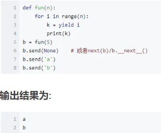

# python 的一些基础


## 正则表达式


1. match：是用来==判断==一字符串是否与正则表达式匹配，不匹配则返回none。

2. 模板pattern:

   1. 。：表示通配符
   2. *：表示0或多个
   3. +：表示1或多个
   4. ？：表示最少
   5. 

3. ```python
   import re	
   res=re.match(pattern,string,flags=0) #pattern是正则表达式，string是字符串，flags是标志位用于控制正则表达式的匹配方式
   print(res.group(1))#
   ```

4. search：扫描整个字符串并返回第一个成功匹配的

   ``` python
   res=re.search(pattern,string,flags=0)
   
   
   line = "Cats are smarter than dogs";
   searchObj = re.search( r'(.*) are (.*?) .*', line, re.M|re.I)#只有在括号（）中的表达式能够被捕获进入group列表中
   if searchObj:
      print "searchObj.group() : ", searchObj.group()
      print "searchObj.group(1) : ", searchObj.group(1)
      print "searchObj.group(2) : ", searchObj.group(2)
   else:
      print "Nothing found!!"
   ```

5. 字符串前面加r：表示该字符串是raw string，字符串内不进行转义（\t之类的）

6. sub：将字符串中与模板匹配的字符串替换为其他字符串

   ``` python
   re.sub(pattern,repl,string,count=0,flags=0)#count表示替换最大次数，=0表示替换所有
   ```

7. /r:表示回车  ,/n：表示换行， /t：表示制表符


## 一些基础细节

1. 列表list：就是其他语言中的数组，但其其中元素可以使任意类型，

   表达方式

   ``` python
   a=['china',1,True]
   a.append(i) 	#添加元素
   ```

2. 元组tuple：就是不能更改的列表

   ``` python
   a=('china',1,2)
   ```

3. yield：使用了yield的函数就不是普通函数，python解释器会将其视作一个generator，每当函数执行到 yield b语句，都会等价于return b，然后返回上一级函数，上一级函数再次调用此函数后，会从 yield b的下一句开始执行（相当于中断）

   ``` python
   def fab(max):
       n, a, b = 0, 0, 1
       while n < max:
           yield b
           # print b
           a, b = b, a + b
           n = n + 1
   for n in fab(5): #所以yield常用于被for当做迭代列表的函数 
   	print n
   ```

4. 使用yield的被当做生成器的函数也可以使用next（）手动逐个生成值（相当于，执行）

   ``` python
   >>> f = fab(5)  #fab()不再是一个函数，而是一个generator对象，所以可以				把值赋给f
   >>> f.next()  #生成器f调用next函数,相当于fab一直执行到yield b处，然后				输出b
   1
   >>> f.next()
   1
   >>> f.next()
   2
   ```

5. b.send（a）：当send=（none）时，send等价于next，其他情况下，是将a的值赋予生成器中（yield i） 这个函数的返回值，所以在下图中，b.send('a')，就是将‘a’赋予了 yield i，而k= yield i，所以k=‘a’，然后再一直执行到下一个yield i。

   

6. 字符串可以用+连接，但是其中所有元素必须是字符串，不能是整数，如果有整数，需要用str(3)进行转换

7. range（0,100）：左闭又开，从0到99。

8. 提取特征的方式（非循环）：

   ``` python
   # 其作用就是首先创建shan字段列，然后该列中的元素等于yuming列中的元素带入getshan()函数的返回值，最终转为# float类型就是该字段元素
   df['shan']=df['yuming'].map(lambda x:getshan(x)).astype(float)
   ```

   1. map(function,iterable,….)：function是一个函数，iterable是1个或多个序列。函数的作用是对于序列中的每一个元素，都代进function函数，然后map的返回结果就是function返回结果的序列。

      1. ``` python
         map(square, [1,2,3,4,5])   # 计算列表各个元素的平方
         # [1, 4, 9, 16, 25]
         ```

   2. 匿名函数：lambda x:getshan(x)。其作用是在某个场景需要使用一个函数，能直接写1个函数上去，且又不需要命名、定义它。

   3. df.astype()：将dataframe中的某一列中所有数据转为该数据类型（str、int、float）
   
9. 字符串连接：

   1. 加号 +
   2. 逗号 ，

10. 打印：print（）。注意：打印括号内的

11. with open('test.txt','r') as f : 使用with as用于打开文件，获得f的文件句柄


## 异步IO

1. 异步：当某一进程发生阻塞，需要等待IO操作的完成时，挂起该进程，然后切换到其他进程
2. 多线程：分为多个时间片，等时间片轮流执行各线程
3. 协程：看上去也是子程序，但执行过程中，在子程序内部可中断，然后转而执行其他代码块，在适当的时候再返回来接着执行。（简而言之，可==中断==的程序）（但是，协程无论如何中断，他始终只有一个线程，只不过是一个线程不同代码块（也就是子函数）的并行）
4. 协程的实现：通过使用yield生成generator，然后调用next、send，从而手动设置中断来达到并发
5. 协程函数：能够相互中断跳转执行的函数


## asynio 

1. 事件循环：是一个死循环，不断执行任务列表中可以执行的任务，任务完成后，将此任务剔除出任务列表（如果某个任务需要io请求，则此任务为不可执行任务）（当正在执行的任务阻塞时，事件循环就会在任务列表中寻找一个可执行任务然后执行）

   ``` python
   import asyncio
   #生成一个事件循环
   loop =asymcio.get_event_loop()
   #将任务放入任务列表中
   loop.runn_until_complete(任务)
   ```

2. 定义协程函数和协程对象

   ``` python
   #函数前面加了async就是一个协程函数
   async def func()
   	pass
   #协程函数后加了（）就是协程对象,注意，下一行中func没有执行，只是生成了一个协程对象
   result=func()
   ```

3. 协程==对象==可以作为任务添加到任务列表中

   ``` python
   loop =asymcio.get_event_loop()
   #协程对象加入任务列表中后就可以执行协程函数
   loop.runn_until_complete(result)
   
   #在python3.7中，不需要写以上2行代码，只需要如下一行
   asyncio.run(result)
   ```

4. await：await后面可以加  可等待==对象==（协程对象、Future、task对象），然后跳到这个对象对于的函数中==去执行==（所以就是生成了一个子函数，必须==等待==子函数执行完毕返回后，才会继续执行await后面的语句）

5. Task对象：

   ``` python
   #将协程函数func加入时间循环
   task1=asyncio.create_task(func())
   ```

   

   

