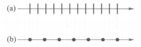
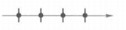

# 大物期末复习

目录：

- 11章 83
- 12章 105  
-  13章 131
- 14章 162
- 15章 187
- 17章 227

​			

## 第十一章 振动

1. x与t的关系：简谐运动的特征式：
2. v与t的关系（对上式求导得）：
3. a与t的关系：
4. w是角频率
5. a与x的关系：
6. 单摆的频率w:
7. 弹簧振子的总机械能：
8. 上式中的弹性势能$E_p=\frac{1}{2}kx^2$
9. 简谐振动合成（前提同方向同频率）(使用旋转矢量法易判断，令t=0)：
   1. 振幅A:
   2. 初相位：

***

## 第十二章 波动

1. 波函数的意义是在一维中，x轴上的质元随时间在y上的位置

2. 简谐波函数（2个变量，x和t，意义是对于某个x位置上的元在t时间时的位置）：（x为正时，表示x处的状态落后于o点状态$\frac{x}{u}$s,即等于0点$t-\frac{x}{u}$时的状态）

   （在表达式的基础上提出$\frac{1}{T}$）

   

   这个不含物理意义，但是表达式最简形式，引入了角波数k）

3. 角波数：$2\pi$空间内波的个数：，

4. 当波源不再原点在$x_0$，只需要先假设波源在原点，再用$x-x_0$代替x即可。方向和$x-x_0$前的符号有关，负号向X正传播，正号向x负传播

5. 位于振幅长度的点无方向（因为v=0）

6. 波线：与波前垂直，且指向波的传播方向的线

7. 光的衍射：波在传播路径上，绕过障碍物的边缘，进入障碍物的几何阴影区继续传播的现象。

8. 光的干涉：相同频率波的叠加

9. 振幅A：

10. 振动强度I：

11. 驻波：2列波，几乎一样，只是x前的符号不同。使得每个点的振幅不同，但有规律，振幅从0到最大再到0。振幅为0称为波节，振幅为最大称为波腹。（整个波不会向前传播）（驻波存在点即波节点是不能动的，而行波每个点都可以动）

    

12. 相邻两个波节之间的距离是$\frac{\lambda}{2}$

13. 相邻2个波节之间所有点是同相的，即同时达到最高点和最低点。

14. 一个波节两侧的点，相位差为$\pi$

15. 半波损失：当波从波疏介质入射到波密介质上，反射波与入射波存在$\pi$的相位差的突变

16. 反射光会和入射光干涉生成驻波，产生相位差，反射点是波节，没产生相位差，反射点是波腹。

17. 人的听觉范围：

18. 多普勒效应的情形

    1. 观察者不动，波源动：观察者收到波时的时间不变，但最终波长变了。（波源是分母，在下面）
    2. 波源不动，观察者动：观察者收到波的时间变了，但波长没变。
    3. 都变了

***

## 第十三章 光的干涉

1. 可见光波的波长：

2. 路程和相位的关系：

3. 光在不同介质中传播时，频率恒定不变，速度和波长会变

4. 不同介质中的速度和波长：（即光在真空中最快，波长最长）

5. 光程：光在介质中通过真实路径所需时间内，在真空中能传播的路程

6. 光路上2点的相位差，只与两点的光程差有关：（因为在不同介质中波长不同，通过转换可以得到与光程相关的式子）

7. 光传播到A点时的相位：（注意是==减号==）

8. 2列光波在同一点的相位差与光程差的区别：

9. 理想透镜不会对物像之间的所有光线带来附加的光程差（即光源向不同方向出发，经过透镜，汇聚为一点，这经过不同方向所有的路径时间相同、光程差都相同）

10. 双缝干涉

    1. 当2列波在同一点的相位差为$2k\pi$（k=0,1。。。），为加强点，是明文。==k=0的明文称为零级明文或中央明文==，其他称为第1、2、3级明文。

    2. 当2列波在同一点的相位差为$(2k-1)\pi$（k=0,1。。。），为减弱点，是暗文

       

11. 光程差与接收屏上距离的关系

12. 相邻明文距离与波长的关系：

13. 波长测法：$\lambda=\frac{d}{D}\Delta x$

14. 只有不按n1n2n3按顺序大于或小于时才会产生$\pi$的相位差，也即$\frac{\lambda}{2}$的光程差（原理是，从光疏射向光密的反射波有pi相位差的突变）。

15. 等倾干涉明暗换的条件：

16. 等倾干涉的光程差与入射角的关系：

17. 等倾干涉和等厚干涉。

    1. 等倾表示由2条反射波的光程差只与==入射角==有关：
    2. 等厚表示垂直射入劈尖产生的2条反射波的光程差只与此时的==厚度==有关：

18. 相邻亮条纹的厚度差：

19. 相邻亮纹在劈尖表面的距离：（$由18中\frac{\lambda}{2n}除以sin\theta而得$）

20. 牛顿环的明暗环半径（中间是暗的，是因为有半波损失）：

21. 将图逆时针旋转90度即可判断凹陷还是凸起

22. 计算凹陷或凸起的距离：

***

## 第十四章 光的衍射

1. 夫琅禾费衍射：光源和接收屏距离衍射屏的距离都是无限远，即衍射屏入射和出射的光均可视作平行光

2. 夫琅禾费光路图

3. 平行光经过衍射屏后的衍射光线包括任何方向，考虑一般性，研究与x轴夹角为$\theta$的衍射角。（相同衍射角的衍射光线通过透$L_2$汇聚于接收屏的同一点，所以屏幕上每一点都对应一个衍射角）

4. 波带法：从衍射屏间隙的上端点开始划分，以某一衍射角$\theta$，依次在间隙上做出点，使得相邻点以$\theta$衍射角发出的衍射光线的光程差为$\frac{\lambda}{2}$,即相位差为$\pi$.

5. 在4中，相邻2划分点之间称为波带，相邻波带对应点的相位差为$\pi$，所以波带的数量决定p的明暗，偶数为暗，奇数为明

6. 随着$\theta$的增加，波带数量增加，明纹的光强随之减小（因为明纹产生的原因就是偶数个波带相互低效，剩下最后一个波带作为明纹，而波带数量越多，抵消的光强度越大，剩下的$\frac{1}{n}$的波带光强度就越小）

7. 入射光垂直衍射屏时（衍射角$\theta$决定明暗）（暗纹即偶数个间距为半波长的波带，明纹为奇数个间距为半波长的波带）：

8. 中央明文的半宽度可以由上式估计所得（$\theta=\sin\theta$）（由此有说明缝宽a越小，中央明文角度宽越大，衍射效果越明显）（通过用$\sin\theta_1$乘以==焦距==可以获得在接收屏上的距离）

   

9. 当平行光斜射（与x轴夹角为$\alpha$）衍射屏时,光程差为（即只需要在原来的基础上加上$\sin\alpha$）

10. 无论是垂直射还是斜射，单缝在衍射屏上的==位置==都不会改变衍射条纹

11. 圆孔衍射中央斑的角度宽（D表示衍射屏上圆孔的直径）

12. 光栅：又叫做多缝衍射，即衍射屏上有多个小缝可以衍射，同一光束同时在多个缝上衍射产生的衍射光再进行干涉。

13. 光栅的透光宽度a,不透光宽度b，光栅周期d=a+b称为光栅常量

14. 相邻2个光栅上发出的光到p点的光程差是

15. ==光栅方程==：，此方程可以决定主极大位置

16. N个狭缝产生暗条纹的条件（所以2个主极大有N-1个暗纹）

17. 缺级：虽然光栅方程能确定主极大，但是由于单缝衍射规律，，存在一些$\theta$使得单缝衍射光为暗纹，多个暗纹相加还是暗纹，所以即使满足光栅方程，依然是暗纹，这种现象称之为缺级

18. 缺级方程：（k不能取0），称为k级主极大缺级，k级指多缝衍射

19. 对与多缝干涉，如果入射光以$\alpha$斜入，则相邻缝的光程差为

    

    

***

## 第十五章 光的偏振

1. 光的振动方向，即介质在空间中移动的方向。

2. 振动面：振动方向和传播方向确定的平面

3. 线偏振光：a表示振动面就是纸面，b表示振动面垂直纸面

   

   

4. 自然光：由于自然光在各个方向上的振动都是一样的，所以可以正交分解为，用任意2个相互垂直且等幅的振动来表示自然光，如

5. 部分偏振光：可以分解为2个振动方向垂直、振幅不等（一个最大一个最小）的线偏振，部分偏振光可以视作：自然光+线偏振光（强度不确定）（利用马吕斯计算部分偏振光时，可以分为自然光和线偏振光2部分分别计算，然后再相加）（因为部分偏振是可以看作2个正交的大小不同矢量，而自然光可以看作2个正交的大小相同矢量，线偏振光可以看作一个光线的矢量，所以部分偏振光可以分解得到线偏振和自然光）

6. 透振方向（偏振化方向）：自然光经过偏振片获得的线偏振光的振动方向

7. 马吕斯定律：是偏振化的强度关系公式，其中$\theta$表示入射线偏振光与出射线偏振光的之间的夹角

   

8. 对于自然光只用偏振片，旋转偏振片，光强不变，均为自然光强的一般

9. 对于部分偏振光，选择偏振片，没有消光现象，只有强弱变化

10. 布儒斯特定律：自然光折射时，当入射角为一定角度$i_b$时，其反射光线为线偏振光，振动方向垂直于纸面，其折射光线依然为偏振光，（但折射光线与反射光线垂直）（布儒斯特角$i_b$与折射角$r$互余），所以可以求出$i_b$

    

    
    
11. 光的偏振度：$P=\frac{I_p}{I_p+I_n}$(线偏振强占总强（线偏+自然）的比值)

***

## 第十七章 量子物理基础

1. h与能量的联系：$E=hv$（此处能量是指粒子内含能量，不是动能或势能即$mc^2$）
2. h与动量的联系：$p=\frac{h}{\lambda}$
3. 粒子本身能量：$E=mc^2$
4. h=$6.63*10^{-34}$
5. e=$1.6*10^{-19}$
6. $m_e=9.11*10^{-31}$
7. c=$3*10^8$
8. 截止电压$U_0$为逸出功对应的电压
9. 光电效应方程：$hv=\frac{1}{2}mv^2_m+A_0$($A_0$为溢出功)
10. 速度与频率的联系：$V=\lambda v$
11. 里德伯方程：$\sigma （即\frac{1}{\lambda}）=R(\frac{1}{m^2}-\frac{1}{n^2})$,其中$R=\frac{4}{B}$,当m=1，为莱曼系，m=2位巴尔默系，m=3为帕邢系。（$R=1.097*10^7m^{-1}$）
12. 能量高于基态的都称为激发态(基态为n=1层,为-13.6V，层数越高能量越高)(第二层n=2称为第一激发态)
13. 由电子轰击计算跃迁层数：$E=\frac{E_1}{n^2}-E_1$(在由层数利用里德伯方程计算出辐射光的波长)
14. 不确定原理：位置与动量：$\Delta X\Delta p \geq \frac{h_1}{2} $（其中$h_1=\frac{h}{2\pi}$）

