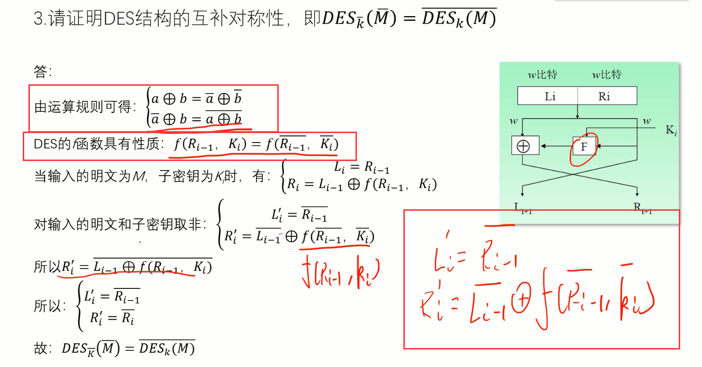
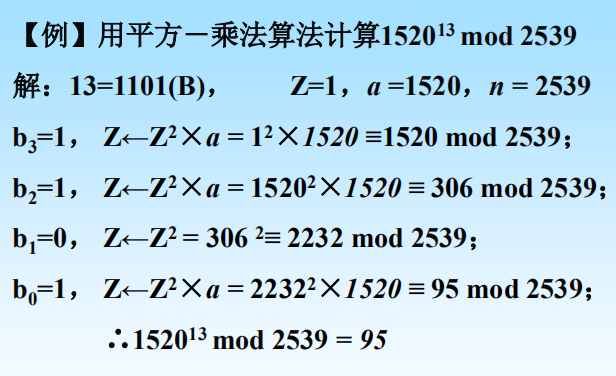
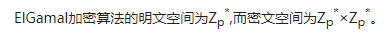
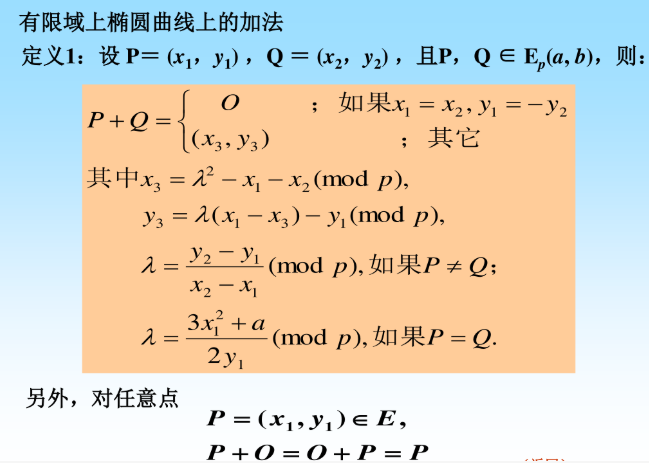
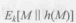
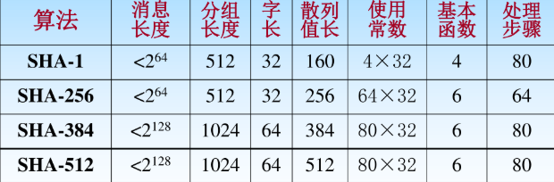
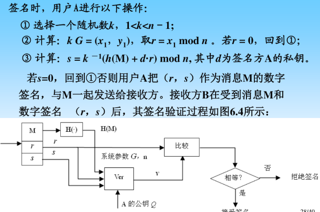
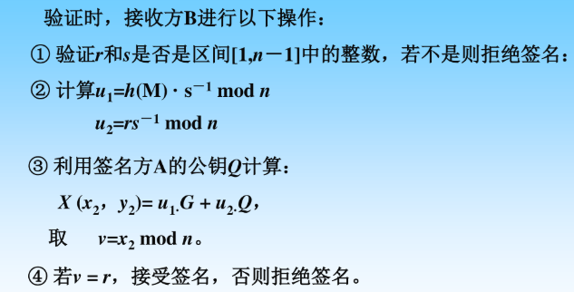
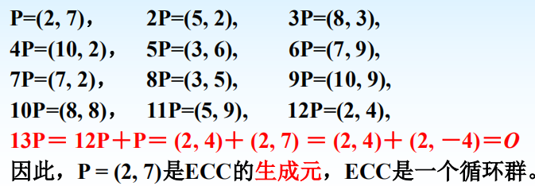
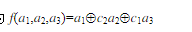

# 密码学期末复习

## 第一章 密码学概述

1. 密码学主要任务（重点）
   1. 机密性：确保信息不被泄露，即使泄露了未授权者也看不懂
   2. 完整性：确保信息没被动过
   3. 可鉴别性：（消息鉴别）确保信息来源的真实性、（身份鉴别）确保通信实体的真实性
   4. 抗抵赖性：要求无论发送方还是接收方都不能抵赖先前通信的行为及传输的内容
2. 明文：m ；密文：c；密钥k
3. 对于密码攻击者的假设：已知密码算法
4. 密码分析攻击类型：
   1. 惟密文攻击：攻击者已知算法和密文
   2. 已知明文攻击：已知一些明文-密文对。（推出算法）
   3. 选择明文攻击：可以通过选择明文，获得相应的密文。（用以推出算法或密钥）
   4. 选择密文攻击：可以选择一些密文，获得相应的明文（用以推出密钥）
5. 评估密码系统的三种方法：
   1. 无条件安全性（即==理论==不可破译）：假定攻击者拥有无限计算资源也无法破译。即攻击者不会从密文中获得任何有助于破解的信息，例如一次一密
   2. 计算安全性（==实际==不可破译）：使用目前最好的方法攻破密码系统所需要的计算==远远超过==攻击者的计算资源
   3. 可证明安全性：将密码系统的安全性归结于某个数学难题，数学难题被证明求解困难。
6. 密码安全性准则
   1. 计算量巨大，以至于实际难以实现
   2. 破解时间长，超过加密信息有用生命周期
   3. 破解代价高，超过了信息本身的价值
7. 对称密码体制：（是指加解密密钥相同（或可相互导出），而不是算法相同）
   1. 优点：加解密速度快、效率高、算法安全性高
   2. 缺点：密码分发复杂（安全）、密钥管理困难（数量）、难以数字签名、通信系统==开放性==差（需要可靠的密钥传递通道）
8. 非对称密码体制：
   1. 优点：密钥分发简单、密钥易于管理、系统==开发性==好、可以实现数字签名
   2. 缺点：加解密复杂、处理速度慢（一般不直接用于文件加密）、同等安全强度下非对称密钥位数多
9. 存在理论上安全的密码体制（一次一密？）
10. 

***

## 附录 数论基础

1. 辗转相除法：用于找到a、b的最大公因数

2. 模运算性质（2个式子之间的运算）：可加减、可相乘

   

3. 乘法逆元:

4. ==求乘法逆元==（使用扩展的欧几里得算法）：先用欧几里得算法算x和n，再使用逆过程计算，p、q使得xp+nq=1，然后p即x的逆元$x^{-1}$

5. 同余式有解的充要条件：

6. ==求解同余方程==：①判断是否有解②求$a^{-1}$③方程2边同时乘$a^{-1}$，即可求解x

7. ==求解同余方程组==（中国剩余定理）：①对于每个方程求$M_i$(模数积乘除以对应模数)②对每个$M_i$求逆元$M_i^{-1}$③其解为：

   

8. 有限域：（域内运算都要模阶数）

9. GF（2）内多项式的表达：

10. 有限域上加法（无进位）：

11. 有限域上乘法（最后需要除以一个不可约多项式）：

## 第二章 古典密码技术

> 掌握==HILL密码==的特性和计算方法

***

1. 替代密码：建立一种映射关系（替换表），使得对于每个明文字符，都有密文字符与其对应

   1. 单表替代，使用固定一个替换表

      1. 缺点：密文频率与明文频率相同

      2. 密钥短语密码（单字母代替密码）

      3. 位移密码

         1. 凯撒密码

      4. 仿射密码：是==线性==变换

         

   2. 多表替代：将明文分组，不同组加解密时使用不同替换表

      1. 维吉尼亚密码：将明文分为长度为n的组
      2. HILL密码：密钥是一个N*N的矩阵K，通过K*M的到密文C，解密乘以$K^{-1}$（==非线性==，对抗==惟密文攻击==强度较高）

2. 求逆矩阵$K^{-1}$:

3. 置换密码（换位密码）（是HILL密码的特例）：

   1. 周期置换：密钥$\pi$表示（上面1-n是明文排序，下面1-n是密文排序），所以需要把下面一行排位1-6的顺序
   2. 列置换密码
   
4. 大多数古典密码体制都不能很好隐藏明文消息的统计特征，因此安全性不高

5. 公钥密码体制不是绝对安全，而一次一密是不可破解的

6. HILL密码;

   1. 特点：
      1. 对抗==惟密文==攻击安全性高
      2. 密钥空间大
      3. 易受==明文攻击==及==选择明文==攻击
   2. 密文和明文都是列向量，C=K*M，其中K是密钥矩阵，解密只需要乘以逆矩阵

## 第三章 分组密码

***

1. 分组密码概述：将密文分为长度为m的组块，然后在密钥的加密下，每个块明文块变换为长度为n的密文组块。

2. 分组密码的要求：分组==足够==大、密码算法足够复杂、密钥空间足够大（是因为足够吗？）

3. 分组密码的设计原则：

   1. 扩散原则：明文中的每一位都都影响密文中尽可能多的位
   2. 混淆原则：是密文、明文、密钥之间的统计关系尽可能复杂

4. 乘积密码体制：S1*S2，即连续2次加密，先用s1加密，再用s2加密

5. 幂等密码：对于密码体制若$S^2=S$,则称为幂等密码，有如下。（幂等密码使用乘积不会使安全性增加）

6. 分组加密算法的2个==基本结构==

   1. SPN结构：

      1. S（substitution）盒用于替换（混淆，==非线性==变换），P（permutation）盒用于置换（扩散，线性变换）。
      2. 一次置换再一次替换构成一轮，重复多伦构成循环，即多个p、s盒串联组成乘积密码
      3. 与Feistel相比：==扩散更快==，但SPN加解密运算通常==不同==

   2. Feistel结构：

      1. Feistel基本单元：密文的左半等于明文的右半，密文的右半等于明文的右半在密钥加密后的密文与明文左半异或的结果

      2. 其中f函数用于产生扩散和混淆效果，（不要求是可逆函数）。$k_i$是由密钥K生成的子密钥

      3. Feistel特点：加解密运算==相同==，但扩散要慢一些，至少需要==2轮==才能改变输入的每一位。至少2轮实现完全性

      4. 主要特点：

         1. 输入为2w比特的分组
      2. 函数F用于产生扩散和混淆作用，不要求是可逆函数
         3. 分组大小越大，安全性越高
         4. 密钥大小越大，安全性越高
         5. 循环次数越多，安全性越高
         6. 子密钥产生的算法越复杂，安全性越高
         7. 函数F越复杂，安全性越高
         8. Ki为密钥K生成的子密钥
         9. 由n个基本结构单元构成，经过n轮循环后，再进行一次左右半分组交换
      
      5. 加解密相同：可以考虑只加密的1轮（因为可以用数学归纳法证明1轮可逆，所有轮都可逆）：明文的右半可以由密文的左半获得，明文的左半可以由密文右半与F函数值异或得到。（a异或a=0，b异或0等于b,即某个值连续2次异或同一个数，其值不改变)
      
         
      
         

7. DES加密

   1. 分组64位、密文64位、密钥64位（有效密钥56位、8位用于奇偶校验），16轮迭代

   2. 使用Feistel结构，解密算法和加密算法相同

   3. DES基本运算操作：置换、替换、异或、循环移位

   4. S盒变换：

   5. ==S盒==是DES中唯一的==非线性==变换

   6. DES算法的互补对称性（即如果明文、密钥、密文都取反则依然成立）：

   7. 注意此处的异或运算规则：==一方取非，整体取非==，两方取非，整体不变。还有f函数的性质，==输入、密钥都取反，结果不变==

      

   8. 

   9. 互不对称性证明：

   

8. 分组密码的操作方式

   1. DES加密算法是对64位明文进行加密的方法，而如何对一串长数据进行加密则需要分组密码==操作方式==
   2. ECB密码本模式：每个块分别加密，最后一块不足则用任意二进制序列补足
      1. 最简单
      2. 易于暴露明文的固有格式
   3. CBC密码块链接模式：①当前明文块与前一个密文块进行异或②DES加密①中的结果，得到的就是密文块（第一个明文块因为没有之前密文块，所以是与初始化向量进行异或）
      1. 有误码扩散，（密文在在==传输==过程中出错，并不是在加密、解密时出错），但又有==自同步==，$C_i$出错，只会影响解密结果$m_i和m_{i+1}$，因为只有在解密$m_i和m_{i+1}$时会使用$c_i$
      2. 同一明文块会产生不同密文块
   4. CFB密码反馈模式：①移位寄存器左移s位，将前一个密文块放入移位寄存器尾部中②对整个移位寄存器中的数据加密，选择前s位与明文异或获得密文块（对于第一密文块，移位寄存器中的是初始向量）
      1. 每次虽然加密还是64位（移位寄存器），但使用的明文块和密文块是s位（小于前面ECB和CBC的64位）
      2. 若密文块在传输过程中出错，会影响后面多个明文的解密结果
   5. OFB输出反馈模式：①将前一次寄存器加密结果区最左边t位②左移寄存器t位，将①中t位补到寄存器后③加密寄存器中数据，将加密结果与明文异或，结果做密文块
      1. 反馈流只和初始向量有关，与密文、明文无关
      2. ==没有误码扩散==
      3. 应用时应采取一次一密方式
      4. 同步？

9. 三重DES加密：由于DES算法是加密解密算法相同，所以可以先解密再加密获得明文

   1. 有4中模型EDE2(k1=k3),EEE2(k1=k3),EDE3(2个不同密钥)，EEE3（三个不同密钥）
   2. 为什么三重密钥中还有D解密呢：为了向下兼容普通的DES，只需要使k1=k2=k3,EDE就退化为一重DES(就可以不需要是用一重DES，所有加密都可以被三重DES替代，这就是向下兼容的意义)

10. IDEA：与DES不同点：

   1. IDEA==密钥128位==，明文、密文64位
   2. IDEA加解密自密钥不完全相同（但可相互导出）
   3. IDEA==不是==Feistel结构
   4. 三种运算：逐步异或、模65536加法，模65537乘法

11. RC5加密：

    1. 明文块32、64、128位，密钥从8-2040位

    

12. AES加密：

    1. 特点：①明文和密文是128位，密钥可变（128/192/256），是DES的2倍？②加解密使用==不同==算法，不是对合运算③结构是SP结构
    2. AES的加解密函数==不同==
    3. 字节替代：即==S盒变换==，是AES中唯一的==非线性==变换
    4. 行位移变换
    5. 列混合变换
    6. 轮密钥加法

13. SM4算法

    1. 明文、明文128位、密钥128位，和AES相似

14. X乘（用以计算多项式相乘）（此为基础需牢记==11011==）（以下所有的加法都是==异或==）

    

15. 用x乘计算多项式相乘（==8位*8位==）：A*B①考虑用二者之间复杂的数作为基数，==较简单的拆分==②基数单独乘以复杂式的每一项（用x乘计0算）③将结果相加得到最终结果

    

16. 模二加法其实等价于异或

17. 多项式（==32位*32位==也即4字节乘法）乘法：

    1. 
    2. 将8字节的数分为4个1字节数，然后排列成==如下矩阵==（记忆要点，a和b的第一个元素下标都是0）

    

    

18. 多项式乘法：

## 第四章 公钥密码体制

***

1. 公钥密钥和对称密码比较：

2. RSA算法：
   1. 流程：
      1. 选择2个大素数p、q（互异）,计算$\phi(n)$,和n=q*p，
      2. 公钥生成：==选择e==使得e与$\phi（n）$互质
      3. 私钥生成：计算==d==为e模$\phi（n）$的==逆元==，注意此处的模是$\phi（n）$
      4. 从而{e，n}为公钥，{d}为私钥
      5. 加解密的模数都是n
   2. 性质
      1. 加解密具有==可交换性==，即先解密再加密还是得到明文
      2. 在计算上，不能从公钥推出私钥（因为难以从n推出$\phi(n)$）
      3. 加解密算法的有效性，RSA密码的加解密运算是模幂运算
   
3. 不同用户使用的p、q==一个也不能==相同

4. 平方乘法加速RSA==加密和解密==计算：

   1. 流程之计算 $a^bmod n$  ：
      1. Z初始值是1
      2. 将b化为二进制形式，然后==从最高位开始==，对每一位$b_i$进行相应计算
      3. 如果$b_i$是1，则将$Z=Z^2*a$;如果$b_i$是0，则$Z=Z^2$
   2. 

5. 利用中国剩余定理加速RSA==解密==计算：

   1. 一般配合费马小定理使用,p是素数，且a不被p整除，则有：$a^{p-1}=1 mod p$
   2. 计算流程   $a^bmod n$：
      1. 将n质数因分解为$n_1,n_2...$,并根据模数的分解将计算式分解为多个同余方程组
      2. 对于每个同余方程上的大幂数，利用费马小定理，即$b_i=bmod(n_i-1)$,将幂数化简
      3. 然后将化简后的同余方程组，利用CRT中国剩余定理求解结果X
         1. 计算每个式子的$M_i$,在计算$M_i^{-1}$，满足$M_i*M_i^{-1}=1mod(n_i)$
         2. 最后结果就是$X=\Sigma(b_i*M_i*M_i^{-1}(mod n))$
   3. 

6. ELGamal算法
   1. ==接收方==的公私钥：
      1. 私钥生成：随机选一个整数$x_B$属于[2,p-2]作为私钥，
      2. 公钥生成：其公钥为$y_B=\alpha^{x_B}(modp)$
   2. 加密流程：
      1. 公共模和生成元：用户选取一个大素数p，$\alpha是Z_p$的一个生成元，p和$\alpha$是公开信息
      2. 私钥生成：选取一个==秘密随机数k==属于[2,p-2],
      3. 密文计算：计算$c_1=\alpha^{k}(modp),c_2=my_B^k(modp)$，其中$y_B是接受方公钥，m是明文$，然后将（$c_1,c_2$）作为密文传给接收方B
   3. 解密流程：
      1. 明文计算：$m=c_2(c_1^{x_B})^{-1}(modp),x_B为接收方私钥$（$(C_1^{x_B})^{-1}=(c_1^{p-1-x_B})$）(费马小定理，$a^{p-1}=1modp$)
   4. 综上：密钥都是随机数，公钥都是通过模幂运算得到。
   5. 特点：具有不确定性，因为使用了随机数k，所以加密相同明文（即使使用相同密钥）可能会产生不同的密文；
   6. ==密文空间大于明文空间==：
   7. 安全性和RSA一样是建立在：==大素数分解的困难性==上

7. 椭圆曲线ECC

   1. 公钥密码空间一般==大于==私钥密码空间

   2. 考虑计算代价时，主要关注算法的==加法==运算次数(主要是NP+MP)

   3. 椭圆曲线关于运算“+”构成了一个交换群

   4. P、Q、R三点位于同一条直线，其三者和为零点或无穷点

   5. 加法逆元：若P、S的x坐标相同，即P+S=0,P=-S（加法逆元x相同，y相反，因为椭圆曲线为关于x轴对称的函数）

   6. 椭圆曲线中的零点指无穷远点0，有P+(-P)=0,但是零点并不是（0,0）

   7. 椭圆曲线上的加法并不是简单的横坐标、纵坐标相加而是有如下规则：

      

   8. 

   9. 用椭圆曲线实现ELGamal密码体制

      1. 在椭圆曲线中，乘法替换了幂乘，加法代替了乘法，减法代替了求逆（解密中的-1次方成了负号）
      2. 基点P代替了生成元$\alpha$
      3. 明文和密文的形式是nP(即基点的整数倍)

8. 常见非对称密码技术：diffie-hellman,DSA

## 第五章 散列函数与消息鉴别

***

1. 散列函数基本性质

   1. 输入长度可变
   2. 输出长度固定
   3. 易于正向计算
   4. 抗原像攻击：逆向计算在计算上不可行
   5. 弱抗碰撞性（抗第二原像攻击性）：对于某一给定分组X，找到另一分组Y使得H(X)=H(Y)在计算上不可行
   6. 强抗碰撞性：寻找任何对（x,y），在计算上不可行

2. 散列函数的应用：

   1. 保证数据的完整性：保证文件未被修改（鉴别）
   2. 数字签名
   3. 单向数据加密

3. ==迭代型==散列函数的一般结构：

   

4. SHA-1：

   1. 输入最多$2^{64}-1$位，==输出160位==，分组单块为512位，每次循环80次
   2. 

5. 对散列函数的攻击，即使找到一对碰撞的消息，或者对于散列码，构造出某一明文使得散列码等于此特定散列码

6. 消息==鉴别==目的：（注：不包括数字签名特有的抗抵赖性）

   1. 真实性：确定报文由确认的发送方发送
   2. 完整性：确认报文内容没被篡改过
   3. 顺序性和时间性：确保报文的发送时间

7. 实现消息鉴别的方法：

   1. 基于==加密==技术的消息鉴别
   2. 基于==散列==函数的消息鉴别

8. 报文鉴别(==消息鉴别==)分类：

   1. 基于加密技术的消息鉴别：通过是使用密钥解密密文，从明文判断是否来自A。
      1. 对称密码：能提供机密性（只有A、B知道明文）、==鉴别==（是否由A发出，是否改变）、但是==不能提供数字签名==（无法提供==抗抵赖性==：接收方可以伪造消息、发送方可以抵赖消息的发送）
         1. 局限性：需要接收方有某种方法能够判定解密出来的明文是否==合法==（即规定合法的明文只能属于在可能位模式上的微小差异的一个小子集）
      2. 非对称密码：无法提供机密性（公钥所有人都知道，都能解密），能鉴别、数字签名。（可以再用B的公钥加密，从而实现机密性）
   2. 基于散列函数的消息鉴别：接收方通过使用含==保密密钥==的散列函数计算消息，所得结果与附带MAC（消息鉴别码）比较，从而判断小心是否完整、是否来自A
      1. 因为散列函数一般公开，所以要实现鉴别能力，还需要与==密钥==或==秘密信息==结合
      2. 用对称密码仅对散列码加密：（鉴别）
      3. 用对称密码加密消息及散列码：（鉴别、机密）
      4. 用公钥密码仅对散列码加密：（鉴别、数字签名）
      5. 公钥、对称结合即在4的基础上用对称密码加密整体：（鉴别、数字签名、机密性（由对称密码提供））
      6. 仅用散列算法（但需附带秘密信息S以提供鉴别）：
      7. 散列算法加对称密码：在6的基础上对整体使用对称加密：（机密、鉴别）

9. 对于SHA-256，输入为$2^{128}$时，至少存在一个碰撞的概率大于0.5

10. ==生日攻击问题==：如果散列码有$2^m$个可能输出，那么当输入个数为$2^{\frac{m}{2}}$时，存在一个碰撞的概率为0.5

11. SHA系列的比较:(主要关注散列值长)

    

12. 国密算法SM3：输入L为[1,$2^{64}$]，输出的散列码为==512==位

13. 对于一个安全的消息摘要，要找出2个不同消息，时期消息摘要值相等是==可能==的

14. 一个安全的散列函数，当输入的明文改变时，相应的报文摘要==不一定==改变

15. ==最后一步是异或明文==的散列函数容易破解（编写一个明文使得其散列码与给定散列码一样）：只需要随意编写前k-1个分组$m_1^‘,m_2^{‘} ...m_{k-1}{'}$，然后最后一个分组改为$m_k^{'}=h_{k-1}^{'}\bigoplus h_k$，即可使$h_k{'}=h_{k-1}^{'}\bigoplus h_{k-1}^{'}\bigoplus h_k=h_k$.这样可以就破坏了散列函数的弱抗碰撞性，所以不安全

## 第六章 数字签名技术

***

1. 数字签名实际上是一种鉴别机制，它可以使一个报文附加上一段起签名作用的代码。这个代码可以==证明==报文的来源和完整性

2. 数字签名的主要作用：将消息和拥有消息的实体可信地联系起来

3. 数字签名不能保证机密性

4. 数字签名的特性：（数字签名包括了鉴别，是鉴别的超集）

   1. 签名不可伪造
   2. 签名==不可抵赖==：签名者事后不能否认签名
   3. 签名是可信的：任何人可以验证签名的有效性
   4. 签名是不可复制
   5. 签名的消息是不可篡改：如果发现消息被篡改，任何人能发现消息和签名的不一致

5. 签名算法：$Sig_{sk}(M)$,验证算法：$Ver_{pk}(M,S)=true/false$

6. 数字签名的执行方式

   1. 直接方式：指签名执行过程中只有通信双方参与。

      1. 缺点：方案有效性依赖与密钥的安全性（可以声称私钥丢失或被盗）

   2. 具有仲裁的方式：指引入了第三方仲裁者A参与。通常发送方发信息到仲裁者，仲裁者对报文进行加工，然后发送给接收方

      1. 对称密码，仲裁者可见消息：发送方发送明文+加密的鉴别信息给仲裁者，仲裁方附加信息（时间戳）后再加密给接收方。

         1. （1）式可以鉴别发送方S，所以在（2）中依然需要附带完整的（1），因为如果发生抵赖纠纷，接收方R可以将信息（2）发给仲裁者进行仲裁，仲裁者根据（2）中的（1）可以证明确实是发送方S发的（因为（1）式中包含了S和A之间对称密钥加密信息，只有S和A拥有此密钥）

            

      2. 对称密码，仲裁者不可见：在1的基础上，发送方对明文进行了SR之间的加密再发给仲裁方，仲裁方加上时间戳再加密发给接收方

      3. 公钥加密，仲裁者不可见：发送方先用自己私钥加密明文（对接收方提供鉴别），再用接收方公钥加密（提供机密），最后加上id用自己私钥加密整体（对仲裁者提供鉴别）。仲裁者提取出除对仲裁者的鉴别部分，加上时间戳再用仲裁者私钥加密发给接收方
      
      4. 综上，A主要的作用是将发送方S发送的信息，提取有效部分，再加上时间戳，最后将整体用AR之间独有的密钥加密再发送给接收方

7. RSA数字签名方案：发送方用私钥进行签名，接收方用公钥验证。（有效性来自于只有确定的用户才能拥有私钥）

8. ELGamal数字签名方案：

   1. ELGamal中，如果攻击者取得k相同的两个数字签名，就能计算出数字签名的私钥
   2. 签名流程：
      1. 私钥公钥生成：随机选定一个整数d作为私钥，e=$\alpha ^{d}modp$作为公钥
      2. 签名:选择一个==随机数==k，k与p-1互素，$r=\alpha^{k}modp$,$s=(h(m)-d*r)*k^{-1}mod(p-1)$,将（r,s）作为签名发给接收方（注意：此处s的计算模式==p-1==）
   3. 验证流程：
      1. 计算$e^r*r^smodp$和$\alpha^{h(m)}modp$，如果二者相等则验证成功

   

   

9. ECDSA数字签名算法：

   1. 54
   2. 
   3. 
   4. 

10. DSS中采用的签名算法叫做DSA，数字签名DSA中采用的散列函数是SHA-1

11. DSA与RSA相比，不能实现加密机制

12. 盲数字签名的特点

    1. 消息内容对签名者不可见
    2. 签名被接受者公开后，签名者不能追踪签名（不知道是不是自己签的？）

13. 签名不需要==保密==（签名不能提供机密性）

14. 大多数数字签名算法的签名算法和验证算法==不同==

15. 不能说ELGamal签名算法比RSA数字签名算法安全性更高（二者不可比较）

16. 伪造一个报文的数字签名在理论上是==可行==的（但在计算上是不可行的）

17. 

## 第七章 密钥管理技术

***

1. 密钥的层次结构
   1. 初级密钥：用于加解密数据的密钥，是底层密钥
   2. 密钥加密密钥：也称二级密钥，用于保护初级密钥
   3. 主密钥：最高级密钥，用于保护密钥加密密钥
2. 密钥的生命周期：密钥的生成、储存和备份、终止和销毁
3. 密钥管理包括：密钥的产生、分配、储存、更换
4. 密钥的分配和更换过程对于用户时==透明==的。（并不是用户==知道==密钥的分配和更换过程）
5. 密钥分发和密钥协商。目的：都是用以在通信双方之间建立所使用密钥的安全协议，在这种协议或机制运行结束时，双方都将安全获得相同的密钥。
6. 密钥分配：通信的一方，生成并选择秘密密钥，然后将其==安全地==传送给通信的相关各方
7. 密钥协商：通常是一种协议，通信双方可以在公开的信道上通过==传输一些信息==，然后能安全创建一个共享密钥。典型协议：Diffie-Hellamn密钥交换协议
8. 好的密钥具有良好的随机性和密码特性，而不是使用==伪==随机发生器
9. 证书各字段意义：
10. 公钥数字证书：公钥证书是一种包含持证==主体标识==、==持证主体公钥==等信息，并由可信任的 CA 签署的信息集合。主要用于确保公钥及其与用户绑定关系的安全；
11. 基本内容：用户的名称，用户的公钥，证书的有效日期以及CA的签名等；
12. 验证数字证书合法性：使用签证机构CA的公钥验证
13. 验证证书持有人的的真实性：验证数字证书后，使用数字证书上的公钥加密信息来约人证书持有人的有效性和真实性
14. Diffie-Hellamn的密钥协商协议
    1. 选择一个大素数p,a是模p的一个本原元，为公开信息
    2. 用户A选择一个随机数$r_A$，属于[1,p-2],计算$s_A=a^{r_A}(modp)$；用户B选择一个随机数$r_B$，属于[1,p-2],计算$s_B=a^{r_B}(modp)$，然后相互发送$s_A和s_B$
    3. 用户A可以计算出密钥为$K=s_B^{r_A}(modp)$，用户B计算K=$K=s_A^{r_B}(modp)$
15. Diffie-Hellman算法的安全性依赖于：有限域上计算==离散对数==的困难性
16. Diffie-Hellman的局限：Diffie-Hellman协议没有提供身份鉴别，易受一个主动攻击者进行中间人入侵攻击。因此在实际使用DH协议时，必须引入某种鉴别机制，以使通信双方能够相互确认对方的身份，从而有效防止中间人攻击。
17. Shamir秘密分割门限方案：
    1. 是完善的门限方案
    2. 易于扩充新用户
    3. 安全性不依赖于未经证明的假设
    4. 秘密分发者知道参与者个数
    5. 不能防止秘密分发者和参与者的欺诈
    6. 门限值固定
18. 公钥数字证书包括的不是==证书持有人==的数字签名，是证书发行机构对证书信息的数字签名。（所有的私钥都是CA的，证书持有人没有私钥）
19. 数字证书的有效性和真实性==不能==验证证书持有人的真实

## 第八章 身份鉴别技术

***

1. 身份鉴别目的：使验证者获得对声称者所声称事实的信任

2. 身份鉴别要求：①A能向B证明自己是A②当A向B证明了自己身份后,B无法冒充A

3. 身份鉴别的基本方法：

   1. 所知
   2. 所有
   3. 唯一特征

4. 用数字证书实现身份鉴别的基本方法包括：“三趟消息”机制、数字签名机制、质询-响应机制。（不包括口令鉴别机制）

5. 保证消息实时性的基本方法

   1. 时间戳：要求不同参与者之间的时钟需要同步
   2. 质询/响应方式：A发给B一个随机质询值，要求从B收到一个消息包括正确的质询值函数

6. 身份鉴别的基本过程：注册、登录、鉴别、口令修改、注销（选）

7. 基于时间同步的动态口令：需要服务器与客户端的时钟同步（$f(PW_A||x)$表示口令加盐后的哈希值）

   

8. 基于质询\应答的动态口令：服务器需要向客户端发送一个随机数r用于质询，然后需要客户端发送

9. S-KEY方案

10. Kerberos系统

   1. 基于==对称密码==体制
   2. 票据：即身份证明，表明了发送方身份、发送方ad、目标
   3. 
   4. 

11. 身份鉴别系统不要求实现双向鉴别

12. PAP（静态口令鉴别机制）

13. 数字证书+“三趟消息”实现身份鉴别的核心是通过双方信息的交互,验证对方是否拥有对应的==私钥==。

1. kerberos只使用对称密码
2. PGP使用多种密码
3. 基于公钥保护的口令密钥不属于PGP密钥
4. PGP采用了非常严谨的密钥管理机制，而非非常安全
5. PGP中加密是用对称密钥，不能用接收方公钥（其一般只用作验证签名）

