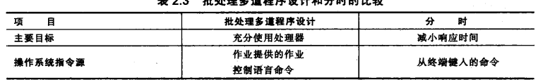
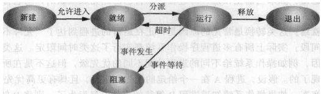
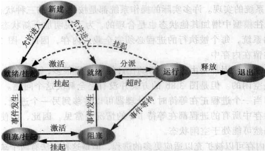
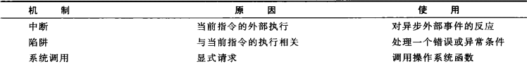
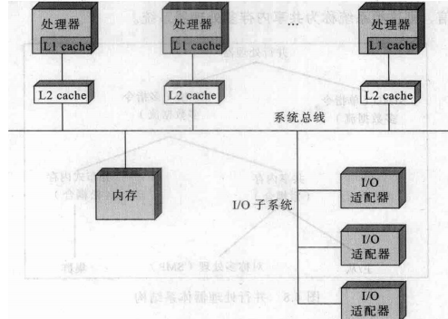
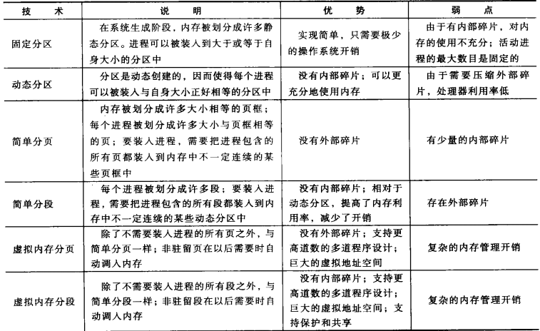
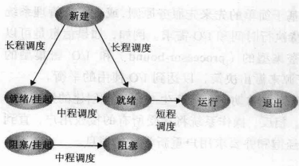

# 操作系统期末复习

## 第一章 计算机系统概述

1. cpu的态（mode）：cpu在不同态下，能使用的资源不同
   1. 核态（kernel mode）:能使用所有资源，执行所有指令，用于管理程序/os内核
   2. 用户态（user mode）：使用一部分资源，用户用户程序
   3. 管态：介于核态和用户态之间
   4. 用户态转向核态：①用户请求os服务②发生==中断==③用户进程发生错误④用户态企图执行特权指令
   5. 核态向用户态转换：中断返回IRET
2. 中断机制：CPU对于突发的外部事件的反应过程或机制。CPU收到中断信号，停止当前工作，转而区处理外部事件，处理完毕后回到工作的中断处继续原来的工作
   1. 目的：①实现并发活动②实现实时处理③故障自动处理
   2. 产生的原因：程序中断、时钟中断、io中断、硬件故障中断
   3. 为了适应中断产生的情况，指令在执行后，会检查是否出现中断信号，出现则挂起当前程序并执行一个中断处理程序
   4. 中断处理流程：
      1. 设备发出中断请求
      2. CPU结束当前指令的执行，并响应中断
      3. CPU对中断进行测定
      4. 为执行中断程序做准备（将PSW和PC压入栈中）
      5. 将中断处理程序地址放入PC中
      6. 寄存器中内容也被压入栈中
      7. 执行中断处理程序
      8. 从栈中释放寄存器内容
      9. 再回复PSW和PC指
3. 局部性原理：在执行程序期间，CPU的指令和数据访问存储呈现“簇”状，因为典型程序包含许多迭代循环和子程序，容易重复访问一个小范围的指令集合。经过长时间，访问’簇‘会改变，但短时间内，CPU主要访问固定的‘簇’
4. 空间局部性：存储器的一个位置被引用，那么将来他附近的位置也会被引用
5. 时间局部性：被引用郭一次的存储器位置在未来会被多次引用

***

## 第二章 操作系统概述

1. 操作系统是控制应用程序执行的程序，充当应用程序和计算机硬件之间的接口。

2. os的目标：①方便，使计算机更易使用②有效，使得能更高效使用计算机系统资源③扩展能力，os应当允许在不影响原有服务的情况下，能有效开发、测试和引进新的系统功能

3. os的功能：①程序开发②程序运行③io设备访问③文件控制④系统访问⑤错误检测和相应记账

4. os与一般程序的区别在于执行的意图。os是控制处理器使用其他系统资源，并控制其他程序的执行实际。

5. 串行处理:早期计算器操作模式，只能按顺序访问计算机

6.  简单批处理系统：将多个作业组成一批，一起放在输入设备上，供==监控程序==使用。即在监控程序的帮助下，多个作业按==顺序==与监控程序交替执行

7. 简单批处理系统出现的原因：①调度，以前用户登记时间，规定一个用户用多久就用多久，无论是否提前完成，或未完成，所以会产生浪费。②准备时间，单个作业在运行前，需要先加载源程序和编译器，再将生产的目标程序链接，每一步都需要安装或拆卸磁带，如果发生错误，将重新来过。所以单个程序运行前的准备时间太长。

8. 简单批处理操作系统的功能：

   1. 内存保护，保护监控程序的内存区域不被改变
   2. 定时器，避免CPU被独占，时间一到就切换
   3. 特权指令，特权实例势能有监控程序执行
   4. 中断

9. I/O操作与CPU的关系：I/O程序再执行开始或结束时（IO开始需要CPU制定IO类型、设备和通道，结束时需要CPU响应中断信号），需要CPU做一点处理，但在执行I/O程序时，不需要CPU干预。所以，可以在I/O程序执行时，CPU运行其他程序，以提高CPU利用率

10. 多道程序设计（多任务处理）：当一个作业需要等待I/O执行时，CPU可以切换到另一个不再等待IO的作业。

11. 多道程序设计批处理系统出现的原因：因为IO设备相对于CPU速度太慢，所以通过对等待中的作业切换到另一个作业的方式提高CP利用率

12. 多道批处理还是批处理，只不过一次性输入多个作业的执行速度提高了！

13. 分时系统：多个用户可以同时通过终端访问系统，但操作系统控制每个用户程序已很短的时间为单位交替执行。所以看起来是多个程序一起执行，其实是在以一小段时间为单位下，多个程序交替执行。

14. 分式系统出现的原因：为多作业提供一种模式，使用户可以直接与计算机进行==交互==。

15. ==要求==由于分时系统运行多用户进行同时交互，所以要求系统能够快速对用户请求信息产生相应

16. 分时系统带来的问题：内存管理，记录存取，资源竞争

17. 多道批处理和分时系统的差异

    

***

## 第三章 进程

1. 进程的定义：进程时一个具有独立功能的==程序==关于某个数据集合的一次==运行活动==。是系统进行资源分配和调度的独立单位

2. 进程控制块PCB：唯一表征了一个进程，包括：

   1. 标识符id
   2. 状态，运行态阻塞态等
   3. 优先级
   4. 程序计数器pc值，下一条要执行指令的地址
   5. 内存指针，包括代码、数据的指针
   6. 上下文数据，执行时寄存器中的数据
   7. I/O状态信息，
   8. 记账信息，可能包括处理机时间总和、时钟数总和、时间限制、计账号

3. 进程是由程序低吗和相关数据还有进程控制块组成

4. 进程的五状态模型：新建、就绪、阻塞、运行、退出

   

   1. 运行态：程序正在运行
   2. 就绪态：进程做好准备（有充分资源），当执行队列轮到自己是即可转为运行态（就绪态也可直接转为退出态，例如父进程终结，子进程也随之终结）
   3. 阻塞/等待态：进程在前置事件发生前不能执行，如I/O操作完成。(阻塞态必须有运行态转化而来，同样的，阻塞态要想转化为运行态必须经过就绪态)（同时阻塞态也可直接进入退出态，如子进程）
   4. 新建态：刚刚创建的进程，还未加入可执行进程组，即还==未加载到内存==的新进程
   5. 退出态：被os从可执行进程组中释放的过程，因为自身结束，或因某种原因被取消了

5. 大型操作系统中，拥有多个阻塞队列（每一个队列对应一个事件），当一个事件发生时，对应的队列中全部的进程都转为就绪态

6. 交换的需求：由于CPU运算比I/O操作快得多，以致于==所有进程==都等待I/O的情况常见，同样导致了CPU的空闲。所以当内存中没有就绪态进程时，OS会把被阻塞的进程踢出内存，放到磁盘的挂起队列。之后OS可能将队列中一个进程放入内存，或者接受一个新进程的请求

7. 进程的七状态模型：新建、就绪、运行、阻塞、阻塞挂起（退出内存，且所需事件未发生）、就绪挂起（退出内存，但所需事件已发生）、退出

   

   1. 阻塞态->阻塞/挂起：当没有就绪进程时，至少一个阻塞进程被换出，为另一个没有阻塞的进程让出空间
   2. 就绪->就绪/挂起：①如果释放内存的唯一方式是挂起就绪态②os确信高优先级的阻塞态进程很快就会就绪
   3. 新建->就绪/挂起：①当没有足够内存空间分配给新进程时②尽可能推迟创建进程以减少OS的开销
   4. 运行->就绪/挂起：当阻塞/挂起队列中一个较高优先级的进程变得不再阻塞，则会抢占一个就绪队列的位置，使得优先级较低的转移到就绪/挂起队列
   5. 各种状态->退出态：父进程终止时，处于任何状态的子进程都将转换到退出态

8. 进程控制块信息分为三类：进程标识信息、处理器状态信息、进程控制信息

9. 使用2种模式（用户态、内核态）的原因：保护os和重要的os表（如PCB）不受用户程序的干涉

10. 新进程的创建：

    1. 分配一个唯一进程标识符，pid
    2. 分配空间。给程序和数据空间
    3. 初始化PCB。进程标识符部分：包括id、其他相关id。处理器状态信息：大部分为0，PC、栈指针。进程控制信息：基于标准默认值和请求的属性
    4. 设置正确的链接
    5. 创建和扩充其他数据结构

11. 进程切换

    1. 进程切换（OS获得CPU控制权）的时机：中断、陷阱、系统调用

       

    2. 中断：包括①时钟中断：进程执行时间超过时间片②IO中断：发生IO请求③内存失效：所需资源不再内存中，需要先调入内存中

    3. 陷阱：os需要确定发生的错误或异常是否致命

    4. 系统调用：正在执行的程序调用os的函数

12. 上下文环境:所有中断处理可能改变的信息和恢复被中断程序是所需要的信息

13. 模式切换和进程切换的不同：

    1. 进程切换：一个运行态的进程被中断，使得另一个进程进入运行态。（实质是被中断进程和待切换进程的上下文切换，过程是：保留被中断进程的上下文，转向进程调度，恢复被中断进程的上下文）
    2. 模式切换：用户态与内核态之间的转换（进程切换在内核态下完成）
    3. 模式切换可以不改变进程状态（也包括不发生进程切换）
    4. 进程切换一定会发生模式切换
    5. 二者区别：进程切换包含模式切换，代价更好，还要保存进程上下文、进程调度、恢复上下文

***

## 第四章 线程、对称多处理（SMP）和微内核

1. 执行/调度的单位是线程。资源分配的单位是进程

2. 线程：进程中能够被调度的最小单位

3. 进程和线程：

   1. 相同点：①都有ID、一组寄存器、状态、优先级、②都有一个控制块③线程和子进程都共享父进程中的资源，并独立于父进程竞争使用处理器资源
   2. 不同点：①线程是进程的一部分②启动一个线程的时间远小于启动一个进程，且线程间切换也小于进程间切换③系统会为进程分配资源，但不会为线程分配。④进程时资源分配的最小单位，线程是执行调度的最小单位

4. 多线程：单个进程内部支持多个并发执行路径的能力。

5. 多道程序设计使得多个进程并发，多线程使得单个进程中多个线程并发处理（同一时间，CPU只能执行一个线程）。

6. 引入线程的原因：提高并发度,为什么能提高参考8

7. 在多线程环境中，每个线程都有一个独立的栈，还有独立的控制块用于包含寄存器值、优先级和其他与进程相关的状态信息

8. 线程的优势：①新建一个线程比新建一个进程块②终结一个线程比终结一个进程快③线程间切换比进程间切换快④线程间通信比进程间通信快

9. 线程的状态：就绪态、阻塞态、运行态

10. 线程的实现可以分为用户级线程和内核级线程

11. 用户级线程：所有线程管理的工作都由应用程序使用==线程库==（一组共应用程序使用的函数）完成，内部意识不到线程的存在。

    1. 优点：
       1. 线程切换不需要内核态特权，节约了2次状态切换
       2. 调度是应用程序相关的。可以为应用程序量身定做调度算法而不影响底层的调度程序
       3. 用户级线程可以在任何操作系统同中运行，而不需要底层内核支持多线程
    2. 缺点：
       1. 线程的系统调用会引起整个进程的阻塞
       2. 一个多线程应用程序不能使用多处理技术。内核只能把一个进程分配给一个CPU，所以一个进程中只有一个线程能够同时执行

12. 内核级线程：所有线程管理由内核完成

    1. 优点：
       1. 内核可以同时把一个进程中的多个线程（最小调度单位）调度给多个CPU，同时并发处理
       2. 进程中的一个线程被阻塞，整个进程未被阻塞，同一进程内其他线程依然能执行
       3. 内核历程自身也能多线程
    2. 缺点：
       1. 线程切换时需要2次内核状态切换

13. 组合方法：就是在用户级线程的基础上，使得多个用户级线程映射到一些（小于或等于用户级线程的数量）内核级线程上

14. SMP体系：通过使用多个处理器，每个处理器都有自己的控制单元、算数逻辑单元、寄存器，每个处理器通过某种形式的互连机制访问一个==共享内存==和==IO设备==。使用MIMD，共享内存（紧耦合）

    1. SIMD单指令多数据流：同一条指令，在不同CPU、不同数据集合的情况下执行（向量和阵列都属于这一类）

    2. MIMD多指令多数据流：多个处理器，在不同数据集下执行不同指令序列

    3. SMP有多个相同处理器，每个处理器都可以通过某种方式的（共享总线）互连机制访问一个共享内存和I/0设备

       

15. 微内核：是一个小型操作系统核心（只包括最基本的os功能），它为模块化扩展提供基础

    1. 优点：一致接口、可扩展性、灵活性、可移植性、可靠性、分布式系统支持、对面向对象操作系统的支持
    2. 缺点:性能问题（需要通过微内核构造和发送信息、接受应答并解码）
    3. 解决方式：增加微内核、减小微内核

16. 宏内核：包括了操作系统的全部功能 

***

## 第五章 同步和互斥

1. 并发（**Concurrent**）：单个CPU在一小时间段内多个进程交替运行

2. 并行**（Parallel）**：多个处理器同时处理不同进程

3. 临界区：一段将访问共享资源的==代码==，一个进程执行临界区时，其他进程不能执行此代码

4. 原子操作：一个或多个指令的序列，对外不分

5. 死锁：2个或2个以上进程因为每个进程都在等他其他进程释放资源而都不能继续执行

6. 活锁：2个或2个以上进程为了响应其他进程的变化而不断改变变化，但不做有用工作

7. 互斥：当一个进程访问临界区资源时，其他进程不能访问，这种情形称为互斥

8. 竞争条件：多个线程或进程读写同一共享数据（临界区）时，结果依赖于他们执行的顺序

9. 饥饿：一个可继续执行的程序，因为调度器的忽视而一直不能执行

10. 互斥：

    1. 软件方法：
       1. 优点：用户态实现更灵活
       2. 缺点：对程序员要求高
    2. 硬件方法：
       1. 中断禁用：在单处理器机器中，并发进程不能重叠只能交替。缺点：执行效率低、不能用户多处理器系统
       2. 专用机器指令：一些机器指令用于保证2个动作的原子性。
          1. 优点：非常简单易于证明、使用单处理器或共享内存的多处理器上的任何数目的进程、可用于支持多个临界区
          2. 缺点：使用了忙等待（一个进程等待进入临界区依然要消耗CPU时间）、可能饥饿、可能死锁

11. 信号量：用于进程间传递信号的整数值。

12. 二元信号量：只取0或1的信号量

13. 互斥量：一种二元信号量，但为其加锁（设置为0）的进程和解锁（设置为1）的进程必须为同一进程

14. 信号量可以通过初始化、wait（减一）、signal（加1），wait执行后的信号量为负数时进程阻塞

15. 实现互斥的三种方法：信号量、管程、消息传递

16. 强信号量：规定进程阻塞队列是先进先出的的信号量

17. 弱信号量：没有规定进程从队列移出的顺序的信号量

18. 一个函数中的临界区应包括与临界资源相关的全部操作

19. 并发带来的问题

    1. os必须记住每个活跃进程
    2. os必须为每个活跃进程分配和释放各种资源
    3. os必须保护每个进程的数据和物理资源
    4. 一个进程的功能和输出结果必须与执行无关

20. PV操作解决（不同进程间）互斥问题：

    1. 临界区前面用p（），临界区后面用v（）
    2. 使用pv不能过小也不能过大，pv临界区不包括同步的pv指令

21. pv操作解决同步问题（即其他进程的部分的执行是其他进程部分执行的前提）：

    1. 在前置操作（前提）后执行v（）
    2. 在后置操作前执行p（）

22. 读者编者问题：①不允许通过编者同时操作②不允许编者和读者同时操作③运行多个读者同时读

    ​	解决方法：①编者编操作上下使用pv

    ​					②读者上下和编者使用同一个pv

    ​				③为实现在读者已经存在一对pv的情况下使多个读者能够同时读，需要引入一个变量ReaderCount,使得只对第一个读者执行p，只对最后一个读者执行v，从而实现读者与编者间的互斥，同时满足读者间的共享！，并且由于多个读者同时使用readercount，因而readercount是临界资源，相关操作需要被另一对pv保护。

23. 在互斥问题中，对于一个操作，通常要分成2步，第一步从共享区中取或放物品，第二步对物品进行操作

***

## 第六章 并发：死锁和饥饿

1. 死锁：当一组进程中的每一个进程都在等待某个事件，而只有在这组进程中的其他被阻塞的进程才可以触发该事件，则称这组进程发生死锁
2. 死锁的条件
   1. 三个必要条件
      1. 互斥，其他进程不能访问已分配的资源
      2. 占有且等待，当一个进程等待时，继续占有已分配的资源
      3. 不可抢占，不可强行抢占其他进程的资源
   2. 四个充要条件
      1. （循环等待）存在一个封闭的进程链
3. 死锁的解决方案
   1. 预防（通过防止4个充要条件中某一个的发送）
      1. 互斥。不可能
      2. 占有且等待。要以要求进程一次性请求全部资源，并阻塞直到所有条件都满足。十分低效的
      3. 不可抢占。只有在资源状态很容易保存和恢复的情况下，才实用
      4. 循环等待。可以通过定义资源类型的线性顺序来预防。例如拥有序列号i资源的进程只能请求序列号大于i的资源。同样低效
   2. 避免。通过明智的选择，使得永远不会达到死锁点
      1. 进程启动拒绝。如果一个进程请求会导致死锁，则不启动此进程。只有所有当前进程的最大请求量加上新进程的需求都能被满足时才启动。
      2. 银行家算法。当进程请求一组资源时，假设同意该请求，然后判断系统是否处于==安全状态==（存在一条路径使得能完成所有进程），如果是同意，否则不同意。
   3. 检测
      1. 周期性地调用以测定死锁
      2. 死锁检测算法：与银行家算法类似。首先标记（即不考虑）未占用资源的程序，然后找到Q需求全部小于A向量（现存资源）的进程，然后将此进程资源全部加给A，继续遍历寻找。最后结果如果不存在除了被标记的进程，而不会被死锁
   4. 死锁与饥饿：死锁进程处于等待状态，忙式等待的进程并非处于等待状态, 但却可能被饿死;
      死锁进程等待永远不会释放的资源, 饿死进程等待可能被释放,但却不会分给自己的资源,其等待时间没有上界;
      死锁一定发生了循环等待,饿死不然;
      死锁至少涉及两个进程, 饿死进程可能只有一个.
   5. 哲学家就餐：plana：只允许4位哲学家同时就餐
   6. 死锁的恢复：
      1. 取消所有死锁进程
      2. 连续取消死锁进程知道不再存在死锁
      3. 连续抢占资源直到不再存在死锁
      4. 把每个死锁进程回滚到前面定义的某些检查点，并重新启动所有进程

***

## 第七章 内存管理

1. 重定位：为了避免程序换入到内存的位置和被换出程序的位置相同，需要将进程重定位到内存的不同区域

2. 内存管理技术（即如何将磁盘的程序载入内存交于CPU执行）

   

3. 分页：即内存被分为多个大小相同的页框，程序被分为多个页，载入内存，即将程序以页为单位放入页框

4. 分段：程序被分为段（例如程序段、数据段、堆栈等），可以不连续地载入内存。（然后通过段基址+偏移量定位）

5. 对于动态分区（连续分配），会产生外部碎片，使得内存浪费，所以需要压缩，但压缩十分费时，因此考虑如何巧妙的将进程分配到内存中。所以就有放置算法

   1. 最佳适配（性能最差）：选择与要求大小最接近的块（块要大于程序）
   2. 首次适配（最简单、最好、最快）：从头开始扫描空闲块，选择大小足够的第一块
   3. 下次适配：从上一次放置的位置开始扫描，选择下一个大小足够的空闲块

6. 伙伴系统：整个内存为$2^U$字，设一个程序为s字，将该程序放到一个$2^k$的块中，其中k满足$2^{k-1}<s<2^{k}$（这样的块课=可通过将整个内存不断半分获得）。然后当程序移出时，如果相同大小的相邻块也空闲则合。

7. 分页与固定分区的区别，块相对较小，一个程序可以占用多个分区，并且分区不要连续

8. 进程载入内存页框可以不连续。但需要一个==页表==，上面记录了该进程的每一页对应页框的位置。每个逻辑地址包括一个页号（不是基址因为可能不连续）和在该页上的偏移量

9. 分段与动态分区的区别：分段方案中，一个程序可以占多个分区（即程序载入内存可以不连续）

10. 段表：每个进程都有一个段表，其中，每个段表项必须给出相应段在内存中的其实位置和段的长度。

11. 覆盖overlay：将内存分为常驻区和覆盖区，常驻区是被某段单独且固定地占用，可分为多个，覆盖区能被多段共用（即使用完再被其他段覆盖使用）。

    1. 缺点：编程复杂，程序员难以划分程序模块并确定覆盖关系
    2. 执行时间长：需要从外存装入内存

***

## 第八章 虚拟内存

1. 虚拟内存管理的思想：进程运行时，只把当前必要的一部分代码和数据装入内存，其余程序保留在磁盘中，需要时再装。不再运行的代码和数据也要及时从内存中移出。
2. 简单分页和虚存分页的区别：使用简单分页是，进程运行时，所有页必须在内存中，而虚存分页使得不是所有页必须在内存页框中，只在需要时读入即可。
3. 程序运行的局部性：程序再一个有限的时间段内访问的代码和数据往往在一个有限的地址范围内
4. 缺页（page fault）中断：所需要的页不再内存中，所以需要产生一次存储器访问故障，需要调用操作系统使装入所需页。
5. PTE：包含进程的与内存中的页框号对应的页号
6. 新页的置换策略：
   1. 最佳（OPT）：选择置换下次访问距当前时间最长的页（需要预知将来，不可能实现，但理论上最好）
   2. 最近最少使用（LRU）：置换上次使用距离现在最远的页。
   3. 先进先出（FIFO）：指针指向第一个页框，每发生一次缺页，就置换指针所指页，再将指针向下移动
   4. 时钟（clock）：①当某一页首次装入内存是，赋值为1，②当某页被访问到时，也赋值为1。③与FIFO一样，有一个指针循环，④指针向下遇到为1的页就置为0，遇到0的页就置换。⑤==与FIFO一样，只有发生缺页中断，指针才开始寻找0==

## 第九章 单处理器调度

1. 处理器调度的目标：以满足系统目标（如响应时间、吞吐量、处理器效率）的方式，把进程分配到一个或多个处理器中执行。

2. 进程调度与进程状态转换

   

   1. 长程调度执行于新建进程时，它觉得是否法进程添加到当前活跃的进程中
   2. 中程调度，决定是否把进程添加到至少部分==在内存==中并且可以被执行的进程集合中
   3. 短程调度真正决定下一次执行哪一个就绪进程

3. 长程调度：决定哪一个程序可以进入到系统中处理。因此他控制系统并发度

4. 中程调度：是交换功能的一部分，决定换入（进程转入内存）。

5. 短程调度：当可能当前进程阻塞或可能抢占当前运行进程的事件发生时，调用短程调度

6. 周转事件：进程提交给计算机到最终完成所花费的时间

7. 带权周转事件w=进程周转事件/进程运行时间（表示进程在系统相对停留时间）

8. 先来先服务FCFS：按顺序调度进程。不利于短作业

9. 最短进程优先SPN：调度程序总是选择进程总时间最短的进程（一个进程不会被中断）

10. 轮转RR：给每个进程一个时间片，时间片结束调度队列的下一个进程。当一个进程到时，排在队列的==末尾==，但是是在刚结束进程的==前面==，（例如C进程时在N秒时刻到达，那么在N-1到N秒时刻内运行的进程A，将排在进程C的后面！）所以准确来说是倒数第二个

11. 最短剩余时间SRT：调度程序总是选择预期剩余时间最短的进程（==进程会被中断==）

12. 最高响应比时间HRRN：考虑响应比**$R=\frac{w+s}{s}$**，w为等待处理器时间,s为预计服务时间。调度程序选择R值==最大==的进程执行。（==进程不会被打断==）（W+S称为周转时间，即完成时刻-达到时刻，也即等待时间+服务时间）

13. 反馈：在轮转的基础上，增加多个优先级队列，每个进程执行一个时间片后，进入下一优先级的队末。但是，如果唯一一个进程处于优先级最低的队列，则它不会再降低。($q=2^i$表示位于第i层的队列，如果执行，能执行$2^i$个时间片)（==假如系统中在N到N+1s内，只有A进程运行，但在N+1时刻，一个新进程达到，那么A进程需要下调一个队列==）

14. 周转时间：完成时刻-达到时刻。（即服务是间+等待时间）

15. 调度问题可以先画一行以1s为单位的时间块，然后在下面写出，这一秒是哪个进程服务

***

## 第十一章 I/O管理和磁盘调度

1. 引入IO缓冲的原因：
   1. ①缓和CPU和I/O设备之间的速度差异
   2. ②减少对CPU的中断频率，放宽对中断响应时间的限制
   3. ③提高CPU和I/O设备之间的并行性
2. IO模块：是一个单独的处理器，有与IO相关的指令集，所以与IO相关操作（磁盘（包括特殊文件外设）与内存之间的数据交互时间）不需要CPU，交给IO模块就行。
3. IO技术
   1. 可编程IO：进程给IO模块发送一个IO命令，然后进程进入忙等待，知道IO模块操作完成
   2. 中断IO：进程给IO模发送一个IO命令，然后CPU将此进程阻塞，切换其他进程执行
   3. 直接存储器访问DMA：DMA模块控制内存和IO模块进行数据交换。即DMA代替了CPU的部分操作，CPU发送指令让DMA完成IO相关的读写操作，然后CPU继续执行其他指令，让DMA单独完成IO操作，等到DMA完成了IO操作，就发一个中断信号给CPU
4. 面向块IO设备：信息保存在块中，大小通常固定
5. 面向流IO设备：以字节流的方式输入输出数据
6. 为什么需要缓存：
   1. 缓和CPU与IO设备之间的速度差异
   2. 提高CPU和IO设备之间的并行性
   3. 减少对CPU的中断频率，放宽对中断响应时间的限制
7. 单缓冲：CPU输出时，将数据放在缓冲区中，然后将缓冲区上的数据写入磁盘。CPU输入时，将磁盘中的数据写入缓冲区，缓冲区满了后，CPU再处理缓冲区上的数据（可以缓和CPU和IO设备间性能的差异，减少中断次数，例如等到缓冲填满后，CPU才处理数据）
8. 双缓冲：分配2个缓冲区，CPU可以向一个缓冲区输入数据是，另一个缓冲区向硬盘输出数据。（提高了并行性和设备利用率）
9. 循环缓冲：就是使用多于2个的缓冲区，然后并行度比双缓冲更高
10. 磁盘调度的延迟
   1. 寻道时间：磁头定位到磁道所需的时间
   2. 旋转延迟：磁盘开始旋转到磁头达到扇区开始位置的时间
   3. 存取时间：寻道时间+旋转延迟
   4. 传送时间：开始执行读写操作，数据传送需要的时间
   5. 排队延迟：发出I/O请求后，在队列中等待直到通道可用的时间
11. 磁盘调度策略
    1. 先进先出FIFO:按顺序处理队列中的项目
    2. 优先级：基于优先级PRI系统，使优先级高的先处理
    3. 后进先出：按照逆顺序处理队列
    4. 最短服务时间优先SSTF：总选择使磁头臂从当前位置开始移动最少的I/O请求
    5. SCAN（扫描）（电梯）算法：SCAN要求磁头臂仅沿一个方向移动，并一次满足所有未完成的请求，直到到达这个方向的==最后一个请求==。接着反转服务方向，沿着相反方向扫描。
    6. C-SCAN(循环SCAN):那扫描限定在一个方向上，即当沿某方向扫描直到该方向最后一个请求后，返回其实位置，再次开始相同方向扫描。
    7. N-STEP-SCAN：把磁盘请求分成长度为N的子队列，每次用SCAN处理一个子队列。在处理某个队列时，新请求添加到其他队列中。
    8. FSCAN：使用2个队列，开始时，所有请求放在一个队列，另一个队列为空。扫描过程中，所有新到请求放入另一个队列中。即当处理完老请求后，再处理新请求

## 第十二章 文件管理

***

1. 文件：是一组赋名的相关联字符流集合，或者是相关联记录
2. 文件分类
   1. 普通文件
   2. 目录文件
   3. 特殊文件：设备被视作特殊文件
3. 文件系统：操作系统中管理文件有关的==软件和数据==称为文件系统。它负责用户建立、撤销、读写、修改、复制文件，还负责完成对文件按名存取和进行控制
4. 文件系统特性：长期存在、进程间共享、结构化存储
5. 文件管理系统：为用户或应用程序提供访问文件功能的应用程序。
6. 文件管理系统的目标
   1. 满足数据管理的要求和用户的需求
   2. 最大限度地保证文件的数据有效
   3. 优化性能
7. 文件组织形式（文件中记录的逻辑结构）
   1. 堆文件：数据按它们达到的顺序被采集
   2. 顺序文件：每个记录都使用一种固定的格式，有相同的长度，并且由相同数目、长度固定的域按特定的熟悉顺序组成
   3. 索引顺序文件：记录按照关键域的顺序组织起来，并且支持随机访问的文件索引和移除文件
   4. 索引文件：
   5. 直接或散列文件
8. 目录结构
   1. 目录项列表：每个文件一个目录项
   2. 层次或树状结构：有一个主目录，下面有许多用户目录，每个用户目录又有子目录目录项和文件向
9. 文件的分配方式
   1. 连续：在创建文件时，给文件分配一组连续的块。文件不易动态增长（预留空间浪费，或者还要重新分配移动），不利于文件插入和删除，存在外部碎片问题
   2. 链接：链上的每一块都包含指向下一块的指针。局部性原理不再使用，随机存取困难，提高磁盘空间利用率，有利于文件动态扩充、插入、删除
   3. 索引：文件的索引表保存在一个单独的块中，索引表记录了文件的部分所在的块

