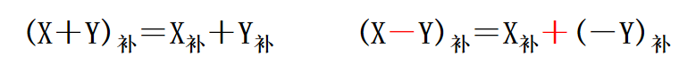
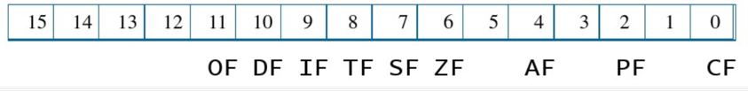
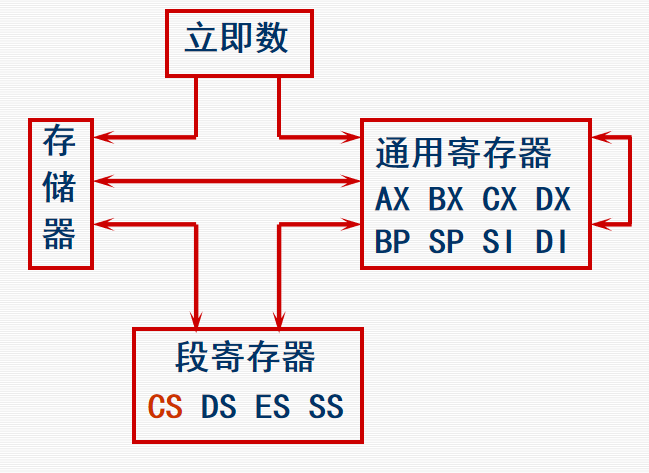
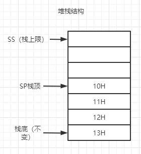
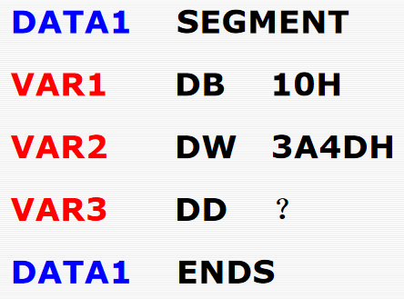
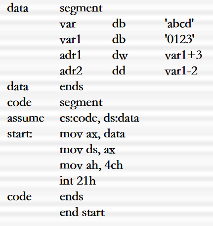
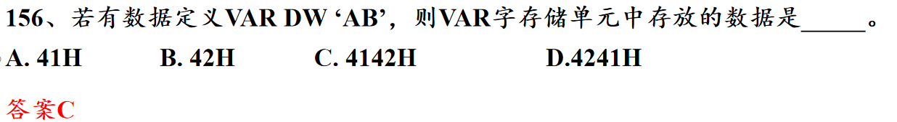
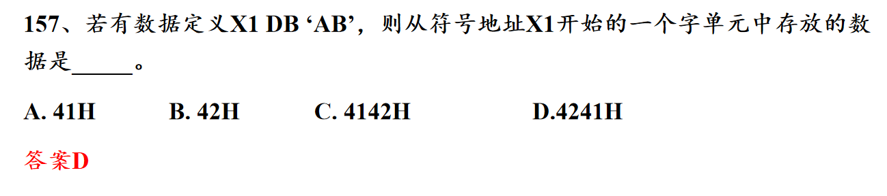
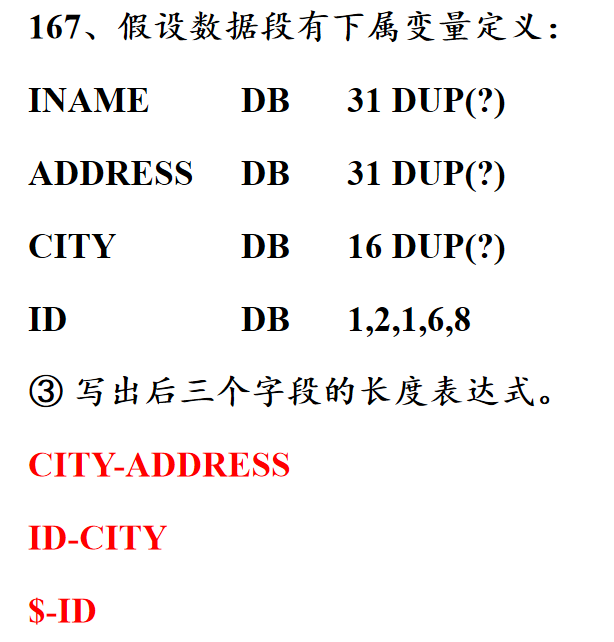

# 汇编期末复习

## 第一、二章

224++7+

1. 机器字长：运算器的位数，通常与数据总线、寄存器位数相同
2. 小端存储（即倒着存）
3. 汇编：将汇编语言翻译为机器语言
4. 汇编程序：完成汇编操作的程序
5. 正数的反码、补码均不改变
6. 使用补码进行二进制加减运算（即通过补码运算得到的结果依然是补码，需要对补码进行求补逆运算才能得到原码）：
7. 溢出：只有在同号相加的情况下出现
8. 判断溢出的方法：最高位（从0开始数，第7位）向上的进（借）位与次高位向上的进（借）位的结果==异或为1==则溢出
9. 0有正、负0，所以原码、反码有2个，但补码还是一个
10. N位补码表示范围（$-2^{N-1}到2^{N-1}-1$），即负数范围比正数范围多1
11. 常见的8位补码范围是（-128-+127）
12. 

## 第三、四章

***

1. 存储单元间的数据交换方法
   1. 寄存器和寄存器间可以直接交换数据
   2. 寄存器和内存单元间可以进行数据交换
   3. ==注意==：内存单元和内存单元间不能直接数据交换
2. 对于每一个内存单元，计算机都会分配一个物理地址（20位）
3. 16位CPU结构表示：运算器一次最多同时处理16位数据，寄存器最高存储16位的数据，运算器和寄存器之间通路是16位
4. 逻辑段：最小大小是16个字节（由段基址左移4位产生的空余4位，也称小段），最大为65536个字节（由偏移地址16位最大产生）
5. CPU的寄存器组
   1. 数据寄存器：一般用于存操作数、结果等，即存放数据的寄存器。（都是==通用==寄存器，即什么都可以存）（还都可以分为8位的寄存器，例如AH、AL表示AX的高8位和低8位）
      1. AX：主要作为累加器，算数运算主要寄存器
      2. BX：还可做基址寄存器
      3. CX：还可以作计算器
      4. DX：还可以和AX一起存放32位双字操作数（DX存高位、AX存低16位）
   2. 段寄存器
      1. DS（data segment）数据段寄存器：存放数据段的段地址
      2. CS（code segment）代码段寄存器：存放代码段的段地址
      3. ES（extra）附加段寄存器：存放附加数据的附加段的段地址
      4. SS（stack）堆栈段寄存器：存堆栈段的段地址
   3. 地址寄存器（可以用来存==偏移==地址，包括基址和变址，也可以作为16位的==通用==寄存器）（BX、IP也可归为地址寄存器，因为也可以存偏移地址）（地址即偏移地址）
      1. SI：存放源缓冲区的偏移地址（变址寄存器）
      2. DI：存放目的缓冲区的偏移地址（变址寄存器）
      3. BP基址指针寄存器：指出==堆栈==区某个单元的偏移地址（基址寄存器）
      4. SP堆栈指针寄存器：指出==堆栈==区栈顶的偏移地址（基址寄存器）
   4. 控制寄存器
      1. IP指令指针寄存器：存放CS段中数据的偏移地址，指出下一条指令的偏移地址（就是IP存下一条指令地址的偏移量，指令的段基址是CS）
      2. FR标志寄存器：有9位有效标志位
6. 6位==状态标志==
   1. CF（carry）进位标志：（假设为无符号数）最高位产生进位或借为则为1
   2. PF奇偶标志位：低8位中有偶数个1为1
   3. AF（assist）辅助进位标志：第3为产生进位或借位则为1
   4. ZF（zero）零值表示：当前指令结果为0则为1
   5. SF（sign）符号标志：最高位为1则为1
   6. OF（overflow）溢出标志：（假设为有符号数）按照补码解释，出现溢出为1，只可能出现在同符号相加的情况
7. 3个==控制标志位==
   1. TF
   2. IF
   3. DF
8. 段的末地址：段基址+段大小==-1==
9. 最大偏移量：段大小-1

## 第五章

***

1. 机器指令+操作码+操作数1+操作数2（操作数1称为目的操作数，存放结果，操作数2称为源操作数）

2. 寻址方式：即提供操作数或操作数地址的方式（源操作数的寻址方式决定指令的寻址方式）

   1. 立即寻址：100H，操作数（存在代码段）写在指令中，
   2. 寄存器寻址：BX,用寄存器名代替操作数。
   3. 直接寻址：VAR（一个变量没用中括号也是表示EA，因为指令中无法储存变量，变量是存在数据段中，属于内存，是直存储器寻址中的直接寻址），[1000H],直接写出EA有效地址（偏移地址）。中括号[]中的数字表示有效地址
   4. 寄存器间接寻址：[BX],将寄存器（基址寄存器BX、BP，和变址寄存器SI、DI）中的值作为偏移量，在内存中获得操作数
      1. BX、SI、DI中偏移量默认的段基址是DS
      2. BP中偏移量默认的段基址是SS（BP和SS是永远绑定）
   5. 寄存器相对寻址：[BX+100H],寄存器中的值再加上一个数作为偏移量。其中的相对表示相对量，所以需要再加一个数
   6. 基址变址寻址：[BX+SI],基址寄存器（BX、BP）中值加上变址寄存器(SI、DI)中的值作为EA
      1. 基址寄存器为BX，则段寄存器为DS
      2. 基址寄存器为BP，则段寄存器为SS
   7. 相对基址变址寻址：[BX+SI+100H],将基址寄存器、变址寄存器、相对量的值相加作为EA

3. 存储器寻址主要就是讨论偏移量如何获得，是由3大类排列组合而得

   1. 位移量，8位或16位的二进制数
   2. 基地址：BX（和DS绑定）和BP（==和SS绑定==）
   3. 变地址：SI和DI

4. 传送类指令：

   1. MOV  A,B：将B的值传给A。（注意事项：①立即数不能直接传送给==段==寄存器，②==CS==代码段不能作为目的操作数③且==段寄存器间==也不能直接传送数据，可用通用寄存器中转实现④==IP==不能作为MOV的操作数）（在无寄存器寻址指令中，要用BYTE PTR 指定数据类型，否则会出现二义性）

      数据传送方向：

      

   2. XCHG A，B：A,B的存储介质互换数据（2个内存单元不能直接交换，要符合MOV的规则）

   3. 堆栈指令：堆栈初始化后，即空栈时，栈顶指向-1，栈底指向0，栈顶地址大于栈底。

      1. PUSH A：①SP=SP-2②将A存入SP指向的单元（==单操作指令不能使用立即数==）

      2. POP A：①SP所指单元内容赋给A②SP=SP+2

      3. PUSHF：将FR标志寄存器内容压入堆栈中

      4. POPF：将栈顶数据存入FR中

         
         
      5. RET：栈顶字单元出栈，其值赋给IP寄存器。

   4. 标志位传送指令

      1. LAHF：将FR的0-7位存入AH
      2. SAHF：将AH中内容存入FR的0-7位

   5. 地址传送指令

      1. LEA A,B：将B的偏移量EA存入A。（load effective address）
      2. LDS A,B：B中内容存入A，再将B+2内容存入DS
      3. LES A,B：B中内容存入A，在将B+2存入ES

5. 算数运算类指令：

   1. ADD A,B：A+B的值存入A中（A、B最多一个内存单元）
   2. ADC A,B：A+B+CF（进位表示位）存入A
   3. INC A：A=A+1,自增指令（increase），不影响CF位
   4. SUB A,B：A=A-B,
   5. SBB：A=A-B-CF
   6. DEC A：A=A-1，decrease，不影响CF位
   7. NEG A：A=0-A，求相反数指令。==操作数A一般理解为补码，结果一般也是补码==
   8. CMP A,B：A-B，与SUB指令一样，但是不存储结果只改变标志位，然后通过观测标志位判断AB的大小关系
      1. A=B：ZF=1
      2. 无符号：A>=B：CF=0；A<B:CF=1
      3. 有符号：A>B:SF和OF相同;A<B:SF和OF不同

6. 位操作指令：

   1. AND A,B：A=A&B。（无论结果如何CF、OF被强置与0）
   2. OR A,B：A=A|B。（无论结果如何CF、OF被强置与0）
   3. XOR A,B ：A=A^B.（无论结果如何CF、OF被强置与0）
   4. NOT A:A按位取反

7. 测试指令

   1. TEST A,B：A&B，与与操作一样，但不保留结果，只改变标志位。可以通过观测ZF上的值，判断A某个为上的值

8. 移位/循环移位指令 OPR A，count（count表示次数，如果大于1必须使用==CL==储存）

   1. SAL A,B：（==算数==左移）A左移B位。操作数理解为==补码==，移出的最低位保存到CF，OF仅在count=1时有意义
   2. SAR A，B:A右移B位。操作数理解为补码，移出的最高位保存在CF中。因为变小，所以不会产生移出，所以OF=0。（算数右移，==符号位不变==）
   3. SHL A,B：（==逻辑==左移）A左移B位。操作数理解为==无符号数==，移出的最高位存入CF
   4. SHR A,B：逻辑右移。无符号数
   5. ROL A,B：循环左移，A左移B位，移出的位数补在低位上，移出的最低位存入CF
   6. ROR A,B：循环右移，移出的最高位存入CF
   7. RCL A,B：带进位循环左移，将CF放在A最左边，与A形成整体做循环左移操作
   8. RCR A,B：带进位循环右移，将CF放在A最右边

9. 取位操作：通过AND 1保留获得某个位置上的数

10. 置位操作：通过OR 1将某个位置上的数置为1

11. 位变反操作：通过XOR 1将某个位置上的数变反

12. 或1置为1，或0保留原数

13. 与0置为0，与1保留原数

## 第六章 汇编语言程序组织

***

1. 每个指令前有一个标号，被引用后会变为该指令的偏移量

2. 伪指令：一些说明性语句，不像汇编指令一样会生成机器代码，但一样是必不可少的。用来指出程序分段、数据定义、存储分配、程序开始和结束相关信息。

3. 分配一个字节单元  VAR1 DB  54H  (VAR1表示54H所在内存单元的偏移量)

4. 定义一个常量  CON1 EQU 123   （CON1等于123，CON1不能改值，CON1不占内存，CON1在汇编过程中直接被123代替）

5. 16进制的数最高位为字母时要在前面添一个0

6. 使用字符串实际是存储相应字符的ASCII码

7. DB1字节，DW1字，DD双字，DQ8字节，DT10字节

8. 定义一个数据段（变量名var不是必须的）（？问号表示仅为变量分配空间，初值是内存单元中原有随机值）

   

9. DB 'ABCD'：表示以==字节为单位==存储，所以按顺序存入A、B、C、D

10. DW 'AB','CD'：表示以==字为单位==存储，AB、CD是一个整体存入，由于小端原则，存入顺序为B、A、D、C

11. 标号与变量：都是代替内存地址的偏移量，但是标号在代码段、变量在数据段。例如 L1:ADD A,B。L1就是标号

12. 问号表达式：？问号表示仅为变量分配空间，初值是内存单元中原有随机值

13. X DUP(N)：重复分配给N，分配X次

14. 完整的汇编程序

    

15. 运算符：运算符将常量、变量、标号等元素连接起来形成表达式

    1. 算术运算符：+、*、/、-、mod、shl、shr

    2. 逻辑运算符：AND、OR、XOR、NOT

    3. 关系运算符：EQ、NE、LT、LE、GT、GE

    4. 数值返回符：

       1. SEG A：返回变量或标号的段基值
       2. OFFSET A：返回变量或标号的偏移量
       3. TYPE A：返回该变量类型占用的字节数
       4. LENGTH A：返回数组中元素的个数。（只对DUP定义的变量有意义，没使用DUP返回1）
       5. SIZE A：返回变量数组占用的字节数，等价于LENGTH*TYPE

    5. 属性运算符

       1. BYTE PTR A:规定了传输数据的类型

    6. MOV AH,1

       INT 21H (上面2行代码表示从键盘输入一个字符存入AL)

    7. MOV AH,2

       INT 21H（上面2行代码表示将DL中字符输出到显示器上）

***

## 错题总结

1. 物理地址相减记住结果是16进制，还有与例如空间大小相加减，空间大小是10进制的。（反正警惕数字是16进制还是10进制）

2. 空间末尾地址-首地址+1=空间大小

3. 大写的B代表字节，小写的b表示比特

4. 指令条数的计算：例如1地址有6位，0地址有12位给指令码，假设1地址指令有x条，那么0地址最多有$(2^6-x)*2^{12-6}$条指令

5. 段首地址位数一定为0，所以各种段首地址的计算题都暗含了这一条件

6. 储存$2^x$数据，需要x位

7. 注意字和字节（太容易坑人了）

8. DS、CS、SS参与计算时，必须先乘以10H

9. 16进制数最高位是字母，则应在前面加一个0

10. 放入寄存区的内存单元都是一个字

11. CS不能作为目的寄存器

12. 立即数可能超过PTR规定范围

13. AX、cx、dx（BX可以）不能用于寄存区间接寻址，即[CX]，即这几个通用寄存器也不能用于地址寄存器

14. （即8086中堆栈只能以字为单位进行）入栈时，是先SP-2，再将数据放入指定内存中，然后出栈是数据先出内存，SP再加2

15. 如果操作数中没有==寄存器==则要在操作码后指定数据类型,WORD PTR,BYTE PTR

16. ADD A,B不允许都是内存单元，但允许A是内存单元,B是立即数

17. SS：【BX+DI】(虽然BX是和DS绑定，但是这样明确指明段基址是SS也是可以的)

18. CPU一次读的是16位，所需数据是以字节为单位

19. VAR1 DD VAR2（因为使用DD，所以VAR1对应的内存，先储存了VAR2的偏移地址，再储存VAR2的段地址，小端存储）

20. NUM3 DB 20H .;     MOV  AX,NUM3。字节类型变量无法传入16位寄存器

21. MOV  NUM1 20H:是正确的，立即数能直接存入内存单元

22. 表达式中不能出现存储单元名称（寄存器），因为表达式是在汇编阶段完成运算，而存储单元必须在程序执行阶段才能确定。但偏移量NUM1可以参与表达式

23. 必须记住堆栈往上地址减少，往下地址增加

24. 在内存中存储数据是用小端存的，但是如果说这个内存单元存放了什么数据，则是按正常顺序读

    

25. 虽然存入数据是以字节按A,B顺序，但以1个字读还是要用小端取数据方法：

    

26. VAR1 DB '0010'（存入字符串，是按照一个字符一个字节位存储其ASCII码）

27. $是“位置指针”在编译（汇编）时将被替换成数据段的==当前地址偏移量==。

28. 

