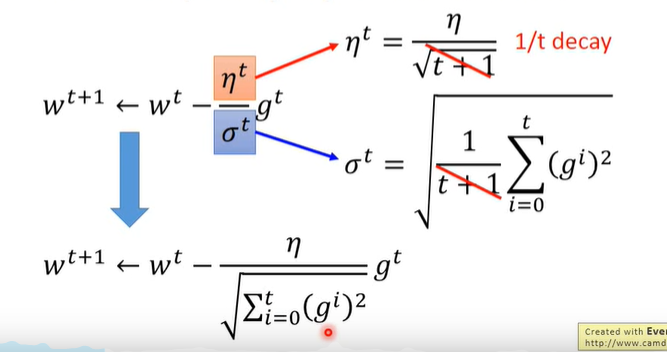
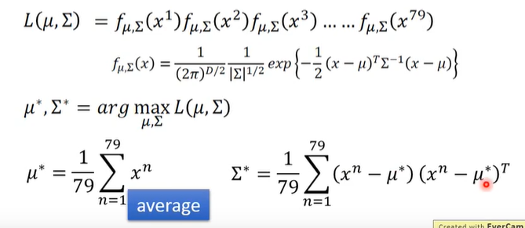
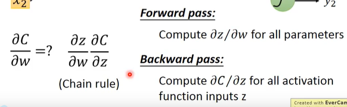
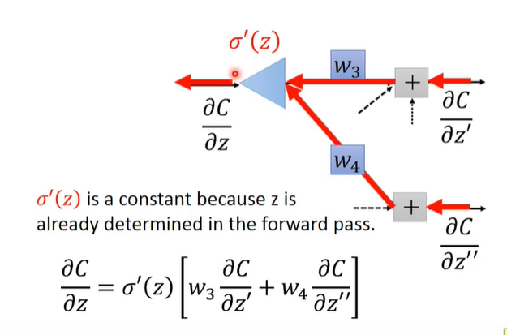
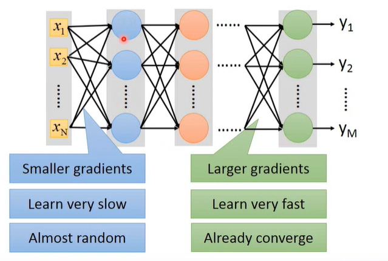
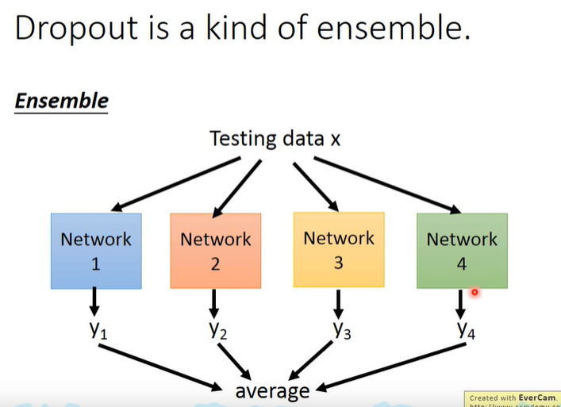

# 深度学习笔记

1. 人工智能AI（artificial intelligence）：即使用计算机来构建拥有人类智慧本质特征的机器，包括弱人工智能和强人工智能

2. 机器学习ML（machine learning）：一种实现人工智能的方法，是使用大量数据训练，通过各种算法从数据中学习如何完成特定任务。机器学习算法可以包括：监督学习、无监督学习、半监督学习、集成学习、==深度学习==和强化学习

3. 深度学习DL（deep learning）：是用深度神经网络来解决特征表达的一种学习过程。

4. 以上三者的联系：机器学习是实现人工智能的一种方法，而深度学习又是实现机器学习的一种技术

   

5. 逻辑回归模型（logistics regression）

   1. sigmoid(x)=$\frac{1}{1+e^{-x}}$：输出在（0,1）的函数

      

   2. 一般模型为$y_{hat}=\sigma（w^{T}x+b）$:意义是对于一个二元分类模型，一个输入X对应输出是1的概率

   3. 损失函数L:用以描述预测值与实际值的差距，用于评价算法效果

      1. 单个训练样本，损失函数（loss function）：
      2. 整个训练集，成本函数（cost function）J(w,b)函数是最重要函数（之后求导都是对J求的导）：

6. 之所以使用J函数作为是cost函数，是因为J函数是凸函数，有整体最优解，而平方评价不是凸函数只有局部最优解所以不采用

   

7. 梯度下降算法：其中$\alpha$表示学习率，就是每次w移动的步长，通过不断对当前w进行如下算法运算，最终w会收敛到是J（w）全局最小值处

   

   

8. 微积分中的链式法则（chain ruler）：J函数对a求导，等于J对V求导的结果乘以V对a求导的结果

   

9. 在python代码中dv表示$\frac{dJ}{dv}$，默认的被求导函数是整体成本函数

10. logistics regression 下的单个样本梯度下降算法：

    1. $y=\sigma(x)$对x的导数是x（1-x）
    2. 所用的全部公式如下：

11. 需要感性认识，J并不比任何一个样本的损失函数大，J只是所有样本损失函数的算数平均值

12. n个样本的梯度下降算法：因为整体损失函数是每个样本损失函数相加后除以n，所以整体损失函数j（w,b）对于w、b的偏导也就等于每个样本损失函数对w、b求得的==偏导的算数平均==（也能算作求导法则的基本性质，a+b的导数等于a导+b导）

    1. 初始化,J=0、dw=0、db=0,初始化w和b
    2. 循环每一个样本，累加求J、dw、db
    3. 更新w和b，使用w=w-$\alpha$dw
    4. 使用更新后的w，b，再次进行1,2,3步骤，直至w和b收敛

13. 在python中2个矢量相乘：

    ``` python
    import numpy as np
    a=np.random.rand(1000)
    b=np.random.rand(1000)
    c=np.dot(a,b)  #这样就完成了a、b2个向量相乘
    ```

14. 避免在程序中使用for循环，每次需要使用循环时，取numpy库中寻找内置函数

15. 这里的单个样本向量一般都是指==列向量==，然后多个样本的集合组成的向量一般都是由多个列向量组成的==行向量==（即行向量中每一个元素是一个列向量）

16. 向量化的n个样本的梯度下降算法

    

17. ``` python
    db=np.sum(dz) #表示对dz各元素求和
    cal=A.sum(axis=0) #表示A的各列上的元素相加，生成一个行向量
    cal=A.sum(axis=1)#表示A的各行上的元素相加，生成一个列向量
    
    ```

18. python中的广播：对于（m,n）的矩阵  +-*/   （1，n）或（m，1）矩阵，都将后面一个矩阵自我复制变化成（m,n）格式的矩阵，再进行相应计算（但==必须注意==，此处的除法和乘法并不是矩阵的乘除法，而是2个矩阵上相同位置元素单独进行的乘除法）

    1. 一个向量加一个常数，结果是向量中各元素都加上这个常数

    2. m* n矩阵+1 *n矩阵，结果是1 * n矩阵自我复制变形为m * n矩阵然后再相加

       

19. ``` python
    imoprt numpy as np
    a=np.random.randn(5,1) #构建一个5 * 1的矩阵，其元素都是随机数
    print(a.T) #打印a的转置矩阵
    a.reshape((1,5)) #改变矩阵的形状
    ```

    

20. 神经元计算一个线性函数（z=Wx+b），然后接一个激活函数（就是sigma函数）

21. 神经网络层级：用带方框的上标表示层数（从0开始），输入层、隐藏层、输出层，但算是几层神经网络时，通常不包括输入层

    


***


## 深度学习与pytorch入门实战

1. linear Regression（线性回归）：预测的y的范围是在负无穷到正无穷的连续实数空间内
2. logistic regression（逻辑回归）：在linear regression的基础上加了一个激活函数，使得预测范围在0到1
3. clssification（分类）:有n个点，n个点的范围都是0到1，但n个点之和为1

***


## 2020李宏毅深度学习

1. y_hat表示样本值（真实值），y表示预测值

2. 线性模型（linear model）：多个特征值的线性组合，输出的范围是R

   

3. 梯度下降（gradient descent）：

   1. 初始化：随机选择初值w，b
   2. 循环：w‘=w-a$\times$dw，b'=b-a$\times$dw ，最后会的趋于稳定的w和b(求偏导的函数是整体LOSS函数)

4. linear regression是凸函数（convex），没有局部最优解，只有整体最优解

5. 过度拟合（overfitting）:寻找的的model对于训练数据有非常低的误差，但对于新的测试数据却有高误差。例子：model的次数越高，model的范围越大，就能找到更好拟合训练数据的model，但是，与实际要寻找的function的差别就更大

6. 规则化（regularization）：调整函数平滑性，可以在loss函数中添加$\lambda\sum{w^2}$,通过调整$\lambda$的大小，进而调整function的平滑性

7. error误差来源

   1. bias：预测值的期望与目标的差距

   2. variance：预测值与预测值期望的离散程度

      

8. 一般function越复杂（次数越高？），bias越小，variance越大。

9. bias太大称为underfitting，需要redesign model，增加更多输入的features,使model更复杂

10. variance太大称为overfitting，增加训练data，还可以规则化（regularization），在loss函数中添加项，使function更平滑

11. 选择mode的要求：l要使bias和variance平衡、

12. 注意:model指的是使用function的范式，例如固定的几次式，而function是在固定model下系数不同函数

13. 选择model的方法：

    1. 将训练集分为训练部分和确认部分（validation set）,使用训练部分去算出不同model下的function，然后使用确认部分去计算这些function的error，选择最小的error的function的model作为选择model

    2. 还可以将训练集分为多个不相交子集，每个子集利用1的方法算error，最终求所有model的平均error，最小平均error的model作为选择model

       

14. learning rate对loss的影响：太小更新速率慢，太大会造成抖动

    

15. 对于一组训练集，其==loss函数是固定的==，取不同的参数值，就可获得不同的loss值

16. learning rate的取值方法之==adagrad==：

    

17. stochastic gradient descent（SGD）随机梯度下降：每次更新参数，只考虑一个训练example的影响

    

18. SGD with momentum（SGDM）：移动的步长会受之前所有gradient descent 的影响，当然，离的越远的，影响越小（可避免停在局部最低点和在在平原上移动过慢和无法越高另一个峰）

    

    

19. RMSProp：与adagrad类似，只是分母修改了，修改为减少历史gradient descent 对分母的影响，增加最新梯度对其影响

    

20. adam

    

21. adam收敛速度快，但不稳定;SGDM收敛稳定，但速度较慢,所以有一种策略是先用adam再用SGDM

22. feature scaling：使每个function中每个实例变量的范围相同

    

23. classification分类：输出是一个种类

24. Gaussian distributtion（高斯分布、正态分布）

    

25. 由训练集去寻找一个最吻合的高斯分布方法：maximum Likelihood，即找到使这个sample出这个训练集可能性最大的高斯分布，使L最大：

    

26. 如何解决分类问题：分类问题等价于给定一个example，输出其属于某个种类的概率，当概率大于0.5时，就认为属于此类。其条件概率又等价于如下，所以需要知道种类分布概率模型（P（X|C））、种类占比数据(P(C))

    

27. 修正分类模型（linear model）：使不同种类的高斯分布共享同一个方差（均值不变），这样可以。。。然后共享方差就是原方差按种类训练集数量的加权平均

    

28. 为什么当方差共享时，边界分割线式线性（linear model）：

    1. 将条件概率转为某个sigmoid函数

       

    2. 而当方差共享时，变量z可以转为一个线性函数（因为sigmoid函数的性质，Z大于0时，概率大于0.5，Z小于0是概率小于0.5，所以对于一个线性函数Z而言，Z大于小于0是由其图像划分（线性规划））

       

29. logistics regression 与 linear regression 的区别：

    1. 逻辑回归的函数值是0到1的概率，线性回归的函数值是实数范围内的值

    2. 逻辑回归的loss function是根据每个sample的概率之积获得（即取某w、b时，能够使得获得训练集的概率最大），然后因为取大不方便，所以将loss function取ln再取负得到最终lossfunction（即cross entropy 交叉熵）；而线性回归的loss function就是普通的方差

    3. 但二者更新w和b的方式是一样的

       

30. 逻辑回归loss function对w的偏微分结果（然后再用梯度下降算法更新w）：

    

31. 为什么logistics regression不选择seuqre error？：因为如果使用方差，当结果是1而预测是0时，二者相差很大，理应更新速度快，但是gradient很小，update速度慢，所以不适合使用方差

    

32. Generative 和 Discriminative

    1. Discriminative是直接假设w和b
    2. Generative是直接算高斯参数，是有前提假设几率模型的，数据符合高斯分布，一般要用naive bayes
    3. Generative受训练集的影响较小，所以当训练集少的时候，可能Generative的效果更好，一般discriminative效果更高

33. multi-class classification（多分类）：使用了一种softmax方法来计算输入X属于某一类的概率

    

34. 交叉熵（Cross Entropy）：主要用于度量两个概率分布间的差异性信息

35. 多分类的loss function计算：使用cross entropy

    

36. logistics regression存在局限性，因为分割边界只能是一条直线，所以无法区分异或，这时候就需要使用feature transformation，即将input的特征转为其他特征，而新的数据的每一个特征值都与原所有特征值有关，这就称为fully connect，然后将新的特征值作为输入，代进一个function中。

    

    

37. 将上面每一个logistics regression称为neuron（神经元），全部的neuron组成的结果就称为neural network（神经网络）

38. 构建一个神经网络的步骤

    1. 定义一个函数集（function set），只有神经网络的结构（fully connect feedforward network）(也就是之前regression中的model，包括hidden layer有多少层，每一层有几个neuron)，而没有每个神经元的具体参数weight和bias（所有w和b组成的集合，所以称为函数集）

       

    2. 定义一个function的好坏，即计算预测值与实际值的交叉熵（交叉熵越小performance越好），然后所有data的交叉熵之和就是total loss函数

       

       

    3. 更新参数w和b，依然使用gradient descent方法

       

39. 神经网络的结构：分层可分为input layer、hidden layers、output later，其中隐藏层可以视作一个==特征提取器==（feature extractor replacing），就是将输入的feature通过一连串的转换，得到一组新的、更合适更好用feature，最后一层output layer可以视作一个多类选择器，通过输入特征提取器输出的新的feature，在通过softmax函数得到最终的选择

    

    

40. 使用矩阵操作表示一个神经元的操作：矩阵乘法左边是权重w矩阵，w的每一个对应一个output需要之前feature的所有权重；然后矩阵乘法右边是input的列向量

    

41. 设计hidden layers需要多少层，每一层有多少神经元并没有通用的方法，而是依靠反复试验和直觉

42. 反向传播（backpropagation）：一种有效计算多层神经网络的gradient descent 的方法

    1. 整个训练集的loss函数对某一w的偏微分可以归结为每一个data的loss函数对某一w的偏微分

       

    2. 单个data的loss函数对参数w求导，使用chain rule可以分为如下2项之积

       

    3. 上式左边一项的计算方法称为forward pass，向前传递，直接计算可得

    4. backward pass：右边一项可通过==递归分治==的方法，最后归结为一种从神经网络最右端开始从右向左逐层计算的方法

       

       

       

43. 神经网络的创建的流程

    

44. 对于一个完成的神经网络还需要测试：

    1. 测试==训练集==（training data）是否有好的结果：如果有好的结果则进入2，否则返回之前神经网络的创建中，查看有哪些错误或有什么可以改进的地方

       1. new activation function新激活函数：换一个新的激活函数，就是吧sigmoid函数用其他函数替换（例如==ReLU== rectified linear unit),sigmoid函数的输出会降低输入的变化（输出压缩到0至1），而多层的sigmoid函数效果叠加会使输入的变化更不明显，以至于当输入层的w还是接近随机数时，输出层的w都已经趋于稳定了。

          

          

          

       2. adaptive learning rate:之前的Adagrad、RMSProp、momentum、==adam==

          

          

    2. 测试==测试集==（testing data）是否有好的结果：如果没有，则修改模型，然后重新从1开始测试训练集

       

       1. early stopping：有时，training data不是越多越好，testing的效果可能会在某个临界点后，随着training data的增加，效果降低，所以训练需要在这个临界点处停止

          

       2. regularization：在loss function后加一个regularization term，使得不仅要求梯度下降的时候，不仅要考虑梯度，还要考虑变化的平滑性

          

          

       3. dropout：训练时，在每个update之前，每个神经元有p%的几率被丢掉（包括input），就是每次梯度下降之前都要使用一次的dropout。而在测试时，不用dropout，并且每个w都乘以（100-p）%。可以理解为，同一个训练集训练了很多不同的model，然后最终测试结果是所有model结果的平均值

          
       
          
       
       4. 

45. overfitting过拟合：指的是在training data上有很好的结果，但在testing上的结果不好

46. underfitting：指的是由于hidden layers层数少、神经元个数少导致的结果不好

47. ==ReLU== rectified linear unit线性整流单元：一种主流激活函数

    

    

48. hidden layers工作原理：可以把神经网络的功能想象为一个main函数，而hidden layers中每个神经元可以想象为一个函数，不同层级可以认为是函数调用关系，所以这种模块化（modularization）的工作方式要好于全部程序写在一个main函数中，因为函数的复用性，所以可以更好的模拟，但是，我们并不知道每个神经元也就是函数的功能是什么，所有的函数都是通过训练生成，我们可以知道整个main的功能，却不知道单个神经元的功能。

49. 使用CNN（convolutional neural network 卷积神经网络）的原因

    1. （convolution）一些特征图案只需要观察一小部分
    2. （convolution）一些特征图可以出现在不同区域
    3. （Max poling）抽像素使图片变小，不影响图片的辨别

50. CNN的流程：

    1. convolution

       1. 需要使用多个大小固定的filter，也就是带有参数的矩阵，其中参数和w、b一样是学习出来的。

          

       2. filter在image不同部位做内积（就是对应位置上的元素相乘，再相加），内积结果组成了新的、更小的image。（作用是根据filter需要探寻的特征，在整个image上进行寻找，值最大处就是特征最吻合处）

          

       3. 不同的filter会生成不同的、新的image，每一个image称为一个feature map（也可以看作不同通道）

          

       4. 对于RGB图片（有3个通道），对应的filter也同样拥有3各通道（也就是厚度为3），但输出的结果==厚度为1==，每个位置上输出的结果是每个通道结果之和

          

       5. convolution其实就是特殊的fully connected：等价于①每个神经元只有部分w是有效的，其他w都是0②某些w是一直相等的（下图中相同颜色表示值相等）

          

    2. Max poling

       1. 对convolution得到的新的、包含特征信息的image，进行处理，得到更小的image，其目的是：在保存关键特征信息的条件下，缩小image大小

          

       2. 处理的方法可以是在每个单元中取最大值或平均值等代替整个单元

          

       3. 经过convolution和max pooling后，image的大小减少了，但深度（feature map或者通道）变大了，深度大少取决于有多少个filter

          

    3. 重复convolution和max pooling

       1. 重复的目的是不断的缩小image

       2. 例如第一层convolution和 maxpolling的输入是厚度为1的6*6iamge，输出是厚度（或称通道数）为2的2 * 2的image，有2层feature map，通过第二层时，输入是看作一个厚度（或称通道数）为2的2 * 2的image，使用的filter也是厚度为2，处理之后依然只有2层feature  map。总而言之，输出的厚度只取决于filter数量，与输入的厚度无关，而filter的厚度与输入的厚度有关。就是==不管输入的厚度有多少，经过1个filter后，都会变成厚度为1==，经过n个filter，厚度就变为n。

          

    4. flatten

       1. 将feature map拉直成一个vector 

          

    5. fully connected feedforward network

       

51. deep learning 是黑盒模型也有一定哲学因素，因为如果模型过于简单，易于理解，那么他的智能效果也一定不行，人脑的构造极为复杂，难以理解，同样的，deeplearning中hidden layers也难以理解，所以才足够智能

52. Keras实现CNN

    1. convolution&maxpooling：每一次输出的feature map数量等于filter数量，但是每一个filter的参数是还要考虑channel（厚度）。

       

    2. flattern&fully connected：

       

53. 什么情况下使用CNN：输入需要类似于图像imge一样，输入一个多维矩阵，矩阵上的pattern（图案）特征比整个矩阵要小的多，而这样的pattern可以出现在整个矩阵的不同位置，还有缩小图片不会影响特性。所以围棋也是使用CNN，但缩小矩阵会对围棋产生很大影响，所以alpha go没有是用max pooling缩小

    

54. CNN还能用于文字处理，一个word占一列，filter的宽就等于image的宽，filter的移动只在行方向移动

    

55. 1-of-N encoding：用于用向量编码多类，每类只有对应位置是1，其余位置是0

    

56. RNN（Recurrent Neural Network 循环神经网络）：其特点是，神经元的输出会存储到缓存区，下次使用神经元时，缓存区也会作为神经元输入

    

57. RNN应用于语义分析：将一句话按照单词分割，然后单词按顺序进入RNN中

    

58. RNN包括elman network和Jordan network：elman network是存储中间值，Jordan network是存储最终输出。传说 Jordan network效果更好

    

59. Bidirectional RNN:双向RNN，每一个单词都了解整个句子

    

60. LSTM（long short-term memory）：就是一个神经网络，有4个输入和1个输出，分别是输入数据、input gate信号、output信号、forget gate信号，input gate会决定是否让输入数据进入存储单元，output gate决定是否输出存储单元，forget gate 决定是否清空存储单元

    

61. LSTM的具体实现

    

    

    更复杂的LSTM：存储作为输入的c和前一个输出作为输入的h

    

    multiple-layer LSTM

    

62. LSTM的具体例子

63. 神经网络能够训练就是依靠于：一个能够求偏导的lossfunction

64. RNN的learning

    1. 

65. unsupervised learning(无监督学习)：训练集只有输入没有输出，而测试结果需要输出

66. 

67. 

68. 

69. 

70. 

71. 

72. 

73. 

74. 

75. 

76. 

77. 

78. 

79. 

80. 

81. 

82. 

83. 

84. 

85. 

86. 

87. 

88. 

89. 

90. 

91. 

92. 

93. 

94. 

95. 

96. 

97. 

98. 

99. 

100. 

101. 

102. 

103. 

104. 

105. 

106. 

107. 

108. 

109. 

110. 

111. 

112. 

113. 

114. 

115. 

116. 

117. 

118. 

     

     

     


