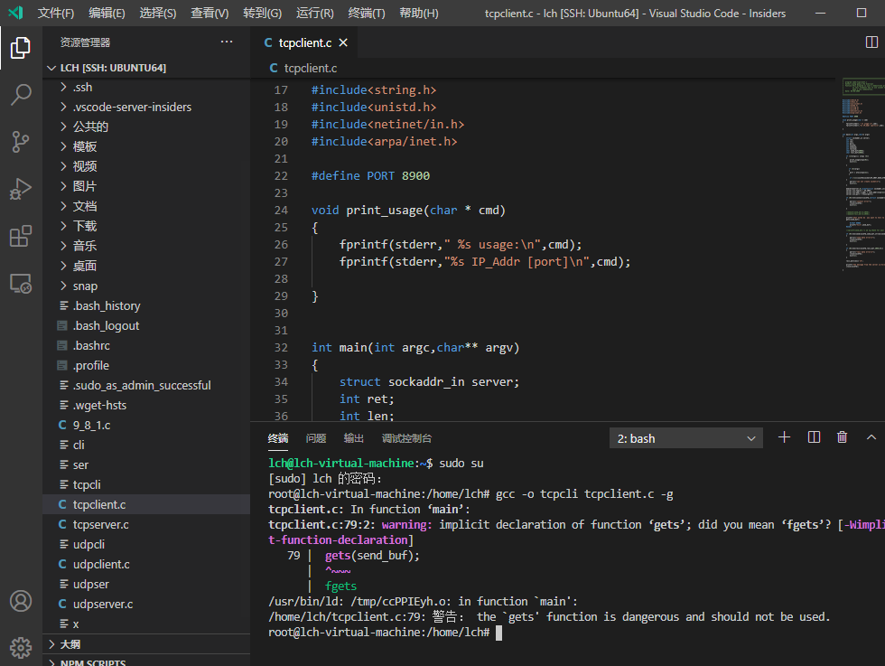

## 网安产品开发

1. gcc编译源文件：gcc -o abc  abc.c -g。然后在./abc 即可运行程序

2. socket编程
   1. tcp
   2. udp
   
3. vscode之remote插件的使用方法

   1. 点击左侧远程资源管理器（电脑状），再右键Ubuntu64使用SSH连接

   2. ctrl+shift+p能打开命令面板

   3. 在下方终端中输入密码

   4. 点击在终端的右上角的+，可生成新的终端（以上已完成Ubuntu的连接）

   5. 点击左侧的文件，选择打开远程文件（需要在终端中输入密码），然后就可以看到根目录下所有文件，可选择文件进行编辑，然后编译和运行

      

   6. 自此，vscode可以完成Ubuntu的终端命令输入的执行和对根目录下所有文件编辑功能

   7. 同时运行多个终端，单击终端右上交加号右边的选项（窗口状），每点击一次就会增加一个并行的终端，点击加号则回归至1个终端

   8. 关闭连接：单击最左下角，选这close the remote connection

4. linux打开终端的快捷键：alt+ctrl+t

5. 套接字可以视作IP+端口号的标识符

6. 套接字对是（ip1：port1，ip2：port2），tcp连接就是通过套接字对辨识的

7. 进程与端口的关系：一个进程可以使用多个端口