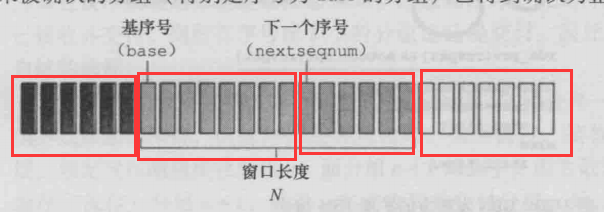
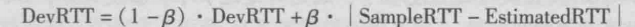
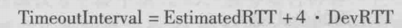

## 计算机网络——第三章    运输层

1. 运输层协议只工作在端系统中（信息在网络核心传递依靠网络层）

2. 运输层2大协议：
   1. UDP：不可靠，无连接服务。数据交付、差错检查
   2. TCP：可靠地，面向连接的服务。可靠数据传输、拥塞控制

3. 运输层分组统称为报文段（segment）

4. UDP报文只要目的ip和目的端口一致就会定向到同一套接字；而TCP报文需要原ip、原端口、目的ip、目的端口都一致（因为tcp是面向连接的，一条连接有固定的通信双方）（但即使有多个套接字，也都是和一个进程联系）

5. 一个进程可以有多个套接字（TCP会为每一个连接创建一个套接字子进程）

6. DNS使用UDP

7. UDP报文段首部包括4个字段，每个字段2个字节，分别是：源端口号、目的端口号、长度（首部+数据）、检验和

8. 检验和：将数据相加，溢出部分加到最低位（即回卷），再进行反码运算得到检验和。检验方式（数据+检验和之和为全1，则无差错）

9. UDP和TCP的应用场景

   

## 可靠协议的扩展

1. rdt 2.0(可能出现比特差错的可靠数据传输)（停等协议）：引入了ACK和NAK，接受端能够就信息对措向发送端进行反馈

2. rdt 2.1（反馈的ACK和NAK可能出错）：解决方式是无论是ACK和NAK只要出错就重传，同时接受方不清楚接受到的是新数据还是重传数据，所以会在分组上标记1比特的序号，重传则序号与之前不变，新数据这加1模2。

3. rdt 2.2 （有比特差错下的无NAK可靠数据传输协议）：即不需要传送NAK，但需要在ACK中包括1比特的需要，具体操作如下：①收到正确的报文，反馈ACK包括报文中的序号。②收到冗余报文，ACK包括该报文的序号。③收到受损的报文，ACK与上一次ACK一样。（==即发送方需要下一个报文则ACK序号与报文对应，需要重传则ACK序号与报文不一样==）

4. rdt 3.0 （有比特差错和丢包信道的可靠数据传输）：丢包的可能包括数据报丢失和ACK丢失，二者都将导致发送方无法收到反馈，所以引入一个定时机制，即在一定时间内，发送方不能收到反馈则进行重传。并且，==发送方即使收到受损的ACK或序号错误的ACK，也不会有反应，只会在没收到正确ACK且超时后才进行重传==。

5. 流水线传输协议：停等协议带宽利用率太低，需要使用流水线式协议提高利用率。①扩大序号范围。②发送方和接收方能够缓存分组。③差错恢复的基本方法：回退N步、选择重传

6. 回退N步（GBN协议、滑动窗口协议）：==发送方==需要响应的三类事件

   1. 上层调用rdt_send（）时，检查N个窗口是否已满，未满发生，已满则返回数据给上层

   2. 收到一个ACK。GBN采用==累积确认==，收到序号为n的ACK，即将n以前全部分组标明已确认

   3. 超时事件。因丢包或时延过长或未收到对于ACK而导致的超时（是第一个已发送但未被确认分组的计时器），将==重传所有==已发送但未被确认的分组

      ​													==返送方==：

   4. 按序收到一个序号为n的分组，则发送一个序号为n的ACK，==否则在其他所有情况下==，丢弃该分组，并发送最近的一次正常按序ACK。（因为发送的ACK都是正常按序ACK，所以如果接收方收到序号为n的ACK，则表示n以前的分组都正常接收）

   

   ​	分别是已发送已确认、已发送未被确认、可发送但未发送的、现在不可发送的。N称为窗口长度（window size）

   

7. 选择重传（SR）：

   1. 发送方：①每一个分组都有自己的定时器，超时后只发送相应的分组。②受到ACK，如果序号在窗口内，则标记为已接收。（如果序号为send_base，则将send_base移动至最小未被确认分组）
   2. 接收方：①序号在[rcv_base,rcv_base+N-1]内分组被正确接收，则返回相应ACK。（如果序号等于rcv_base，则将该分组和之前缓存连续的分组交付给上层，然后将窗口移动至已交付的序号+1）。②序号在[rcv_base-N,rcv_base-1]内的分组被正确收到，也必须返回一个ACK，即使改分组是冗余的（使得发送方能够继续前进下去）。③其他情况，忽略掉

8. 对于SR协议，窗口长度须小于或等于序号空间大小的一半。窗口过大会导致接受方不清楚收到的分组是新分组还是重传分组。

9. MSS（maximum segment size）最大报文段长度：是指传输层能承载的应用层能承载的应用层最大数据长度，不包括传输层头部

10. MTU 最大传输单元（Maximum Transmission Unit）：是包或帧的最大长度。

11. sequence number:指的是在一个报文中，数据部分第一个字节在整个文件数据中字节序号中的编号。（例如将整个需要传输的文件划分为1000个字节，而mss=100，则第一个报文的sequencenumber=0，第二个报文是100，第三个是200）

12. ACK number：接收方==期待==收到的数据的第一个字节的序列号。（例如收到一个sequence number为12，而mss=5的报文，name相应ACK number=12+（5-1）+1=17）

13. 因为TCP是全双工协议（同时进行双向信息传输），所以无论哪一方发送数据包，都带有sequence number（自己携带数据的信息），和ACKnumber（对对方数据信息的需求）

## TCP

1. TCP

   1. 发送方：①发送时：发送包中seq表示第一个字节在整个数据中的序号，并且为最老的一个已发送未被确认的数据包这是一个定时器。②超时:只重传导致超时事件的报文(即仅重传已发送未被确认的序列号最小的数据包)。③收到ACK：采用==累积确认==更新，并==重启定时器==（重启定时器只在收到大于base的ACK报文或超时后）.④==快速重传==：如果发送法收到3个相同的冗余ACK（共4个），则不需要等time out，而立即重传base所指的数据包（因为base是指第一个已发送未被确认的数据包，而接收方一直发送了冗余ACK，必有ACK<=base，说明有数据包未到，而在累积确认机制下，接收方base之前的都已被确认了，发送方不会发送比原来发送ACK序号还小的ACK报文，所以ACK>=base,故ACK=base，所以就是base缺失，需要重传base）
   2. 接收方：①收到冗余数据包，丢弃，（？发送所需的最小序号的ACK？）。②收到非冗余，但乱序，缓存起来，依然发送所需的最小序号的ACK报文。

2. time out时间的设置：

   1. 估计时间公式：$EstimatedRTT=0.875*EstimatedRTT+0.125*SampleRTT$

   2. 估计时间与实际时间的差值：（b=0.25）

      

   3. 重传时间的设置：

      

3. 流量控制（flow control）：因为对于乱序不冗余报文，接收方不会丢弃，而是存在buffer中，等待形成一块完整所需的数据后才会传给应用程序。绿色已被应用层读取。黄色：在buffer中的报文。蓝色：还未收到的报文

   

4. rwnd=buffer-（lastrecvd-lastread），即buffer中空余字节数。（rwnd会加在接收方反馈给发送方的首部,使得发送方已发送但未被确认的数据包小于rwnd）

5. 三次握手（TCP连接的建立）：①发送方（客户端）发送一个报文，其中SYN=1，SEQ=X（一个随机数），no data。②接收方返回一个报文：SYN=1，SEQ=Y(另一个随机数),ACK=X+1，no data(服务端一开始分配内存buffer和变量)。③发送方再次确认：SYN=0，ACK=Y+1,SEQ=X+1。（第三步中可能携带data，例如http，目的是节约资源）。之后双方交互的报文SYN都为0

6. TCP关闭连接：①客户端发送一个FIN=1报文。②服务端发送一个对FIN的ACK报文，再发送一个FIN=1的报文。③客户端再发送一个ACK，服务端收到后即关闭连接。而此时客户端还没关闭连接，而是出于timed wait状态，因为如果发送的ACK丢失，服务端会仍然出于closing状态，进而重发一个FIN，如果客户端已关闭，将无法对FIN进行反馈。（确保服务端进入关闭状态）

7. RST报文（对于TCP，udp是icmp）：如果接受方收到一条报文的目标端口自己并未有应用，或者有应用但未与源目标建立tcp连接，则会返回一条RST报文，意思是不要在发消息了，你的目标端口或源ip不能匹配我的套截字。（一般利用此机制进行端口扫描）

8. 拥塞控制（避免网络阻塞）：

   1. 端到端的拥塞控制（==重点==）（TCP使用的方法）：
      1. cwnd(发送方的拥塞窗口)：

   

   1. 接收方感受网络状态的方式：①网络拥塞：“loss event”丢包事件：time out或者3次冗余ACK。②网络良好：接收到ACK

9. 拥塞控制算法：（是round n出现状态改变事件，round n+1时状态开始改变）

   1. slow start（慢启动状态）：cwnd初始值为1MSS，每经过一个RTT，cwnd增加为原来的2倍（具体实现是通过每收到一个ACK为cwnd增加一个MSS，而每轮发送cwnd/MSS个报文，网络良好，则收到cwnd/MSS个ACK，所以cwnd=cwnd+cwnd,实现每过一个RTT，cwnd增加一倍）

   2. 如果出现time out超时事件，则阈值ssthresh=cwnd/2（向下取整），cwnd=1，同时再次进入==慢启动状态==

   3. 如果cwnd>=ssthresh阈值，则进入==拥塞避免状态==（cwnd由指数增长变为线性增长，每过一轮RTT，cwnd增加一个MSS）

   4. 如果收到3次冗余ACK，则ssthresh=cwnd/2（向下取整），cwnd=ssthresh+3MSS，并进入==快速恢复状态==（每收到一个冗余ACK则cwnd增加一个MSS，收到一个新ACK，则cwnd=ssthresh，并进入==拥塞避免状态==）

      

2. 网络辅助的拥塞控制：交换机会根据当前网络状态（排队延迟、丢包率）对接收方或发送方（最终都会交给发送方）发送RM cell（资源管理信元）（包括2个位 NI轻度拥塞和CI重度拥塞），交换机也会修改data cell中的EFCI字段，如果接收方收到的data cell中EFCI字段为1，则会修改接下来收到的RM cell中的CI值再传递给发送方。（总体来说，就是网络中的设备会传递信息，直接或间接最终传给发送方进而修改发送信息的速率）