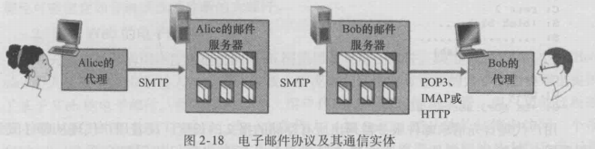
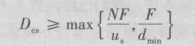
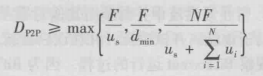
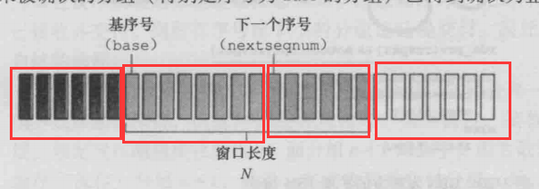
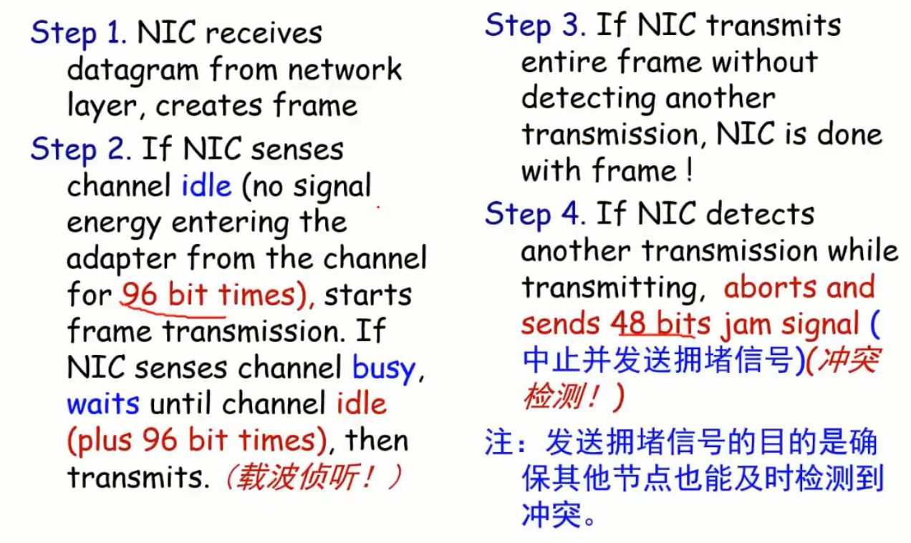
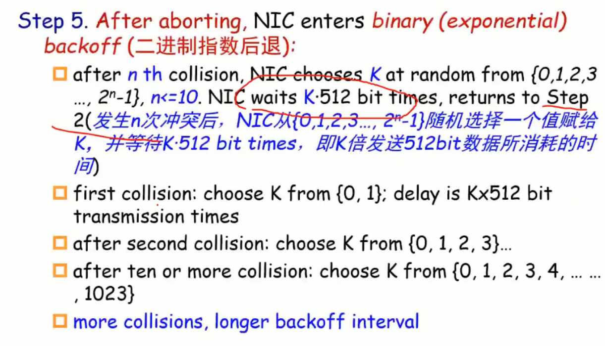

# 计网期末复习

## 第一章 概述

***

1. API==应用程序==编程接口：端系统上的软件可以通过使用API从而发送数据到其他端系统的应用程序上

2. 协议：协议定义了2个或多个通信实体之间交换的报文的==格式==、==次序==和报文发送或接受所采取的==动作==

3. 网络边缘：终端设备

4. 接入网（access network）：终端设备连接到边缘路由器（edge router）的物理链路

   1. 家庭接入：
      1. DSL数字用户线：双绞铜线（twisted-pair），使用电话基础设施，非对称，即上行和下行速率不等
      2. 电缆（cable）：同轴电缆（coaxial-cable），利用有线电视基础设施，不对称
      3. 光纤到户FTTH（fiber to the home）：光纤（fiber），主动光纤网络AON，被动光纤网络PON
      4. 卫星链路（satellite）
   2. 企业接入：
      1. 以太网：双绞铜线，多台终端与交换机相连，交换机再和边缘路由器连接
      2. WIFI：无线电，基于IEEE 802.11技术的无限LAN接入
   3. 广域无限接入：
      1. 3G
      2. LTE

5. 物理媒体：

   1. 双绞铜线：DSL（电话网）、2根铜线绞合起来以减少邻近双绞线的电气干扰
   2. 同轴电缆：2个同心导体
   3. 光纤：
   4. 陆地无线电信道

6. 分组交换机：包括路由器和链路交换机

7. 网络核心：由==分组交换机==（路由器和链路交换机）和==链路==的网状网络

8. 分组交换：源端将长报文划分为较小的数据块进行传输

9. 存储转发运输：==交换机==在开始向输出链路传输该==分组==的第一个比特之前，必须接收到整个==分组==（注意：只是等待该分组全部被接收，并不是该报文全部被接收）

10. 终端通过网络链路和交换机传输数据的方式：分组交换、电路交换

11. 电路交换：==预留==了端系统间通信沿路径所需要的资源，需要建立一条连接，这条连接可以保证恒定的传输速率，即预留了带宽。例子：电话网络

12. 电路交换的实现：

    1. 频分复用FDM：为每条连接设置一个专用频段
    2. 时分复用TDM：时间被划分为固定的区间块，每条连接使用一个时间块

13. 分组交换与电路交换的对比：

    1. 分组交换
       1. 优点：带宽共享性高，更简单有效、实现成本更低
       2. 缺点：实时性不好，时延变化不可测（主要因为排队时延），
    2. 电路交换：
       1. 优点：传输速率恒定，实时性好
       2. 缺点：需要预先分配，带宽利用率低

14. 网络中的网络：每个接入ISP向区域ISP连接，每个区域ISP又向第一层ISP连接

15. 时延

    1. 结点处理时延(nodal processing):路由器检查分组并决定导向哪条链路，还有校验，处理完后将该分组放到决定了的链路的队列中
    2. 排队时延(queuing)：要向某一条链路传播的分组组成的队列，要想向这条链路传输，必须等待队列前面的分组传输完毕
    3. 传输时延(transmission)：分组大小/传输速率
    4. 传播时延（propagation）：路程/速率，与距离有关

16. 流量强度：La/R(输入流量速率比上输出流量速率)。当流量强度大于1时，该队列无限增加，==平均==排队时延将趋向于无穷大。所以，当流量强度接近1时，==平均==排队时延将趋近无穷大

17. Traceroute：向目的地发送多个分组，路径上的路由器会返回信息（时延、编号）

18. 计算机网络性能参考属性：时延、丢包、吞吐量

19. 吞吐量：（其实就是速率）

    1. 瞬时吞吐量：任何时间瞬间文件的接受速率（即真正到达的速率），吞吐量取决于传输速率最短的一条链路
    2. 平均吞吐量：一个文件F比特用了T秒，则平均吞吐量是F/T

20. 因特网的5层协议栈

    1. 应用层：报文（message）
    2. 运输层：报文段（segment）
    3. 网络层：数据包（datagram）
    4. 链路层：帧（frame）
    5. 物理层：比特（bit）

21. 路由器有网路层，链路交换机有链路层

22. payload有效载荷：有效载荷通常来自上一次的分组

    

    

## 第二章 应用层

***

1. 应用程序体系结构

   1. 客户-服务器体系结构：客户之间不能直接通信，使用例子，web、FTP、telnet、email
   2. P2P体系结构：例子BiTtorrent、迅雷、Skype（因特网电话）、IPTV、PPstream

2. P2P的3个挑战

   1. ISP友好，因为ISP是非对称宽度，下载比上传快，p2p占用了大量上传流量，给ISP带来巨大压力
   2. 安全性，因为高度分布和开放，带来了安全挑战
   3. 激励，需要鼓励用户资源提供带宽、储存和计算资源

3. 套接字：进程通过套接字的软件接口向网络中发送报文。即一个进程有其专有的套接字与传输层交互，是应用层和传输层之间的接口，可以通过它选择传输层协议、或设置几个参数

4. API（应用程序编程接口）：网络应用程序使用的套接字也称为API

5. 端口号=ip+套接字，即用端口号标识一个进程

6. 应用程序的服务要求

   1. 可靠数据传输
   2. 吞吐量
   3. 定时
   4. 安全性

7. 常用应用对于可靠性、定时性的要求

   

8. 安全套接字层SSL：用SSL加强后，TCP不仅能做传统TCP所做的一切，还提供了进程到进程的安全性服务。这种强化是在==应用层==上实现的

9. 传输层协议（TCP、UDP）不能对==吞吐量==、==带宽==和==定时==进行保证

10. 因特网电话使用==UDP==或TCP

11. 应用层协议定义了：

    1. 报文类型
    2. 报文类型的语法，如字段如何描述
    3. 字段的语义
    4. 一个进程何时记忆如何发送报文，对报文进行相应的规则

12. web页面：由HTML基本文件（==也是对象==）和引用对象组成。

13. non-persistent connection：不保留用户状态，服务器回应该请求后即断开TCP连接，每个TCP连接只传输一个请求对象

14. 可以并行连接，就多个TCP同时连接

15. RTT（round-trip-time）：一个小分组从客户端到服务器再返回客户端的时间

16. 第三次握手的同时可以携带请求报文

17. 获得对象的时间：当未建立TCP连接时，需要进行三次握手，并且在第三次握手时顺便发送请求报文，所以总的相应时间是==2RTT+对象传输时间==（对象传输时间=对象大小/带宽）

18. http：

    1. 默认是带流水线的持续连接(persistent connection)

    2. 是无状态的（statelessful）：即服务器不会记录客户端的信息

    3. 请求报文格式：第一行为请求行，包括方法（HEAD用于测试不返回请求对象，PUT上传文件）、URL、Http版本；接着是首部行；空行；实体主体（可以为空）

       

    4. 响应报文格式：状态行，包括协议版本、状态码和相应状态信息；首部行，content-length表示发送==对象==的大小；实体主体

       

19. 状态码和相应短语的意义：

    1. 200 OK :请求成功
    2. 301 Moved Permanently：请求对象被永久地转移了
    3. 400 Bad Request：该请求不能被服务器理解
    4. 404 Not found：被请求的文档不再服务器上
    5. 505 HTTP version Not supported：服务器不支持请求报文使用的HTTP协议版本

20. cookie：每当客户端第一次访问一个服务器时，服务器会生成一个cookie储存在自己的存储器中，并且在返回的报文中在set-cookie字段包含这个cookie，然后浏览器客户端收到这个响应报文后取出cookie，并在浏览器所管理的特定cookie文件中加一行，包含了主机名与cookie值。之后每次向该主机访问发送请求报文时，浏览器都会从cookie文件中取出与其对应的cookie值放在cookie字段中。

21. cookie的作用：是一个用户标识符，服务器可通过它记录特定用户的行为

22. web缓存器（web cache）也称代理服务器（proxy server）：即可以代表web服务器来满足客户端的HTTP请求

23. 因特网时延：因特网一侧的路由器从发出请求，到收到响应对象的时间

24. 使用了web缓存器后的平均时延：命中率 * 缓存器时延+miss率 * 因特网时延

25. 条件GET方法：使得从web服务器上获得的对象不是过时对象

    1. 代理服务器发给原始服务的请求报文在首部行中加入一个 IF-Modified-Since字段，值是上一次获得的Last-Modified值
    2. 如果对象没有修改，原始服务器则向代理服务器返回一个空文件，并附带 304 not modified，如果修改了，则返回修改后的对象

26. FTP（文件传输协议）：

    1. 使用TCP协议
    2. 有2个TCP连接：==21==端口的控制连接，==20==端口的数据连接
    3. 控制连接贯穿用户会话的整个期间，而数据连接（非持续）是每传输一个对象就建立一个
    4. 因为有控制连接，所以FTP会保留用户state，是stateful协议
    5. FTP的控制信息是带外（out of band）传送

27. 电子邮件流程：

    1. 邮件从发送方的用户代理传输到发送方的邮件服务器，（SMTP、HTTP）

    2. 再从发送方的邮件服务器传输到接收方的邮件服务器（SMTP）

    3. 然后在接受方的邮件服务器中，将邮件放入接收方的==邮箱==中

    4. 接收方要查看邮件，需要使用口令和id登录接收方邮件服务器，进行查看（POP3、IMAP、HTTP）

       

28. SMTP：用户邮件服务器之间的通信

    1. ==25号==端口
    2. 使用TCP
    3. ==持续连接==
    4. 每个报文使用7比特ASCII码格式
    5. 包所有对象放在一个报文中
    6. SMTP是一个推协议（即发送），HTTP是一个拉协议（即接收）

29. DNS：使用UDP，==53号==端口

30. DNS使用单一服务器的弊端

    1. 单点故障：这台DNS服务器崩溃，整个因特网都瘫痪
    2. 通信容量（traffic volume）：交互频率太高
    3. 远距离的集中式数据库：存储数据太多太远
    4. 维护（maintenance）

31. DNS服务器

    1. 本地localDNS服务器
    2. 根DNS服务器：负责顶级域名如，com,org,net,edu,gov,uk,ca,fr
    3. 顶级域DNS服务器
    4. 权威DNS服务器

32. DNS工作流程：

    1. 客户端通过域名查询ip，先和根服务器联系，根服务器返回顶级域名服务器的IP
    2. 客户端请求顶级域名服务器，顶级域名服务器返回权威DNS服务器ip
    3. 客户端请求权威DNS服务器，权威DNS服务器返回目标主机IP

33. 如果有本地DNS服务器，则最先访问本地DNS服务器，查询是否有记录，如果没有则==代替==客户端执行查询流程，先查根服务器。。。。（这种方法使用了递归recursive查询和迭代iterative查询）

34. 递归查询：接收方发生了改变（将查询工作交给了其他服务器）

35. 迭代查询：接收方不变（始终是自己在进行请求查询工作）

36. P2P：BitTorrent

37. 分发时间：N个对等方获得该文件副本所需的总时间

    1. 客户服务器体系：（服务器上传N份时间，客户端下载1份时间最长时间）的最大值
    2. P2P体系：（服务器上传1份，客户端下载1份的最长时间，N份大小比上网络总==上传==）的最大值

## 第三章    运输层

***

1. 运输层协议只工作在端系统中（信息在网络核心传递依靠网络层）

2. 运输层2大协议：

   1. UDP：不可靠，无连接服务。数据交付、==差错检查==
   2. TCP：可靠地，面向连接的服务。可靠数据传输、拥塞控制

3. 运输层分组统称为报文段（segment）

4. UDP报文只要目的ip和目的端口一致就会定向到同一套接字；而TCP报文需要原ip、原端口、目的ip、目的端口都一致（因为tcp是面向连接的，一条连接有固定的通信双方）（但即使有多个套接字，也都是和一个进程联系）

5. ==一个进程可以有多个套接字==（TCP会为每一个连接创建一个套接字子进程）

6. DNS使用UDP

7. UDP报文段首部包括4个字段，每个字段2个字节，分别是：源端口号、目的端口号、==总长度==（首部+数据）、检验和。（ip在ip层）

8. 检验和：将数据相加，溢出部分加到最低位（即回卷），再进行==反码==运算得到检验和。检验方式（数据+检验和之和为全1，则无差错）

9. UDP和TCP的应用场景

   

### 可靠协议的扩展

1. rdt 2.0(可能出现比特差错的可靠数据传输)（停等协议）：引入了ACK和NAK，接受端能够就信息对措向发送端进行反馈

2. 停等：发送一个后，要接收到其ACK才发下一个

3. rdt 2.1（反馈的ACK和NAK可能出错）：解决方式是无论是ACK和NAK只要出错就重传，同时接受方不清楚接受到的是新数据还是重传数据，所以会在分组上标记1比特的序号，重传则序号与之前不变，新数据这加1模2。

4. rdt 2.2 （有比特差错下的无NAK可靠数据传输协议）：即不需要传送NAK，但需要在ACK中包括1比特的需要，具体操作如下：①收到正确的报文，反馈ACK包括报文中的序号。②收到冗余报文，ACK包括该报文的序号。③收到受损的报文，ACK与上一次ACK一样。（==即发送方需要下一个报文则ACK序号与报文对应，需要重传则ACK序号与报文不一样==）

5. rdt 3.0 （有比特差错和丢包信道的可靠数据传输）：丢包的可能包括数据报丢失和ACK丢失，二者都将导致发送方无法收到反馈，所以引入一个定时机制，即在一定时间内，发送方不能收到反馈则进行重传。并且，==发送方即使收到受损的ACK或序号错误的ACK，也不会有反应，只会在没收到正确ACK且超时后才进行重传==。

6. 流水线传输协议：停等协议带宽利用率太低，需要使用流水线式协议提高利用率。①扩大序号范围。②发送方和接收方能够缓存分组。③差错恢复的基本方法：回退N步、选择重传

7. 回退N步（GBN协议、滑动窗口协议）：==发送方==需要响应的三类事件

   1. 上层调用rdt_send（）时，检查N个窗口是否已满，未满发生，已满则返回数据给上层

   2. 收到一个ACK。GBN采用==累积确认==，收到序号为n的ACK，即将n以前全部分组标明已确认

   3. 超时事件。因丢包或时延过长或未收到对于ACK而导致的超时（是第一个已发送但未被确认分组的计时器），将==重传所有==已发送但未被确认的分组

      ==接收方==：

   4. ==按序==收到一个序号为n的分组，则发送一个序号为n的ACK，==否则在其他所有情况下==，丢弃该分组，==并发送==最近的一次正常按序ACK。（因为发送的ACK都是正常按序ACK，所以如果接收方收到序号为n的ACK，则表示n以前的分组都正常接收）

   

   ​	分别是已发送已确认、已发送未被确认、可发送但未发送的、现在不可发送的。N称为窗口长度（window size）

   

8. 选择重传（SR）：

   1. 发送方：①每一个分组都有自己的定时器，超时后只发送相应的分组。②收到ACK，如果序号在窗口内，则标记为已接收。（如果序号为send_base，则将send_base移动至最小未被确认分组）
   2. 接收方：①序号在[rcv_base,rcv_base+N-1]内分组被正确接收，则返回相应ACK。（如果序号等于rcv_base，则将该分组和之前缓存连续的分组交付给上层，然后将窗口移动至已交付的序号+1）。②序号在[rcv_base-N,rcv_base-1]内的分组（之前收到过的）被正确收到，也必须返回一个对应ACK，即使该分组是冗余的（使得发送方能够继续前进下去）。③其他情况，忽略掉

9. 对于SR协议，窗口长度须==小于或等于==序号空间大小的==一半==。窗口过大会导致接受方不清楚收到的分组是新分组还是重传分组。

10. MSS（maximum segment size）最大报文段长度（指应用层message大小，就是segment的payload大小）：是指传输层能承载的应用层能承载的应用层最大数据长度，不包括传输层头部

11. MTU 最大传输单元（Maximum Transmission Unit）：是==数据包或（帧的payload==的最大长度。

12. sequence number:指的是在一个报文中，数据部分第一个字节在整个文件数据中字节序号中的编号。（例如将整个需要传输的文件划分为1000个字节，而mss=100，则第一个报文的sequencenumber=0，第二个报文是100，第三个是200）

13. ACK number：接收方==期待==收到的数据的第一个字节的序列号。（例如收到一个sequence number为12，而mss=5的报文，name相应ACK number=12+（5-1）+1=17）

14. 因为TCP是全双工协议（同时进行双向信息传输），所以无论哪一方发送数据包，都带有sequence number（自己携带数据的信息），和ACKnumber（对对方数据信息的需求）

### TCP

1. TCP

   1. 发送方：
      1. ①发送时：发送包中seq表示第一个字节在整个数据中的序号，并且为最老的一个已发送未被确认的数据包这是一个定时器
      2. ②超时:只重传导致超时事件的报文(即仅重传已发送未被确认的序列号最小的数据包)。
      3. ③收到ACK：采用==累积确认==更新，并==重启定时器==（重启定时器只在收到大于base的ACK报文或超时后）
      4. .④==快速重传==：如果发送法收到3个相同的==冗余==ACK（共4个），则不需要等time out，而立即重传base所指的数据包（因为base是指第一个已发送未被确认的数据包，而接收方一直发送了冗余ACK，必有ACK<=base，说明有数据包未到，而在累积确认机制下，接收方base之前的都已被确认了，发送方不会发送比原来发送ACK序号还小的ACK报文，所以ACK>=base,故ACK=base，所以就是base缺失，需要重传base）
   2. 接收方：①收到冗余数据包，丢弃，（发送==所需==的最小序号的ACK）。②收到非冗余，但乱序，缓存起来，依然发送所需的最小序号的ACK报文。

2. time out时间的设置：

   1. 估计时间公式：$EstimatedRTT=0.875*EstimatedRTT+0.125*SampleRTT$

   2. 估计时间与实际时间的差值：（b=0.25）

      

   3. 重传时间的设置：

      

3. 流量控制（flow control）：因为对于乱序不冗余报文，接收方不会丢弃，而是存在buffer中，等待形成一块完整所需的数据后才会传给应用程序。绿色已被应用层读取。黄色：在buffer中的报文。蓝色：还未收到的报文

   

4. rwnd=buffer-（lastrecvd-lastread），即buffer中空余字节数。（rwnd会加在接收方反馈给发送方的首部,使得发送方已发送但未被确认的数据包小于rwnd）

5. 三次握手（TCP连接的建立）：

   1. ①发送方（客户端）发送一个报文，其中==SYN===1，SEQ=X（一个随机数），no data。
   2. ②接收方返回一个报文：==SYN===1，SEQ=Y(另一个随机数),ACK=X+1，no data(服务端一开始分配内存buffer和变量)。
   3. ③发送方再次确认：==SYN===0，ACK=Y+1,SEQ=X+1。（第三步中可能携带data，例如http，目的是节约资源）。之后双方交互的报文SYN都为0

6. TCP关闭连接：

   1. ①客户端发送一个FIN=1报文。
   2. ②服务端发送一个对FIN的ACK报文，再发送一个FIN=1的报文。
   3. ③客户端再发送一个ACK，服务端收到后即关闭连接。而此时客户端还没关闭连接，而是出于timed wait状态，因为如果发送的ACK丢失，服务端会仍然出于closing状态，进而重发一个FIN，如果客户端已关闭，将无法对FIN进行反馈。（确保服务端进入关闭状态）

7. RST报文（对于TCP，udp是icmp）：如果接受方收到一条报文的目标端口自己并未有应用，或者有应用但未与源目标建立tcp连接，则会返回一条RST报文，意思是不要在发消息了，你的目标端口或源ip不能匹配我的套截字。（一般利用此机制进行端口扫描）

8. 拥塞控制（避免网络阻塞）：

   1. 端到端的拥塞控制（==重点==）（TCP使用的方法）：
      1. cwnd(发送方的拥塞窗口)：

   

   1. 接收方感受网络状态的方式：①网络拥塞：“loss event”丢包事件：time out或者3次冗余ACK。②网络良好：接收到ACK

9. 拥塞控制算法：（是round n出现状态改变事件，round n+1时状态开始改变）

   1. slow start（慢启动状态）：cwnd初始值为1MSS，每经过一个RTT，cwnd增加为原来的2倍（具体实现是通过每收到一个ACK为cwnd增加一个MSS，而每轮发送cwnd/MSS个报文，网络良好，则收到cwnd/MSS个ACK，所以cwnd=cwnd+cwnd,实现每过一个RTT，cwnd增加一倍）

   2. 如果出现==time out==超时事件，则阈值ssthresh=cwnd/2（向下取整），cwnd=1，同时再次进入==慢启动状态==

   3. 如果cwnd>=ssthresh阈值，则进入==拥塞避免状态==（cwnd由指数增长变为线性增长，每过一轮RTT，cwnd增加一个MSS）

   4. 如果收到==3次冗余ACK==，则ssthresh=cwnd/2（向下取整），cwnd=ssthresh+3MSS，并进入==快速恢复状态==（每收到一个冗余ACK则cwnd增加一个MSS，收到一个新ACK（即非冗余ACK），则cwnd=ssthresh，并进入==拥塞避免状态==）

      

10. 网络辅助的拥塞控制：交换机会根据当前网络状态（排队延迟、丢包率）对接收方或发送方（最终都会交给发送方）发送RM cell（资源管理信元）（包括2个位 NI轻度拥塞和CI重度拥塞），交换机也会修改data cell中的EFCI字段，如果接收方收到的data cell中EFCI字段为1，则会修改接下来收到的RM cell中的CI值再传递给发送方。（总体来说，就是网络中的设备会传递信息，直接或间接最终传给发送方进而修改发送信息的速率）

## 第四章 网络层

***

1. 主机和路由器都有网络层

2. 路由选择算法：分组从发送方流向接受方时，网络层决定这些分组所采取的路径的算法

3. 分组交换机分为：路由器（网络层）和链路层交换机（链路层）

   1. | 应用层     | 报文message       |
      | ---------- | ----------------- |
      | 传输层     | 报文段segment     |
      | 网络层     | 数据报datagram    |
      | 数据链路层 | 帧frame           |
      | 物理层     | 数据单元data unit |

4. 转发表：每个==路由器==所拥有的，通过检查数据报的头部字段，再依照转发表，决定数据包转发至哪条链路（==路由算法即决定每一个网络中路由器的转发表==）

5. 网络层模型：带宽、丢包、按序、及时、拥塞反馈

   1. 

6. 包交换网络包括：虚电路网络（例如上图中的ATM，==有连接==）和数据报网络（internet网络，无连接）

7. 一条虚电路（VC）包括：路径（链路+路由器），VC numbers（每一条链路上的编号），记录entries（路由器上的转发表）。所以每个packet使用VC编号而不用IP，VC编号在每条链路上时会改变（新VC编号从转发表中获得）

8. 虚电路网络建立一条虚电路的过程：

   1. 网络层决定一条由发送方到达接受方的path
   2. 网络层决定每一条path中每一条链路的VC number
   3. 网络层使path中的每一台路由器更 新转发表

9. 数据报交换网络：包可能通过不同路径到达目的地，因为路由选择算法可能通过每条路的==实时拥塞程度==而选择实时路由

10. internet中路由器也有转发表，根据目的ip的范围决定输出链路

11. ==最长前缀匹配==：将ip转为二进制形式，选择能与目的ip最长前缀匹配的链路输出

12. IPv4 format（）

    1. 
    2. 在网络层此处包含源和目的ip地址（传输层就不需要写了）
    3. Ipv4头部==典型==长度20B与TCP的==典型==字节一样，UDP是固定8字节，ipv6是固定40字节,由此的head len和length可以知道TCP/UDP报文的总长度
    4. 没经过一次路由器就要从新计算一次check sum（因为每过一个路由器TTL就会改变）
    5. 网络层的checksum只对头部字段，而传输层的checksum对于整个segment

13. MTU（最大传输单元）：即网络层能承载到的最大数据包大小（==头部+data==）

14. 默认网关：终端所连接的第一台路由器

15. ip地址可以认为是路由接口，路由器的每一个接口都对应一个ip（主机一般1个ip；路由器可以有多个ip，不同ip对应不同的网络）

16. 子网：设备可以物理上抵达其他设备所构成的网络（路径中没有路由器）（路由器不同的接口分割了不同的子网）（即使2台路由器接口间无终端设备，也称之为一个子网）

17. 子网的网络地址+子网掩码即可用于标识子网，例如223.1.1.0/24，其中223.1.1.0是子网网络地址（即子网中第一个ip地址），/24是子网掩码（11111111 11111111 11111111 00000000）（即指的是从左往右数1的个数）

18. 子网==网络地址==可以通过子网中任意一个IP地址与子网掩码取与运算获得，除网络部分的称为==主机地址==

19. 主机地址全0是网络地址，全1是广播地址，所以可用主机数量最多为$n=2^x-2$，（此处为可用ip地址，==包括路由器接口的ip==）

20. 私有IP地址分类(一组专门用于私有网络的ip，不被internet分配，也不会在Internet上路由，但可以通过NAT技术与Internet通信)

    1. A类10.0.0.0-10.255.255.255（即10.0.0.0/8）
    2. B类172.16.0.0-172.31.255.255（即172.16.0.0/12）
    3. C类192.168.0.0-192.168.255.255（即192.168.0.0/16)

21. 路由聚合：使用单个网络前缀代表多个子网的能力称为地址聚合或路由聚合

22. ICANN：分配ip、分配域名、管理DNS根服务器

23. 如何获得IP地址：

    1. 硬编码：手动设置ip，但是需要熟悉自身网关信息、子网信息后依此获得
    2. DHCP(动态主机配置协议)（==使用udp的应用层协议==）：动态地从DHCP服务器（为什么路由器还能用应用层协议？）中获得ip。还可以从DHCP中获得子网掩码、默认网关、本地DNS服务器
       1. DHCP流程：
       2. DHCP discover：申请者发送一个目的ip为255.255.255.255（广播地址），目的端口为67，源ip为0.0.0.0，源端口是68的信息，还包括yiaddr0.0.0.0(建议ip)，和transactionID
       3. DHCP offer：DHCP服务器发送一个目的ip是255.255.255.255(广播地址)，目标端口68，源ip，源端口67，data中包括transactionID、yiaddr、子网掩码、租赁时间
       4. DHCP request：申请者选择一个ipoffer然后返送DHCPrequest的消息，目的ip255.255.255.255，目的端口67，源ip0.0.0.0，源端口68，还有yiaddr、transactionID（新id）
       5. DHCP服务器收到后发送DHCP ack，目的ip255.255.255.255，目的端口68.
       6. 因为直到申请者收到最后的DHCP服务器的ack，才真正获得ip，所以之前申请者发送的源ip都是0.0.0.0，目的ip都是255.255.255.255（广播），DHCP服务发送的都是目的ip255.255.255.255.（==即二者都是通过广播对话，通过transactionID标识对方==）

24. NAT(网络地址转换)：为解决ip地址不足，默认网关（拥有公网ip）分配给子网中主机私有ip（3类）。使得只需一个公网IP就能够使整个子网都能与Ineternet通信

    1. 子网中不同私有ip的数据报进入Internet时拥有相同的源IP和不同的端口
    2. 私有IP只能用于子网中通信
    3. NAT路由器需要做的事
       1. 将内网中向外运输的数据报中源IP、源端口替换为路由器IP、一个新的端口号
       2. 创建一个==NAT转换表==：源ip和源端口对应 一个新的端口
       3. 收到外网向内网传递的信息时，将目的ip、目的端口根据（2）中NAT转换表转为子网ip和子网端口

25. NAT穿越

    1. 在路由器上静态设置公网IP和端口对应的内网IP和端口
    2. UPnP：增加端口映射
    3. 中继服务器：让客户端和服务端都访问一个==中继服务器==（然后）

26. ICMP（控制报文协议）（网络层协议？）：在IP的datagrams中，类似于TCP、UDP，用于在主机和路由器间交流网络层信息（ping、错误信息、请求回复 ）

27. Traceroute工作原理：主机发送n个UDP报文，第x个的报文TTL=X，第x报文到达地X路由器后返回一个==ICMP==信息包括该路由器名字和ip（对于同一个TTL值发送==3==个包）

28. IPv6，（128位，ipv4是32位）

    1. 不再进行分割，no fragmentation allowed
    2. 去掉了checksum字段，options字段不在首部中出现，在Next header字段中
    3. 头部字段固定==40==个字节
    4. 

29. IPV4到IPV6的过度

    1. 双栈模式：服务器同时支持ipv4和ipv6，如果途中某个路由器只支持ipv4，必须将ipv6转为ipv4（如果之后再转成ipv6可能会带来信息损失）
    2. 隧道模式：如果经过只支持ipv4的路由器，则将ipv6的报文整个放入新ipv4报文的payload中，之后遇到支持ipv6的路由器后，取出payload作为报文传输

30. 路由算法（重点）

    1. 全局式路由算法（例如，LS链路状态算法）：==网络中每个路由器都知道网络的拓扑结构和每条链路的状况==

       | C(x,y) | x到y的代价                       |
       | ------ | -------------------------------- |
       | D(v)   | 原点到v的最小代价路径的值        |
       | p(v)   | 到v的最小代价路径中，v的前继节点 |
       | N‘     | 已确定最小代价路径中的节点集合   |

       1. 初始化时将原点u放入N'中，然后把u作为最小代价路径中的前置节点，计算达到其他所有节点的代价值（不可达记为$\infty$）
       2. 然后将计算拥有最小代价值路径的终点x放入N'中，然后将x作为前置节点，路径前一部分是u到x的路径，然后计算达到其他所有节点（不包括N’）的代价，不可达记作$\infty$
       3. 循环2过程。
       4. 以上为迪杰斯特拉算法，算法的内涵是一点到其所有相邻点中的路径的最小值，就是该点到路径终点的最小代价路径，因为如果还有其他最小路径，则必须经过其他相邻点，而该点到其他相邻点的距离又大于最小值，所以产生矛盾。而每次迭代，使用已确定最小值的N‘集合作为中间点更新所能达到点的最小代价值，再在其中取最小值作为又一点的最小代价路径，因为如果有更小代价路径到达该点，则也要使用其他路径作为部分路径，而该路径已经是现存最小路径，其他从原点出发的路径均大于路径，所以每次去最小路径都必是最小代价路径。(==如果源节点到达目标节点的路径是最小代价路径，那么源节点达到该终点的前置节点（其实路径上的每个节点都是！）的路径也是最小代价路径==)（所以可以通过迭代的方式由近及远获得所有最小代价路径）

31. 根据迪杰斯特拉算法得到的路径，可以获得某一源点到其他节点的最小路径树。然后根据==最小路径树==，每个节点可以得到一个转发表：记载要通过最小路径时需要前往的相邻一条链路(就是该节点与相邻节点形成的链路)与对应目的节点

32. 链路状态算法的==缺点==：==振荡效应==，因为每个路由器都知道整个网络的情况所以，会产生一旦某条链路的流量小，其他路由器都会转向该链路，造成链路流量变大，失去优越性，之后又转为其他流量小的链路。产生的原因是路由器几乎同步获取信息并改变策略。==所以解决的方法是路由器异步发送自身状态的信息==。

33. 分散式算法（例如，DV距离向量算法那）：每个路由器只知道自身以及==相邻路由器有关链路==的情况

34. 贝尔曼福特方程：$d_{x}(y)$表示X到y的最小代价路径值，所以有$d_{x}(y)=min\{c(x,v),d_v(y)\}$,其中v表示x的==所有邻居节点==。（其本质和迪杰斯特拉算法一样，迪杰斯特拉算法是通过逐步获得最小路径进而在获得的最小路径基础上获得新的最小路径，而BF则是逐步将$d_x(y)$作为未知量迭代，最终当x和y相邻时，$d_x(y)=c(x,y)$,为已知量，在将此已知量回带回之前迭代的方程中，算出一系列最小路径值）

35. DV(距离向量算法)：$D_x(y)$表示x到y最小路径的估计值。每一个节点内部保存了到达相邻节点的真实值C（y），和到达其他非相邻节点的估计值D（y），并且节点可以将自己存储的D（y）传递给相邻节点（给相邻节点的信息只有估计值，没有真实值）

    1. 当节点自身的C（y），发生改变时，会根据邻居发的DV信息和新的C（y）信息，使用BF方程更新自己的==DV信息==，并将新的DV信息发送给邻居。（DV信息即该节点到其他节点最短路径的估计值）
    2. 当节点收到邻居法的DV时，根据自己的C（y）和新的邻居DV信息，使用BF方程更新自己的DV信息（如果未改变则不发送），然后再发给所有邻居
    3. 通过不断迭代，最终每个节点中的DV信息接近真实的最短路径

36. 每个节点的表中，==列数据只有自己和邻居==

37. 在每个节点的路由选择表上，==每个节点只需要更新从自己节点出发到其他节点的最小距离的估计值即可==（就是只需要计算自己那一行，其他行只是邻居传来的数据）

38. 当A的相邻一条链路代价==增加==时，A重新进行评估最短代价路径，但由于所用邻居落后评估信息，所得的结果也是落后的，然后邻居用这个落后的结果又获得一个落后的结果，如此反复多次才最终获得正确值的现象叫做：路由循环（routing loop），也被称为无穷计数（count-to-infinity）

39. 毒性逆转（为解决路由循环）：当X的到Y的最短代价路径经由Z时，X告诉Z，X到Y的距离为无穷

40. 自治系统AS：一个范围内的路由器形成区域，自己管理区域，不需要与区域外的路由器交换状态信息

41. LS和DV是作为AS内部（intra）路由选择协议

42. AS间（inter）路由选择协议（BGP4）：①从相邻AS获取可达性信息②向该AS中所有路由器传播可达性信息

43. 网关路由器：位于AS边缘，用于AS之间的连接的路由器 

    

44. 当AS有多个网关路由器时，需要决定通过哪个网关路由器出去时，要使用域间路由协议（inter-AS routing protocol，常用BGP4）：会使子网中的路由器知道，每个网关路由器出去后，能到达哪些地方。

45. 热土豆路由：当多个网关出口都能达到目的地时，选择路径代价最小的网关作为出口。（只关心子网内部情况，子网内部最快即可，外部的流量情况交给外部的AS去管！）

46. inter域间：BGP（应用层）

47. intra域内:OSPF（LS传输层）、IGRP（DV传输层）、RIP（DV应用层）

## 第五章 链路层

***

1. 节点：主机、路由器、交换机

2. 链路：2个节点间的信道，包括有线链路和无线链路

3. 传输单位是frame帧 

4. 链路层的作用：负责==相邻==2个节点间数据的传输

5. 链路层协议：一条连路上数据传输使用的协议

6. 组帧：在数据包datagram的头部和尾部加上一段数据，形成帧

   1. 头部：preamble（前同步码）、MAC地址
   2. 尾部：错误检查和纠正位

7. 链路层服务：组帧、链路接入、可靠交互（optional）、流量控制、错误检测、错误纠错 、半双工和全双工（半双工是双向非同时、全双工是双向同时）

8. 链路层是在==网卡==（NIC network interface card ）上实现的

9. 奇偶校验（parity checking）：1位的50%错误率

   1. 1位奇（odd）检验：如果数据中有奇数个1，则检验位为1
   2. 1位偶（even）检验：如果数据中有偶数个1，则检验位为1 
   3. 二维奇偶检验：将数据放入矩阵中，每一行每一列都进行奇偶检验，最后全部的奇偶检验位也进行奇偶校验，这种方法可以对1位错误进行纠错（FEC向前纠错）

10. 循环冗余检测（CRC）：多项式是r位，

    1. 数据左移r-1位
    2. 上述数据模2除以多项式，所得余数就是CRC
    3. 将CRC添加到数据左移r-1位后的尾部作为新的数据传输

11. 冲突：一个节点==同时==受到多个不同节点传输的信息，那么这些信息都不可用。 

12. 点对点链路：无冲突，没什么说的

13. 广播链路：多个节点共享信道，同时传输信息

    1. MAC多路访问协议：

       1. ==信道划分==协议：虽然没冲突，但一定产生浪费

          1. :TDMA(时分多路访问)：将时间帧分为n份，n个节点使用其中的一份（即使某节点没有数据传输，也会占用一份）
          2. FDMA频分多路访问：将频率分为n个频段，n个用户同时传输数据并占用不同频段（所谓划分频段，也将可传输的数据容量减少了，原本数据传输占整个频谱，划分频段后，数据传输的量变少了）
          3. CDMA码分多路访问：每个节点使用的编码不同，所以节点可以同时传输数据，然后接收方使用不同编码方式解码

       2. 随机访问协议(random access protocols)（==重点==）:

          1. Slotted(时隙) ALOHA：（需要时钟同步）如果只有1个节点发送数据则直接传，如果有多个节点同时发送数据，则==每个==节点以某一概率发送数据，①可能同时多个节点发送数据（产生冲突，此次作废），②也可能全部节点都没传，③只有当仅一个用户传输数据时，这个时隙才是有效的、成功的。经过分析，0.37为最高效率（以上操作都发生在一个完整时间片段中）

          2. pure（unslotted)Aloha:(不需要时钟同步)，0.18最高效率（不需要发生在时间片段中，所以不需要时钟同步）

          3. 载波侦听多路访问CSMA：

             1. 操作：①侦听共享信道是否空闲，如果空闲则发送数据②如果不空闲，则等待一段随机时间后再进行侦听，知道发现空闲后才发送数据
             2. 由于传播延迟，还是可能存在冲突
             3. 在发送数据后，若监听到其他信息的传输，则==发送完==此时的帧后才停止发送，继续侦听

          4. 带冲突检测的载波侦听多路访问CSMA/CD：应用于ethernet以太网

             1. 如果持续 ==96bit==没检测到冲突，则开始传输帧

             2. 检测到冲突后，==立即== 停止传输数据 ，并发送==48bit==拥堵信号

             3. 然后根据这产生冲突的次数n，==随机==选择k属于[0,$2^n-1$],接着在k*512b的时间后继续==侦听==（而不是发送）

                

             4. 效率公式$d_{prop}是传输延迟，d_{trans}是传播延迟$

          5. CSMA/CA 带冲突避免的载波侦听多路访问：应用于802.11无线网

       3. 轮流协议 polling protocol：有master模式和token模式，应用于蓝牙、FDDI、token ring

14. MAC地址：

    1. 48位（6B），固化在网卡的ROM上面，即每一个网卡有一个MAC地址
    2. 功能：使帧能够从一个网卡传输到另一个物理上相邻的网卡
    3. 来源：生成商在生成网卡时，向IEEE购买MAC地址，然后再烧录进网卡中，MAC地址是==唯一不可变==的

15. 需要注意链路层协议都是在相邻2个节点之间考虑

16. ARP地址解析协议：每一个==节点==在局域网LAN中，会缓存一张==ARP表==，包括了IP与MAC的对应关系（只需要记录相邻主机的MAC映射关系，因为链路层协议只传递一条链路），当然，表上每条映射关系有生命周期TTL，因为根据DHCP，每台主机的IP会动态改变，而主机的MAC不变

17. 在链路层，传输帧不仅需要目的IP，还需要目的MAC，否则不能传递

18. 如果A的ARP表中没包括目的MAC地址，则需要广播ARP报文，报文的MAC地址是FF-FF-FF-FF-FF-FF全F，报文==中==目的ip就是目的ip，目的MAC是空的。目标主机收到后，就会发生自己MAC给A。（注意：广播ARP报文的目的IP一定是相邻的ip，因为只需要相邻的MAC地址，所以通过ARP报文 的目的ip也是相邻IP）

19. 数据包每经过一条链路，其源MAC和目的MAC都会改变 

20. 以太网协议Ethernet：不可靠，无连接，类似ip和udp

21. 中继器（repeater）：物理层设备 

22. 集线器（hub）：物理层设备，功能是放大数据传输的能力，使数据传输不衰减（即等价于==多个中继器==（repeater）集成），数据从一个接口进入，从其他所有接口广播出去，所以==会产生冲突==

23. 交换机（switch）：链路层设备，全双工不会产生冲突，所以不需要使用CSMA/CD，有以太帧的转发、过滤功能，可以隔离冲突域，不能隔离广播域

24. 交换机中有交换表switch table，记录了相邻主机的MAC地址对对应连接的接口

25. ==交互机==工作流程：从X接口收到一个目标地址是A的帧，

    1. 如果交换表中没有A相关记录，则广播该帧到所有除了X的接口
    2. 如果A对应接口就是X，则丢弃帧，即过滤
    3. 如果A对应接口是除了X的其他接口，则转发该帧至该接口

26. 交换机的switch table是智能的，不需要手动设置，最开始为空时，交换机每收到一条新的帧数据，都会在交换表中存储发送方MAC与接口的对应信息

# 习题注意：

1. ALOHA（pure纯的？）只有要帧需要发送就发送（无限制），而却不需要感知信道情况
2. slotted ALOHA不能在任意时间发送帧（slotted的最大效率大于纯的）
3. CSMA/CD可以被实现在无线信道中
4. channelization：就是信道划分协议，包括FDMA TDMA CDMA
5. p-persistent in CSMA:表示如果有空闲信道（idle line），则有p的概率发送
6. CSMA/CD中避免==反复冲突==的算法叫做：exponential back-off
7. 在一个帧中：preamble表示同步时钟
8. 发生包冲突的原因：2个节点可能同时发送数据包
9. 链路层不能提供拥塞控制服务（congestion control），也不能完成信道编码（channel coding）
10. HOL阻塞发生在输入端口
11. 在CSMA/CD网络中，传输时间要大于传播时间的2倍，因为发送方需要确认数据包在传输之前是否遇到了冲突
12. 如果只有一个节点，使用token-passing有最大通量
13. 传输时，多个位发生错误称为：burst error（不用multiple-bit），一个位错误称为single-bit
14. 蓝牙不是随机访问协议（wifi和ethernet是随机访问协议）
15. 峰值速率与观看时间无关
16. http请求报文在三次握手的第三步中
17. 长距离使用UDP，因为TCP需要2个RTT，距离长，RTT就长
18. 一个HTTP请求报文，总报站一个请求行和头部行（没有body？）
19. 传输层是为应用程序提供交流
20. 网络层视为主机提供交流
21. 一个浏览器打开2个相同页面时，只有源端口号不同
22. Ipv4头部==典型==长度20B与TCP的==典型==字节一样，UDP是固定8字节，ipv6是固定40字节,由此的head len和length可以知道TCP/UDP报文的总长度
23. 当TTL=0，但没有到目的地时，返回一个ICMP信息：time-exceeded
24. 网络层3大组成部分：IP协议、ICMP、路由协议、
25. ICMP是网络层协议
26. DHCP是==应用层==协议
27. TTL类型的ICMP信息是traceroute的基础
28. inter域间：BGP（path vector）（应用层）
29. intra域内:OSPF（LS传输层）、IGRP（DV传输层）、RIP（DV应用层）
30. ==RIP使用UDP（内）==，BGP使用TCP（间）
31. RIP使用520端口
32. Ipv4比Ipv6的多的：fragmentation、header checksum、==options（可选字段）==
33. ipv6比ipv4读的 flow label
34. IPv6中 traffic class对应 Ipv4中的 ToS 
35. A类地址前缀码8位、B类地址前缀码12位、C类地址前缀码16位
36. 在路由表中使用层次结构能够==减少==路由表的大小
37. MSS是segment的payload，MTU是frame的payload（中间隔了一个网络层）
38. Piggybacking（捎带）：在ACK报文中夹带数据（例如三次握手的第三次ACK就捎带了请求信息）
39. Multiplexing（多路复用）；De-multiplexing（多路分解）
40. http 1.0是非持久连接，而1.1是持久连接且请求流水线
41. FTP：数据连接20端口，控制连接21端口
42. SMTP：使用25端口
43. iterative（迭代）、recurisive（递归）
44. POP3（太简单了）是无状态协议，IMAP是有状态的
45. DNS一条记录type=MX，其值是具有别名主机名的邮件服务器的==规范主机名==
46. ICANN：负责向管理DNS服务器
47. 路由器不同接口的MAC和IP都不同
48. 交换机不能作为host节点（只有终端和路由器可以作为）
49. NAT转换时，用的都是==出口==的MAC和IP

