# 计组复习 重点

## 第一章  介绍

***

1. The Common Measures、Historical Development (Moore’s Law, Rock’s Law)
2. 摩尔定律：每18个月，硅芯片的密度就会翻倍
3. 洛克定律：每4年，生成半导体的设备价格就会翻倍
4. 摩尔定律和洛克定律是==互斥==的，即一方成立，另一方就会失效
5. （1.6）层次结构:用户层，高级语言层、汇编语言层、系统软件层（控制执行过程和保护资源）、机器层（指令集架构）、控制层（微程序和硬接线的控制单元）、数字逻辑层
6. （1.8）冯诺依曼模型：

   1. 三大组件：CPU(控制单元、算术逻辑单元ALU、寄存器、程序计数器)、主存储系统、IO系统。
   2. 限制(瓶颈)：在CPU和主存中是单一的数据路径
   3. 取指-译码-执行周期：①控制单元从计算机存储器中提取下一条程序指令，并利用程序计数器决定这条指令的所在位置；②对提取的指令进行译码变成ALU能够理解的一种语言；③计算出操作数的有效地址，④从存储器中取出执行指令需要的操作数的数据，把他们放到寄存器中；⑤ALU执行指令，⑥结果放到寄存器或存储器中
7. 冯诺依曼瓶颈（bottleneck）：在主存和CPU的控制单元之间，包含一条单一通道可以强制改变指令和执行的周期
8. （E1.1）数值表示

   1. 一个字节通常是最小的可寻址单元
9. （E1.2）位置计数法/进位制

   1. 通过下标表名进制$1001_2$
10. （E1.3）有符号整数的表示

   1. 符号-幅值表示法：左边第一位表示符号，其他位表示数值
   2. 1'complement（反码表示法）：正数不变，负数的数值为全部取反。减法即被减数加上减数的补码
   3. 2‘complement（补码表示法）：正数不变，负数的数值为全部取反，然后再+1。a-b即a+（b的补码）（忽略溢出）
11. （E1.6）检错与纠错：CRC进行模二运算，即无进位；检验方式：数据除以一个模板，如果结果全0，则数据正确；
   12. CRC：信息码左移模式的位数-1，用0补足，然后再除以规定的模式串，所得余数再与信息码相加
   13. 汉明距离：2个编码字不同的位数
   14. 纠错：reed-solomon codes适用于连续比特的损坏；hamming code是一种伴随式码

## 第二章  MARIE

***

1. （E2.1）布尔代数

2. （E2.2）逻辑门

3. (E2.3)数字元件

4. (E2.4)组合电路

5. (2.1)MARIE介绍

6. 64 1MB RAM chips：表示有64个1MB大小的RAM芯片

7. bank number可以寻找chip，offset可以在一个chip中找到所需的字（即一个chip包含多个字）（==16-way指有16个chip==，就是下图所示）

   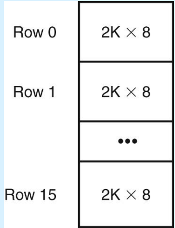

8. 

9. 十进制转为其他进制：每除以一次基数都要去掉余数，然后继续除，最后余数顺序倒序即为所求

   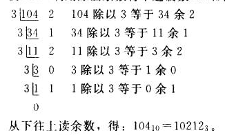

10. 小数的进制转换：乘以基数取整数

11. 其他机制转为其他进制：以10进制为中间状态即可

12. 正数的反码、补码就是它本身

13. 反码（one's complement）：基数-1-位上的数。

14. 补码（two's complement）：反码+1

15. 浮点数的表示：符号、指数、尾数（有效数位），将数用科学计数法表示，并且将有效数全部移到小数点右边，那么小数点右边的数就是尾数，2的次数再加上（2的n-1次方减一，（避免出现负指数））就是指数位上的数

16. 浮点数的运算：

    1. 加法：直接化为二进制数相加即可
    2. 乘法：尾数相乘，然后再依次乘以2个数的指数即可

17. 并不是精度（即位数）越高，准确度越高

18. (2.2)CPU基础

    1. ==CPU==包括2个重要部分：数据通道datapath（由ALU和寄存器通过总线连接起来）和控制单元control unit（负责对各种操作进行排序，并保证数据适时出现在合适位置）

19. 控制器：保证合适地译指、执行

20. (2.3)总线

    1. CPU通过数据总线与系统其它部件进行交互
    2. 控制总线：决定数据传输的方向和什么时候进行传输
    3. 地址总线：==决定==数据来源和目的地的==地址==
    4. 数据总线：用于传输数据流
    5. 串级联（daisy chain）：依靠设备的优先级，串行使用；
    6. 集中平行（centralized parallel）：由中央仲裁器决定使用顺序；
    7. 自选择分配式（distribute using self-detection）：由设备自己决定谁先谁后；
    8. 冲突检测分配式（distributed using collsion-detection）：每个设备尝试使用总线，如果产生冲突则在某个时刻后再进行尝试，如果没冲突则执行

21. (2.4)时钟

    1. clock用于==协调==每个部件的活动

    2. 时钟频率的倒数就是一个时钟周期的时间

    3. 时钟频率：每一秒包括的时钟周期（RISC 通过减少每条指令的时钟周期、CISC通过减少每个程序的指令数来提高性能）

       

       

22. (2.5)输入/输出子系统

    1. 存储器映射，CPU就io设备视作内存
    2. 基于指令集。需要一个特殊的指令集

23. (2.6)存储器组成 

    1. 一个RAM chip存储1位
    2. 8-way寻址，意味使用了8个存储bank，表示3为module Number
    3. high-order：表示module number在高位
    4. low-order：表示module number在低位

24. (2.7)中断

    1. 通过中断，实现cpu中event的改变
    2. 中断产生原因：IO请求、==计算错误==、非法指令

25. (2.8) MARIE 模型

    1. MARIE的特点

       1. 二进制、补码数据表示
       2. 程序存储，
       3. 固定长的数据和指令、16位数据，16位指令（4位操作码，12位地址）
       4. ==4K字可寻址内存==
       5. 16位的ALU
       6. 7大寄存器

    2. 七大寄存器：

       1. AC累加器，16位，存储cpu需要操作的数据，即==操作数==
       2. MAR存储器地址寄存器，12位，存储指令或操作数的地址
       3. MBR存储器缓冲寄存器，16位，缓存交互过程中的数据
       4. PC程序计数器，12位，存储下一条将要执行指令的==地址==
       5. IR指令计算器，16位，==存储==马上要执行的==指令==
       6. InREG、OutREG，输入输出寄存器，8位，存储与IO设备交互的数据

    3. MARE架构

       

    4. ISA指令集规定了==指令的格式==和==指令能实现怎样的操作==，16位指令包括4为操作码（用于标识操作）和12位地址码（用于表示操作数），所以以X都表示。而以下指令都在IR中

       1. load X：将X地址中的内容数据存入AC
       2. Store X：将AC中的内容存入地址X
       3. Add X：将X地址中的内容与AC中的相加
       4. Sub X:AC减去X地址内容
       5. Input ：键盘中的值输入AC
       6. Output：AC中的值输出
       7. Jump X：==将X加入PC==
       8. SKIPCOND X：根据X的最高2位的数值，决定是否要跳过下一条指令的条件，00：AC<0就跳过；01：AC=0就跳过；10：AC>0就跳过

    5. 指令是由更小的微操作实现的，可以用RTL表示：

       

       ​											

26. (2.9)指令的执行（ Fetch–Decode–Execute Cycle 取指-译码-执行循环）

    1. 将PC赋值到MAR
    2. 将MAR所指的内容赋予IR
    3. 进行译码，然后将IR低12位内容赋予MAR
    4. （optional）将MAR所指内容赋予MBR
    5. 执行指令

27. (2.10) 一个简单的程序

28. KB MB GB TB PB EB

29. IEEE：为计算机组件、信号协议和数据表示制定标准的组织。

30. 控制单元：==硬线控制单元和微程序控制==单元的目的都是提出一系列信号，在计算机系统内部进行操作。

## 第三章 指令集架构

***

1. (3.1)指令集架构介绍

2. (3.2)指令格式（重要）

   1. 指令集的==区分==：指令的长度、==CPU存储数据的方式==、（显式操作数的个数、操作数（operands）的==位置==、操作数的类型和大小）、操作码（operations）的类型
   2. 指令集的==评判==：程序占用的空间、（指令的复杂度、指令长度、指令的个数）
   3. 设计指令集的==设计==：指令长度、操作数的个数、可寻址寄存器的个数、字节或字寻址、 寻址方式

3. 字节序byte ordering：

   1. 小端：8086使用的
      1. 从16位整数地址转换到==32==位整数地址不需要任何计算
      2. 比较难找到一个数的符号
      3. 使用例子： GIF, Microsoft RTF, Microsoft WAV, etc
   2. 大端：高位数放低地址，低位数放高地址
      1. 自然
      2. 符号可以通过偏移量为0上数判断
      3. ==奇数地址不允许存数据，会产生浪费==
      4. 使用例子：Adobe Photoshop, JPEG, Microsoft WAV

4. CPU存储数据的方式

   1. 堆栈体系结构：不能随机访问，后缀表示法
   2. 累加器体系结构：（MARIE?）一个操作数隐含在累加器中，但是一个操作数在内存中，产生大量的总线流量。
   3. 通用寄存器体系结构GPR：现在最常用的，用寄存器代替内存，比累加器更快。

5. (3.3) 指令类型：数据转移、算数运算（arithmeticc）、波尔运算（boolean logic）、位操作（bit manipulation）、IO操作（input/output）（INPUT,OUTPUT）、控制转移(SKIPCOND)(transfer of control)、特殊目的(CLEAR)

6. 扩展码的表示：（escape opcode为转义码）

   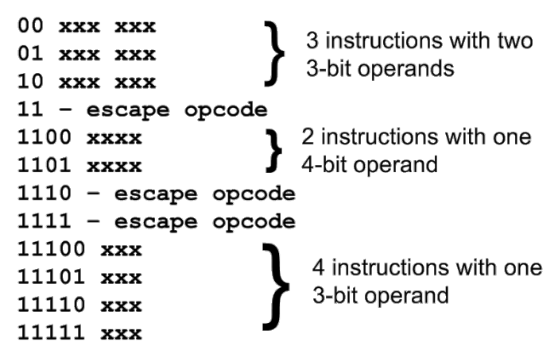

7. (3.4) 寻址

   1. 立即immediate，操作数就是value
   2. 直接direct，操作数是value的地址
   3. 间接indirect，操作数是value地址的地址
   4. 索引/变址==indexed==，操作数加==寄存器的==值作为value的地址
   5. 基址based
   6. 寄存器寻址register
   7. 寄存器间接寻址register indirect

8. (3.5)指令流水线

9. speedups加速比（未加速的时间比上使用了流水线的时间）：$S=\frac{nkt_p}{(k+n-1)t_p}$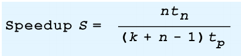

$t_n为一个进程所用的时间，t_p为一个时间周期，n为进程的个数，k为一个进程使用时间周期的个数，当n趋近于无穷时，s=k$

10. 影响(hazard)流水线的原因：
    1. 资源冲突（数据总线可能被其他进程占用）
    2. 数据依赖（下一条指令需要上一条的结果）
    3. 条件转移语句（跳转语句后面的语句是无效的，所以不能放入CPU进行取指-译码-执行过程）
11. 指令的长度固定，不代表操作码的长度固定
12. 指令长度固定，不代表操作数个数固定
13. 固定长度的指令：浪费空间，但==性能好==于可变指令

 

***

## 第四章 存储器

1. （4.2存储器类型）RAM：构成也就是所谓main memory主存、内存，包括SRAM（静态）、DRAM（动态）

   1. SRAM：速度更快，价格更高，需要供电不断，用作==高速缓存器==（cache）
   2. DRAM：速度慢些、价格更低、需要每隔几毫秒充电，存储密度更高，消耗功率更低，产生的热量小，用作主存储器

2. Cache用作buffer缓冲

3. （4.3层次结构）

   1. 第一级（system）（10ns级）：寄存器、高速缓存、主存

   2. 第二级（online）：固态硬盘（us）、机械硬盘（ms）

   3. 第三级(tertiary):光盘（s）、磁带

   4. 第四级（off-line）:U盘、可移动硬盘

      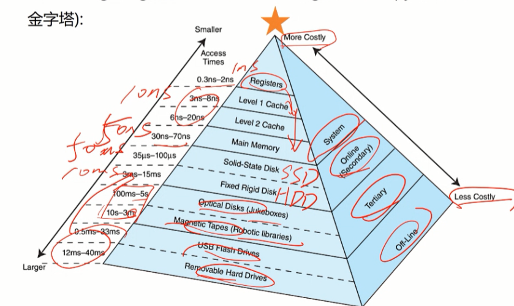

4. 虚拟内存提供更多的空间、高速缓存提供更快的速度

5. 局部性原理:

   1. 时间局部性：最近被访问的数据单元，之后也有被访问的趋势
   2. 空间局部性：一个数据单元被访问，周围的数据单元也有被访问的趋势
   3. 顺序局部性：指令趋向于被顺序执行

6. （4.4高速缓存）高速缓存（cache）：提高访问速度，通过储存最近被CPU使用过的或者将要被CPU使用的数据在高速缓存中 

7. 高速缓存是通过按==内容寻址==，主存是使用地址寻址

8. 高速缓存的映射模式（schemes）

   1. 直接映射
   2. 全相联映射
   3. 组相联映射

9. ==主存==到==缓存==的==直接映射==：主存有N个块，缓存有X个块，通常缓存可以主存和缓存的映射关系是Y=NmodX

10. 直接映射（direct）时，从内存传输数据到缓存时是将==整个块block==传输，block值==固定了==块被储存在缓存上的位置

11. Tag表示数据前面的主存空间是缓存的多少倍（通常最后算，用总位数减去block和offset位得出），Block域表示是缓存的第几块，Offset表示是块上的第几个数据

12. Tag+block+offset的总位数，取决于主存有多少个字节容量，block位数取决于缓存有多少个块，offset取决于一个块有多少个字节

13. ==全相联映射==（fully associative）：包括tag、offset（块的大小决定）（==注意==：只有==2==个字段）

    1. 当在缓存的寻找数据时，所有的tags会被并行检索
    2. 缺点：需要专用的、昂贵的硬件电路
    3. 从主存传输一个块到缓存中，其块储存的位置是==随机==的（一般按顺序？），和直接映射相比能更大程度利用缓存空间
    4. 所以full associative全相联==不能知道某个地址是属于哪个块==

14. ==组相联映射==：N-way表示在缓存中，每N个block组合为一个set，格式包括tag、set（就是高速缓存块个数的幂数==减==去n-way的幂数$\log_2{\frac{N_{block}}{N}}$）、offset（由块大小决定）

    1. 相比直接映射，这种方式更灵活，每个set中有N个block，相同set值的block存储到缓存中时能选择这N个块中的==任意==一个

15. 替换策略：对于映射方法，当有新块进入缓存时，需要替换掉旧块，替换策略就是选择旧块的方法，根据时间局限性替换掉使用可能性低的块，保留可能性高的块。

    1. 最近最少使用算法LRU：替换最早==使用==过的块
       1. 复杂性高
    2. 先进先出FIFO：替换最早==进入==缓存的块
    3. 随机选择（random）：
       1. 不会造成thrashes（抖动、来回颠簸）

16. 有效存取时间（EAT）：$EAT=H*Access_c+(1-H)*Access_mm$（即命中率乘以缓存访问时间+miss率乘以主存访问时间）（因为取数据使用并行方式，同时向缓存和主存中寻找数据，如果在缓存中找到，则终止向主存中访问）

    1. 而非重叠 not overlap的方式：$EAT=H*Access_c+(1-H)*(Access_mm+Access_c)$

17. dirty blocks脏块：block在缓存中被修改了

18. 缓存写策略：脏块必须被写回主存中，缓存写策略就是决定它如何写回

    1. 写直通（write through）：缓存中块被更新，主存中相应块同时也被更新
       1. 缺点：减慢访问速度
    2. 回写（write back）： 当被更新的块被替换时，才更新主存中的相应块
       1. 缺点：因为主存中储存的数据和缓存中的不一样，会造成多用户使用不一致问题，而且万一断电，缓存中的数据就丢失了

## 第五章 i/o系统

***

1. 阿姆达尔定律（Amdahl's Law）：$S=\frac{1}{(1-f)+\frac{f}{k}}$，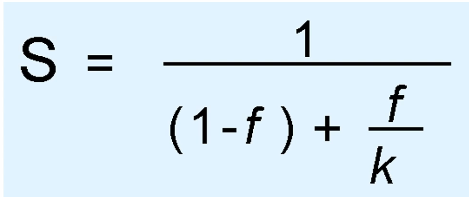

   其中S为加速比（即性能上的提升），f是某部件占总部件上工作的比例，k表示某部件的加速比。（所谓加速比，就是加速后的速度与加速前的速度的比值）

2. 加速性价比就是S每提升1%所需要的费用

3. ==I/O控制==方式： 

   1. 程序控制I/O:轮询地检查每一个I/O设备是否发出IO请求
   2. 中断控制IO：执行io操作时，CPU同时进行工作，直到IO操作完成，发出中断请求给CPU，CPU才再去处理IO相关进程（并发操作）
   3. 内存映射的IO：将IO设备映射到主存空间（即将IO设备视作一个在主存中的特殊文件）
   4. 直接存储器DMA：DMA和CPU共享bus,DMA和CPU的工作时互斥的
   5. 通告控制IO

4. IO设备的分类

   1. 字符IO设备：一次只能处理一个byte（或字符），键盘、鼠标，通常使用中断io控制，即大多数常用涉笔
   2. 块IO设备：一次处理一个块的数据，磁盘、磁带，通常使用DMA、通道IO控制

5. 寻道时间（seek time):磁头定位到所需磁道的时间

6. 旋转延迟（rotational delay）：磁头在特定磁道旋转到特定扇区需要的时间。（此延迟是算法上的并不是物理上的延迟，即在算法上找到所需扇区的时间）

7. 访问时间（access time）=寻道时间+旋转延迟

8. 平均反应时间（Average latency）:==实际==上，将磁头移到所需扇区需要的时间

9. 平均失效时间（Mean time to failure）：产品生命周期

10. 磁盘技术

    1. 优点：费用低
    2. 缺点：速度慢、脆弱性（材料问题）、移动部件损耗（老化）
    3. 可以通过记录==介质==区分2个记录方式

11. 固态硬盘SSD：非易失性闪存

12. 不可恢复的误码率UBER：在模拟整个使用周期，误码量与总读取量的比值

13. 写入的兆字节TBW：连续写入的数据量直到其不能满足所要求的速度和错误率的兆字节量

14. 光盘

    1. CD-ROMS：数据存储在螺旋状的轨道上，二进制数据的01以凹凸不平的形式存储，最多存650MB
    2. DVDs：可以存储17GB，因为DVD使用了==更短==的波长
    3. Blu-ray（蓝光）：单层可以存储25GB
    4. 可以储存比磁盘长的时间并且可以恢复

15. RAID（独立磁盘冗余阵列）：用以解决磁盘的可靠性、费用、性能、生命周期耐力问题。方法是：使用多个磁盘存储数据

    1. RAID 0（磁盘跨区）：将数据分为多个==块==，然后按块跨区存储。缺点：稳定性低，没有提供冗余备份或检错纠错。==当故障不涉及到一个磁盘和它的镜像时，RAID-1也可以忍受1个以上故障==

       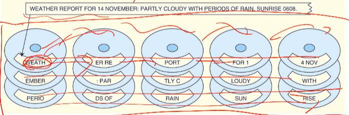

    2. RAID 1（磁盘镜像）：==分块==、每个数据储存2次。缺点：费用高

       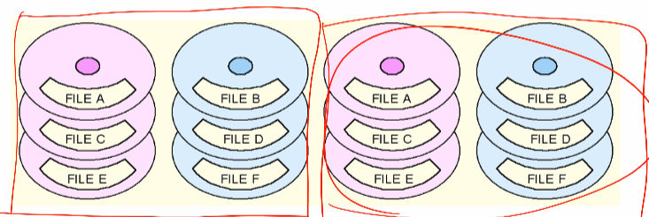

    3. RAID 2：按bit位跨区存储，再储存对应的==汉明码==。缺点：性能不好，费用还高

       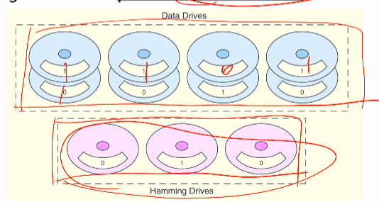

    4. RAID 3：和RAID 2一样按位跨区存储，但提供的校验是==奇偶检验==。不适合商用但适合个人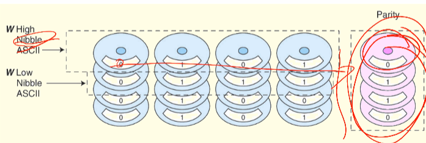

    5. RAID 4：==分块==和RAID 0一样按块跨区存储，但加了==奇偶校验==的额外磁盘。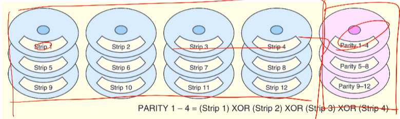

    6. RAID 5：==分块==、和RAID 0一样使用按块跨区存储，但使用的是==分布式==奇偶校验，优点：可以实现数据按行的并行访问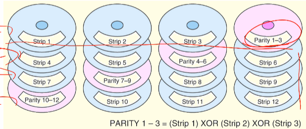

    7. RAID 6:==分块==、在RAID 5的基础上又==增加了一种==校验方式（Reed-Soloman）,即可以容忍2个磁盘数据的丢失，并恢复。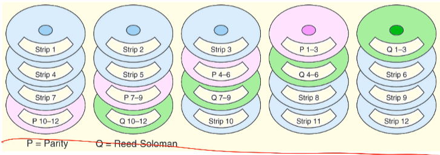

    8. RAID DP：==分块==、和RAID 6一样使用了2个纠错方式，也可以容忍2个磁盘数据的丢失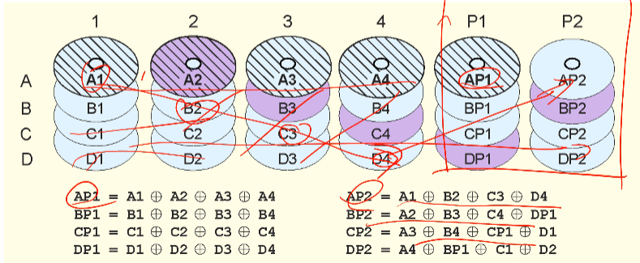

    9. 采用哪种RAID取决于数据的关键性（重要性？）
    
    10. 只有23shiyilei
    
16. 当计算机使用分页时，每个进程都必须有一个页表。

17. 与并行数据接口相比，串行通信接口可以更快更远地传输数据

## 第六章 系统软件

***

1. 进程调度、虚拟机、子系统、分区、  汇编
2. 进程调度：
   1. FCFS：先来先服务
   2. priority 优先级调度
   3. shortest job first最短作业优先调度
3. General multiprogramming systems多道批处理系统
4. timesharing systems分时系统
5. 为了保护系统环境，有时需要将进程隔离起来，以避免冲突，保证安全。方法有：虚拟机、子系统subsystems、分区partitions
6. 虚拟机：被内核kernel控制，是一种反应完整系统资源的假象的机器
7. 子系统： 可以提供逻辑上截然不同的环境，这些环境能够被单独的控制和管理
8. 分区：一般情况下，不同分区的进程无法访问其他分区的进程，除非显式规定，分区的==屏障比子系统的高==
9. 汇编器assemblers：将助记符翻译为机器码

## 第七章 可选体系结构

***

1. Register window、SISD、MIMD、Superscalar、Vector machine
2. 精简指令集和复杂指令集的区别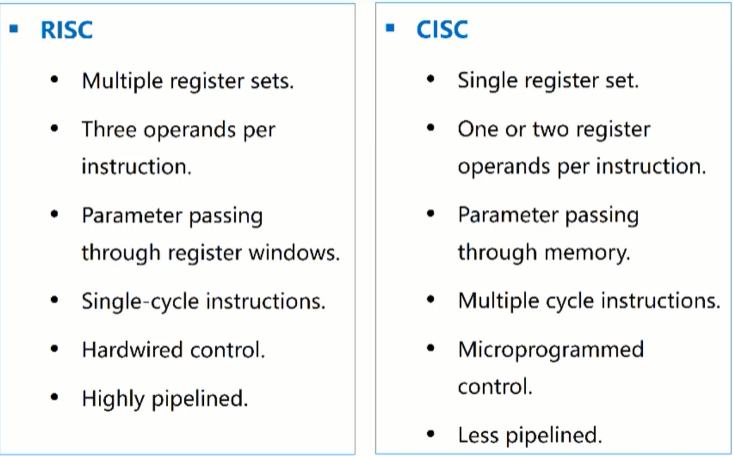
3. 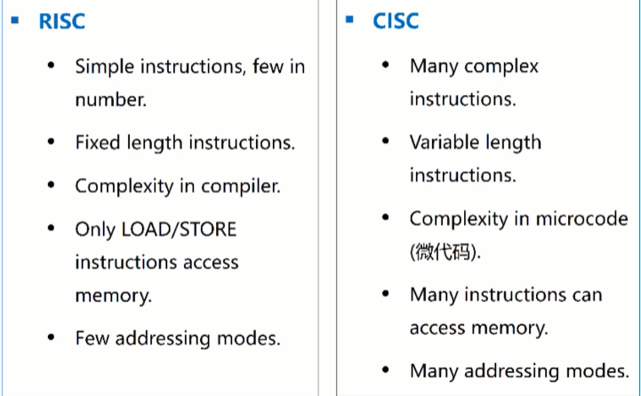
4. register window：RISC体系中包含16个寄存器组，每个组中有32个寄存器，在任意时刻，CPU只能在唯一一个寄存器组（即寄存器窗口）中工作。作用：当改变CPU的上下文环境时，只需要换到另一个寄存器窗口（寄存器组）即可
5. 富林分类法：根据CPU的数量和数据通路的数量（数据流）
   1. SISD：一般都是这个
   2. SIMD：单指令、多数据流，矢量机
   3. MIMD：多指令、多数据流，并行结构
      1. SMP：较少处理器，共享主存，多处理器通过主存连接
      2. MPP：较多处理器，主存独立，多处理器通过网络连接
   4. MISD：未实现
   5. 缺点：①没有MISD②假设MIMD是同构的③MIMD可以再分类
6. 超流水线作业：在流水线的基础上，将一个时钟周期划分为小于半个时钟周期区完成
7. Superscalar超标量设计：能在少一个时钟周期内完成的
   1. 有多个执行单元，包括专用的整数和浮点加法、乘法器
   2. 取指单元可以同时从存储器取出多条指令
   3. 译码单元决定哪些指令可以并行处理然后结合在一起执行
8. 矢量计算机：可以同时在一个完整的矩阵或向量上操作
   1. 因为矢量计算机可以高度流水线工作
   2. 矢量寄存器
      1. register-register vector processors：要求所有操作数都在寄存器中
      2. memory-memory vector processors：要求操作数都从主存中出发到算数逻辑单元

## 第八章 嵌入式系统

***

1. 标准处理器、Reconfigurable hardware

2. 内存占用是嵌入式系统的关键问题

3. 事务处理是嵌入式系统的核心功能

4. 在嵌入式系统中，RAM\ROM\FLASH都共享一片地址空间

5. 嵌入式系统和通用系统的比较：

   1. 嵌入式系统资源受限，其存储资源、运算资源都受限
   2. 硬件和软件的功能是不固定划分的
   3. 嵌入式系统程序员必须了解硬件的全部细节
   4. 信号的时序和事件的及时处理

6. Reconfigurable hardware可重新配置的硬件

   1. off-the-shelf现成的：只可添加一个memory和外设
   2. configurable可配置的
   3. Fully-customized完全定制的

7. watchdog timer：定期检查系统是否在运行状态，以防止系统挂起或无限循环。也不是应用于所有的微控制器中

8. GPR不需要watchdog timer，因为人类观察

9. PLDs可编程逻辑器件

   1. PAL可编程阵列逻辑：由可编程AND与门和固定OR或门组成

      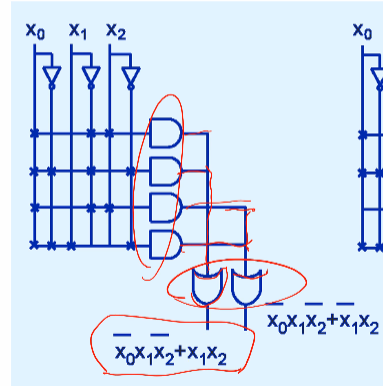

   2. PLA可编程逻辑阵列：由可编程AND与门和可编程OR或门组成

      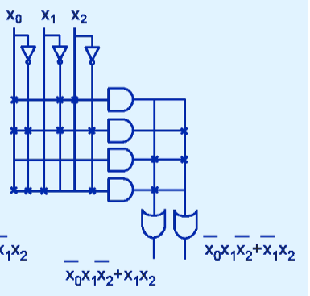

   3. FPGAs现场可编程门阵列 ：通过改变存储在memory中的值决定输出的逻辑函数

      1. 岛屿式配置
      
      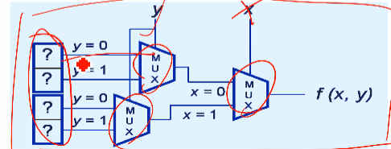

## 第九章 网络组织和体系结构

***

1. Seven protocol layers of the OSI RM、Basic concepts of the three-layer TCP/IP protocol stack
2. DARPANet 是internet的前身
3. ISO：国际标准化组织
4. OSI（open system interconnection reference model）开放系统互联参考模型：应用层、表示层、会话层、传输层、网络层、数据链路层、物理层
5. 3层TCP/IP协议栈：
   1. IP：对应OSI中网络层
   2. TCP：对应传输层和部分会话层
   3. FTP、http、telnet、smtp。。。：应用层、表示层、和部分会话层
6. 服务接入点SAP：就是端口
7. IPv4的所有安全措施都是可选的，这是它的局限之1

